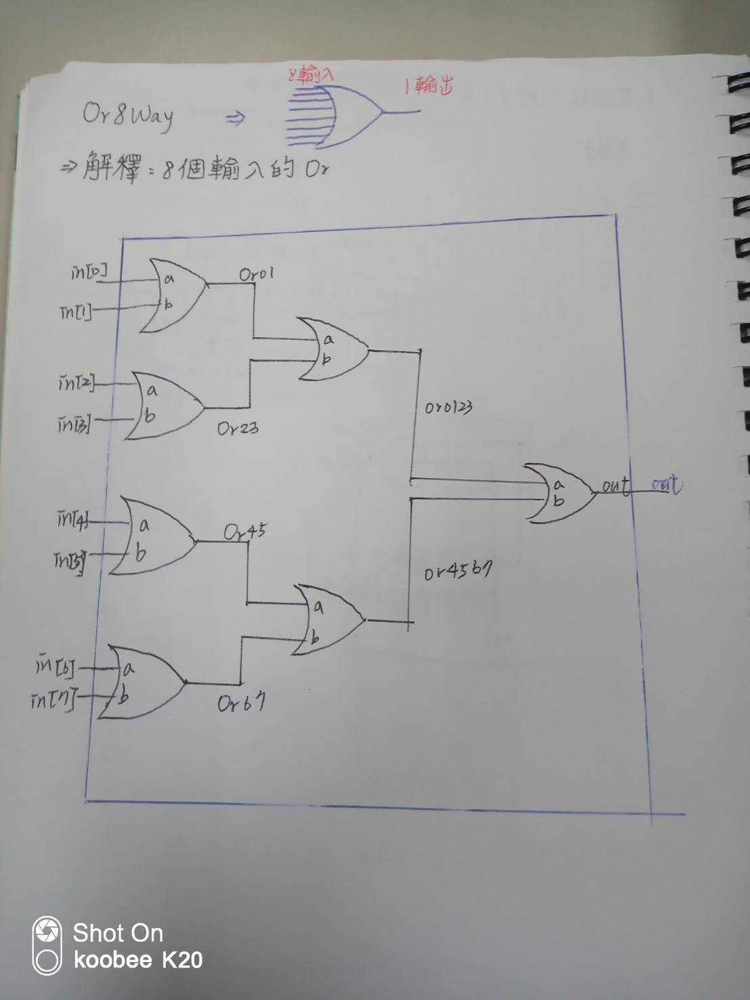

## 11.Or8Way
* picture


* code
```
// This file is part of www.nand2tetris.org
// and the book "The Elements of Computing Systems"
// by Nisan and Schocken, MIT Press.
// File name: projects/01/Or8Way.hdl

/**
 * 8-way Or: 
 * out = (in[0] or in[1] or ... or in[7])
 */

CHIP Or8Way {
    IN in[8];
    OUT out;

    PARTS:
    // Put your code here:
     Or(a=in[0],b=in[1],out=Or01);
     Or(a=in[2],b=in[3],out=Or23);
     Or(a=in[4],b=in[5],out=Or45);
     Or(a=in[6],b=in[7],out=Or67);
     Or(a=Or01,b=Or23,out=Or0123);
     Or(a=Or45,b=Or67,out=Or4567);
     Or(a=Or0123,b=Or4567,out=out);
}
```