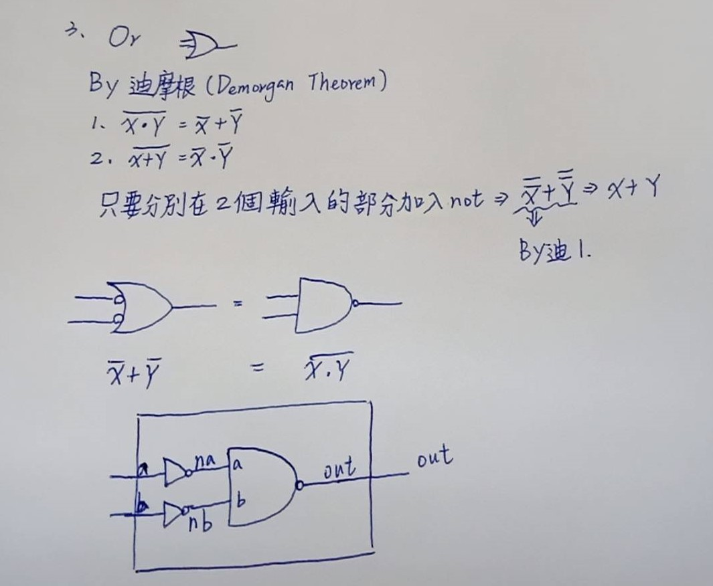

### 3.Or
* Use the Demorgan Therem to use the two Not to let the Nand to Or
* picture


* code
```
 // This file is part of www.nand2tetris.org
// and the book "The Elements of Computing Systems"
// by Nisan and Schocken, MIT Press.
// File name: projects/01/Or.hdl

 /**
 * Or gate:
 * out = 1 if (a == 1 or b == 1)
 *       0 otherwise
 */

CHIP Or {
    IN a, b;
    OUT out;

    PARTS:
    // Put your code here:
    Not(in=a,out=na);
    Not(in=b,out=nb);
    Nand(a=na,b=nb,out=out);
}
```