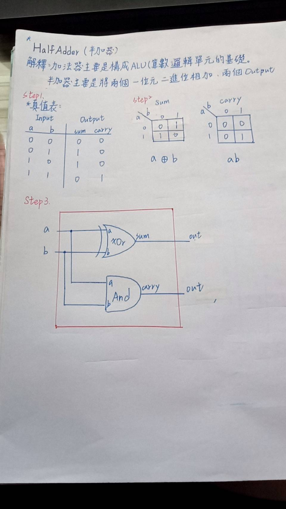

### 1.HalfAdder 
* picture
  
 
* Explanation
>* 加法器主要是構成ALU(算術邏輯單元的基礎)，半加器主要是將兩個一位元二進位相加，有兩個OUTPUT

* code
```
// This file is part of www.nand2tetris.org
// and the book "The Elements of Computing Systems"
// by Nisan and Schocken, MIT Press.
// File name: projects/02/HalfAdder.hdl

/**
 * Computes the sum of two bits.
 */

CHIP HalfAdder {
    IN a, b;    // 1-bit inputs
    OUT sum,    // Right bit of a + b 
        carry;  // Left bit of a + b

    PARTS:
    // Put you code here:
    Xor(a=a,b=b,out=sum);
    And(a=a,b=b,out=carry);
}

```
