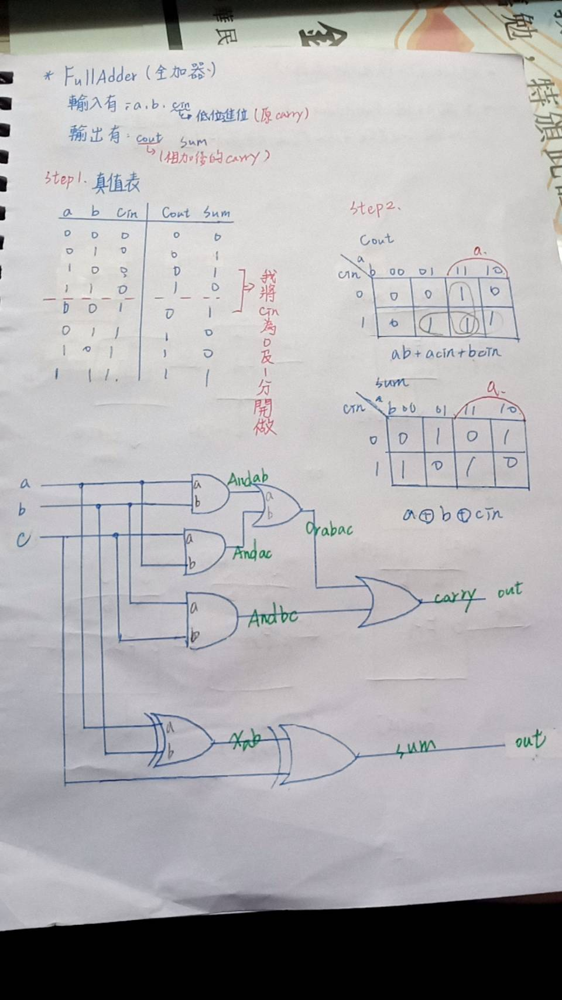

### 2.FullAdder
* picture
 
 
* Explanation
>* 全加法器有三個輸入a,b,cin(原carry)，有兩個輸出cout(相加後的carry),sum

* code
```
// This file is part of www.nand2tetris.org
// and the book "The Elements of Computing Systems"
// by Nisan and Schocken, MIT Press.
// File name: projects/02/FullAdder.hdl

/**
 * Computes the sum of three bits.
 */

CHIP FullAdder {
    IN a, b, c;  // 1-bit inputs
    OUT sum,     // Right bit of a + b + c
        carry;   // Left bit of a + b + c

    PARTS:
    // Put you code here:
    And(a=a,b=b,out=Andab);
    And(a=a,b=c,out=Andac);
    And(a=b,b=c,out=Andbc);
    Or(a=Andab,b=Andac,out=Orabac);
    Or(a=Orabac,b=Andbc,out=carry);
    Xor(a=a,b=b,out=Xab);
    Xor(a=Xab,b=c,out=sum);
}

```
