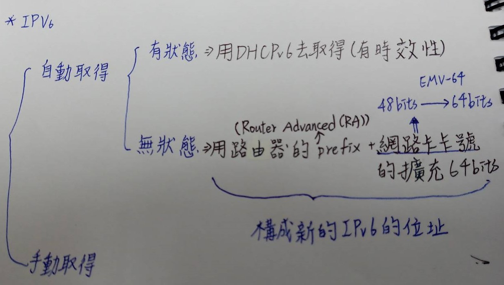

## DHCP(動態主機設定協定)
### 為何要使用DHCP?
>* 因為IP位址是有限的，但是網路需求是無限的，所以需要DHCP對IP位址使用動態分配IP位址，並設定使用期限
>* DHCP server自動取得IP

* picture

### IPv6
* picture

* 補充
* APR(Address Resolution Protocol；位址解析協定):通過解析網路層位址來找尋資料鏈路層位址的網路傳輸協定
>* 使用廣播的方式
>* IPv4主要就是使用ARP
>* IPv6則沒有ARP，被multicast所取代(在第二層就能被過濾掉)，且被放入ICMPv6(網際網路控制訊息協定第六版)

