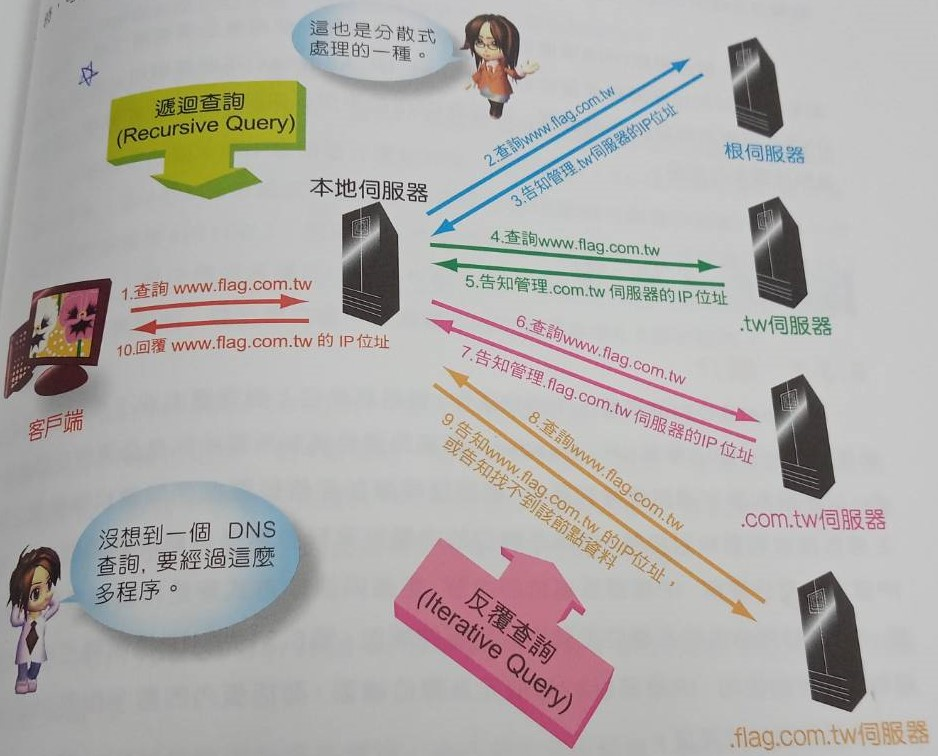

### DNS(Domain Name System)
>* Explanation:IP(e.g 1.2.3.4)和Domain Name(e.g www.a.com)的轉換。(網路上只會是IP位址)
>* 通常使用UDP傳輸(快)(非連線是傳輸)。補:TCP=>慢(連線式傳輸)
>* Port:53

* DNS會用於CDN的網路裡(CDN:Content Delivery Network，是一種透過網際網路互相連接的電腦網路系統，利用最靠近每位使用者的伺服器，更快地，高效能、可擴展性及低成本將音樂、圖片、影片、應用程式及其他檔案傳送給使用者)
>* 可看你的IP來自位址
>* 依照位置不同，給不同的位址

* DNS如何做出負載均衡?
>* 每次分配不同的IP位址

* IOS七層
>* 前兩層:放在www內
>* 後幾層:房於RFC中

### FQDN(Fully Qualified Domain Name；完整的網域名稱)
>* 1. www為主機名稱
>* 2. flag.com.tw為其網域名稱
>* 3. 跟網域"."

* DNS的運作流程

### DDNS
>* 無法拿到固定的IP，仍能進行DNS(e.g撥接網路環境)
>* 用在一種撥接網路
>* 可在搜索引擎中用myip來查自己的位置
