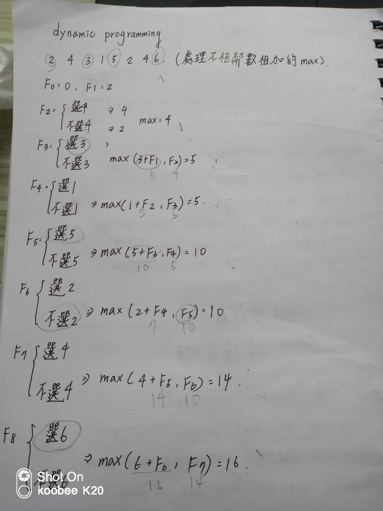

## 動態規劃(dynamic_programming)
>* 動態規劃就是運用陣列紀錄已經做過的事情，增加效能和速度的方法，去除不必要重複的動作
>* 在這，我實際的做做看運用動態規劃寫出的費式數列和沒有的做出比較
>* 我還實作了老師上課所過的範例
 
### 首先是費式數列
>* 這是我沒運用動態規劃的寫法所做的
>* 可以發現，每一次都繪需要重新呼叫相同的直很浪費效能，而且也不能用太多次，這種方法差不多50次就跑不出來了
```
#include<bits/stdc++.h>

using namespace std;
#define MAX 1000

int fib( int a );
int main()
{
    int num;
    cin>>num;
    cout<<fib(num)<<endl;
}

int fib( int a )
{
    if(a==0) return 0;
    else if(a==1) return 1;
    else{
        int tmp=fib(a-1)+fib(a-2);
        return tmp;
    }
}
```
>* 接者是有運用動態規劃的寫法
>* 我測試過了這種發算到5000都可以快速及算出來
```
#include<bits/stdc++.h>

using namespace std;
#define MAX 1000
long long int fib(long long int a);
int main()
{
    long long int num =0 ;
    cin>>num;
    cout<<fib(num)<<endl;
    return 0;
}
long long int fib(long long int a)
{
    long long dp[a+1];
    dp[0]=0;
    dp[1]=1;
    for(int i=2;i<a+1;++i){
        dp[i]=dp[i-1]+dp[i-2];
    }
    return dp[a];
}


```

### 接者是老師上課舉過的例子
>* 處理不相鄰數字的相加
>* 運用"選"和"不選"當條件，就可以輕鬆做出來
>* picture


```
#include<bits/stdc++.h>

using namespace std;

int maxvalue(int arr[],int len);
int dpmax(int be,int af);

int main()
{
    int arr[8]={2,4,3,1,5,2,4,6};
    int len = 8;
    cout<<maxvalue(arr,len)<<endl;
}
int maxvalue(int arr[],int len)
{
    int record[len];
    int maxV=0;
    record[0]=arr[0];
    if(arr[1]>arr[0])record[1]=arr[1];
    else record[1]=arr[0];
    for(int i=2;i<len;i++){
        maxV=dpmax((arr[i]+record[i-2]),record[i-1]);
        record[i]=maxV;
        cout<<maxV<<endl;
    }
    return maxV;
}
int dpmax(int be,int af)
{
    cout<<be<<" "<<af<<endl;
    if(be>af)return be;
    else return af;
}

```
>* 運行結果

```
5 4
5
5 5
5
10 5
10
7 10
10
14 10
14
16 14
16
16
```
