>* 期中from book :選擇->簡答(70%);上課講+課本(30%)
* cmd(window)
>* cd(change directory):切換目錄
>* dir| findstr 03 (dir:input,|:pipe,findstr:input,03:想查詢的關鍵字)
* GCP(google cloud platform)

## 建立linux
* step1:下載virtualBox,並下載安裝擴件包
* step2:下載完後，按下左上角新增的按鈕
* step3:填上名稱，類型選擇linux，版本選擇Rat Hat(64bits)

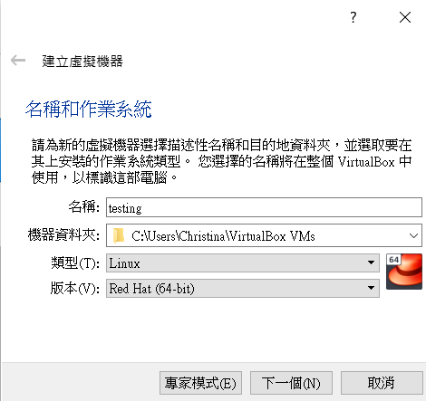

* step4:記憶體選預設1024MB

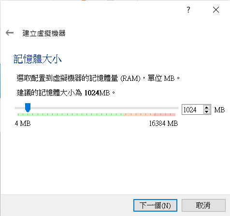

* step5:硬碟選取立即建立虛擬硬碟

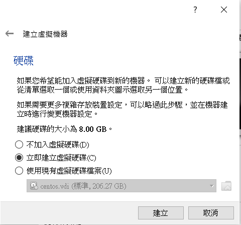

* step6:硬碟檔類型選擇VDI

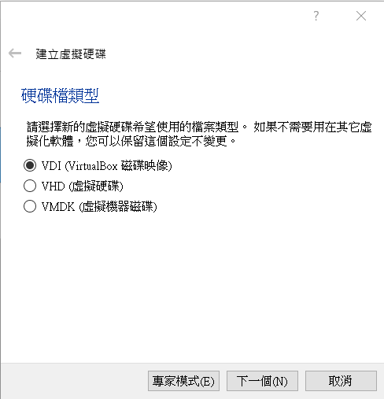

* step7:存放裝置在實體硬碟選擇動態分配

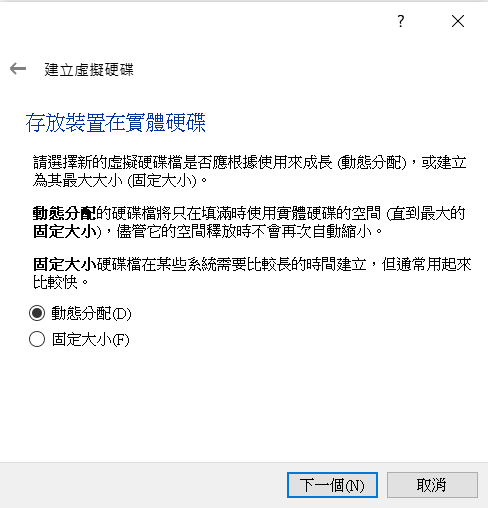

* step8:檔案位置和大小，大小可以調製50GB(到這邊，基本配置就配置完了*-*)

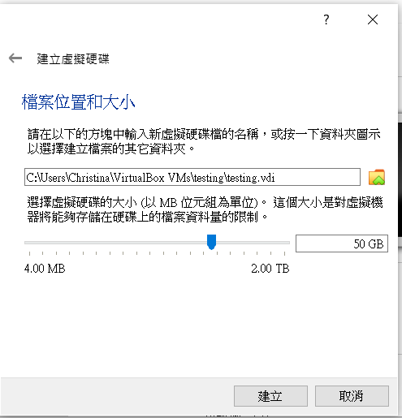

* step9:download IDE(下載自己喜歡的iso檔)
[IDE](http://ftp.jaist.ac.jp/pub/Linux/CentOS-vault/centos/7.0.1406/isos/x86_64/)

* step10:在存放裝置IDE中加入自己剛放進去的ISO檔

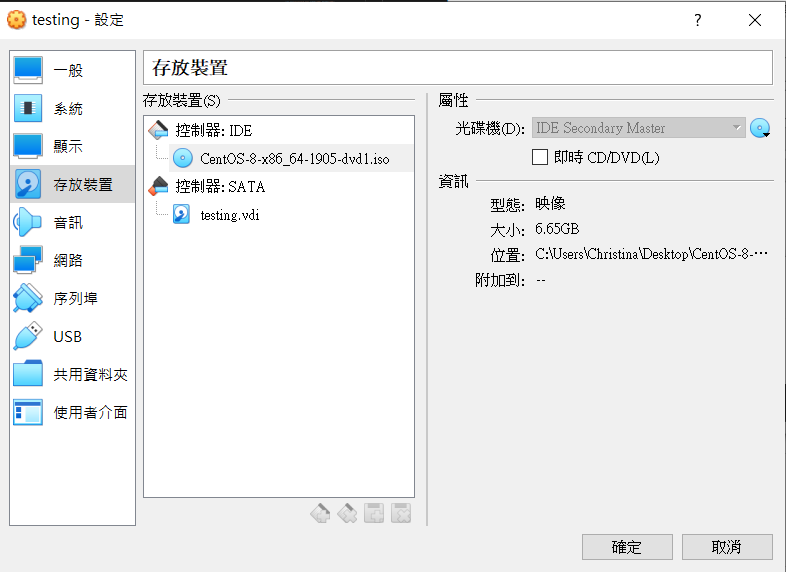

* step11:接者點選啟動，先選語言

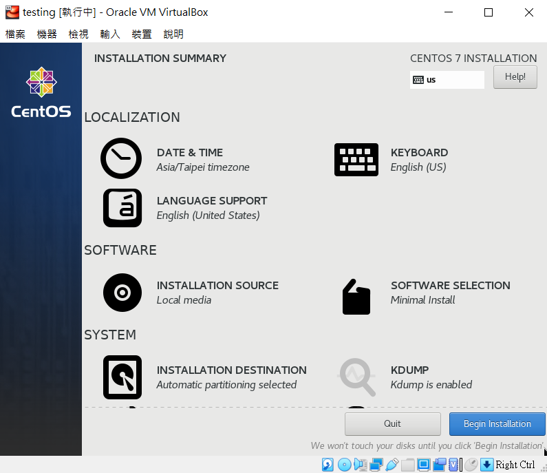

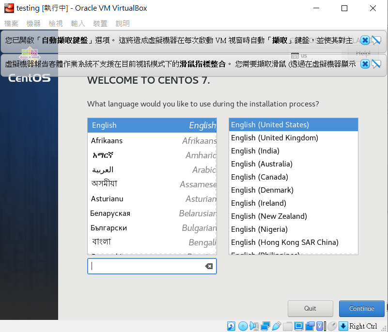

* step12:DATE&TIME(選Taipei)，然後按下Done

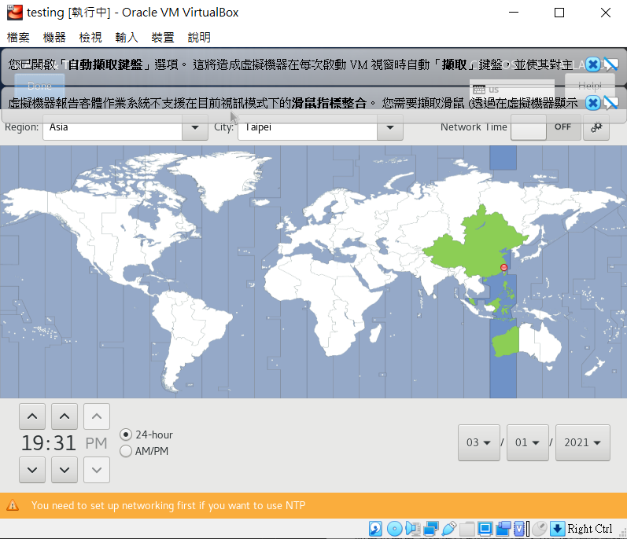

* step13:INSTALLATION DESTATION(將Local Standard Disks)勾選，然後按下Done

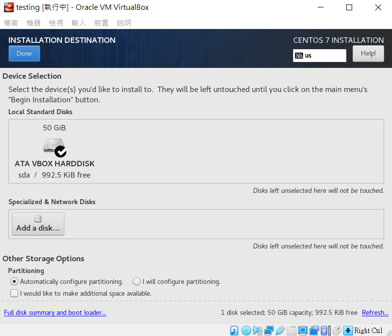

* step14:SOFTWARE SELECTION

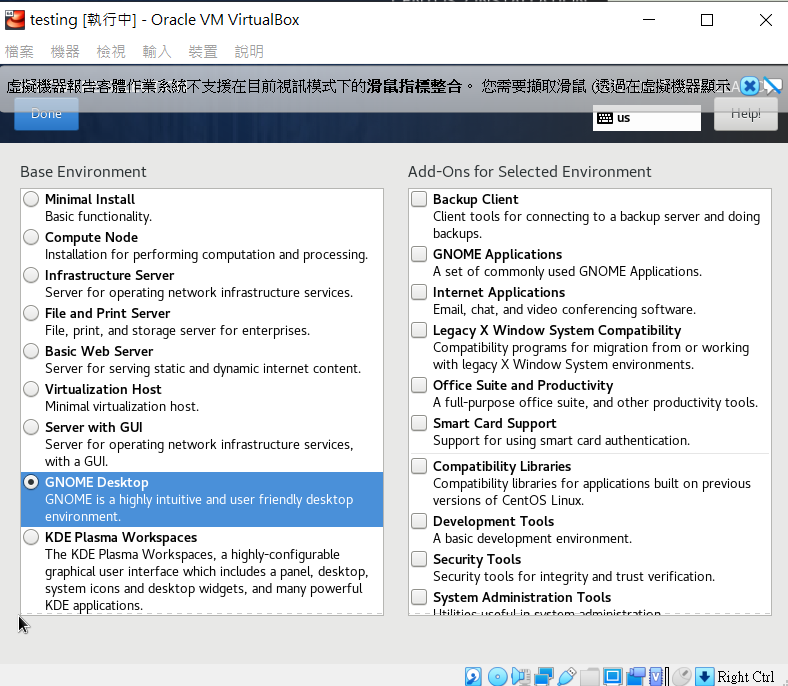

* step14:按下begin installation
* step15:接者設置自己的ROOT PASWORD(超級使用者時要用) 和 USER CREATION(登入時使用)

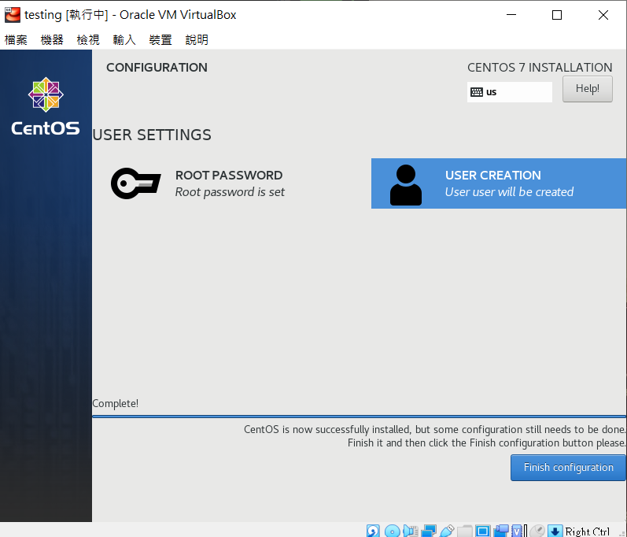

* step16:按下 Finish configuration