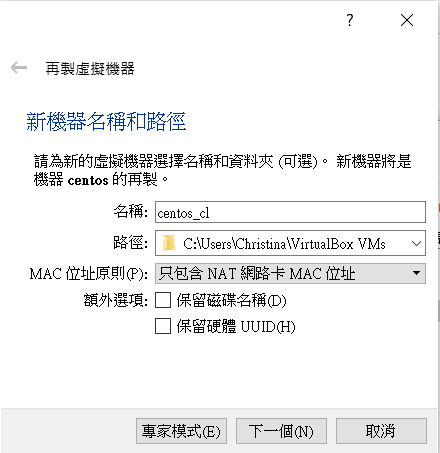
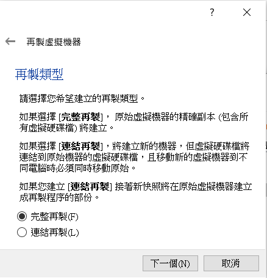
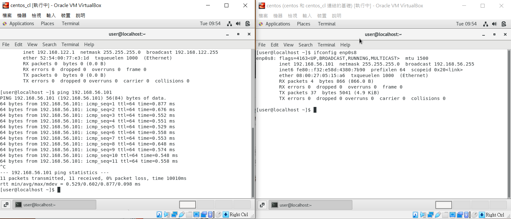
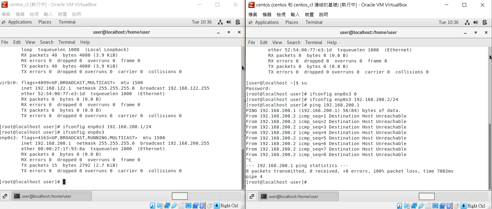
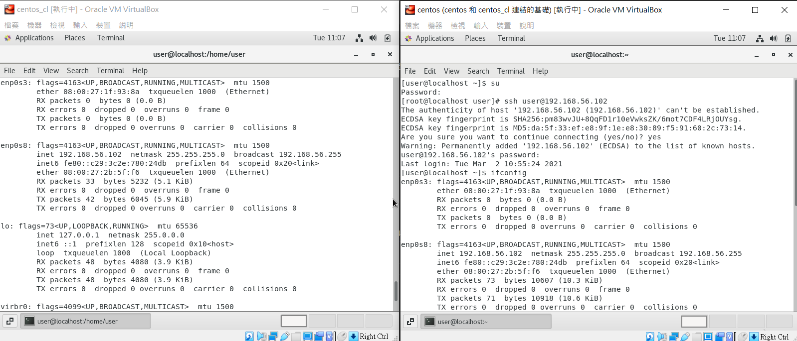
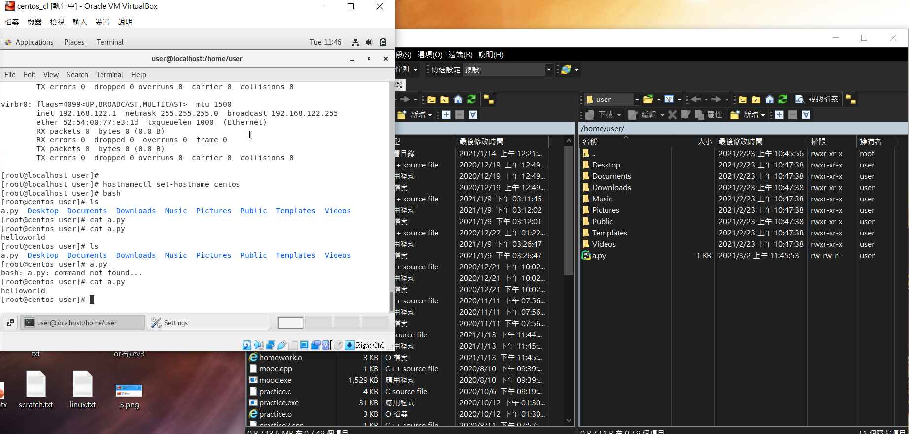

## 複製另外一台虛擬機的方法
* 1.先關閉執行中的主機
* 2.接者，對組機按下右鍵的右鍵的再製(clone)
* 3.接者輸入名稱

* 4.接者選擇完整再至或是連結再製

>* 完整再製(full clone):完全再串造一個vm，但是叫耗硬碟空間
>* 連結再製(linked clone):會共用原本就有的資源，較省硬碟空間

## 試著做出兩台虛擬機相互溝通
* 1.先在一台中ping enp0s8
* 2.接者，ping enp0s8的inet

## 建立內部網路通訊
* 1.先關起主機，在設定==>網路==>介面卡一，將剛剛建置的兩台主機都設為intnet1
* 2.接者，開啟兩台主機
* 3.在兩台主機的終端機中設定內部網路IP
* 4.先清除原本，輸入指令 ifconfig enp0s3 0
* 5.一台設定新的ip位置 ifconfig enp0s3 192.168.200.1/24
* 6.另一台設定新的ip位置 ifconfig enp0s3 192.168.200.2/24
* 7.在192.168.200.2中ping 192.168.200.1如果成功就成功溝通了

## 切換成另外一台主機(遠端登陸)
* 1.先在設定中設定，在網路==>介面卡一==>NAT(兩台都要改回來)
* 2.接者進入超級使用者中(su)
* 3.打上yum install openssh-server
* 4.接者，打上systemctl start sshd
* 5.接者，打上systemctl status sshd，如果出現active(running)==>表示成功
* 6.接者，進入另一台主機，進入su

* 7.打上ssh @192.168.56.102
* 8.按下yes然後輸入密碼就成功了
 

## windows和linux相互傳文件
* 1.下載winSCP，然後輸入IP位置，然後user帳號密碼就可以連上了
* 2.可以試者傳值，然後就可以看到了

## 補充
>* 在linux中一張網路卡所對應一個網路卡
>* 例如打上ifconfig會有enp0s3,enp0s8 ==> 代表有兩張網路卡
>* ssh:22(加密)
>* telnet:23(沒加密)
>* 修改主機的名稱:hostnamectl set-hostname centos
>* 打上bash就可以看到設改

>* 0.0.0.0代表任何一個介面

