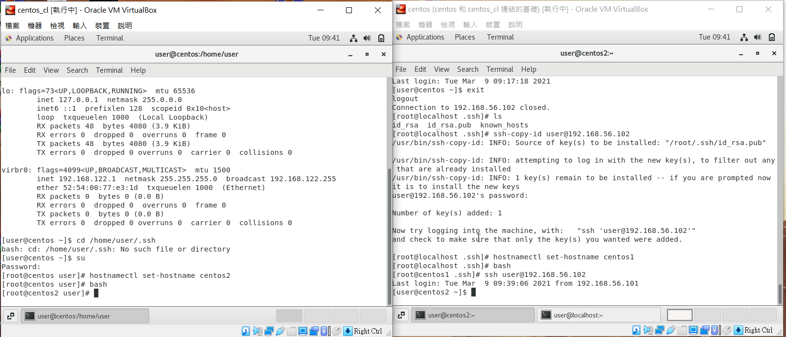
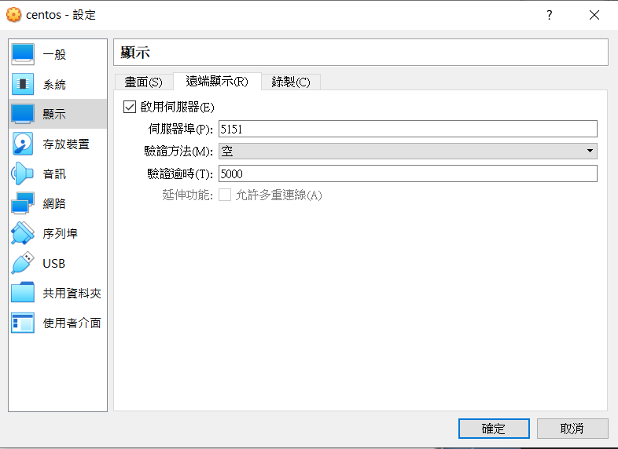
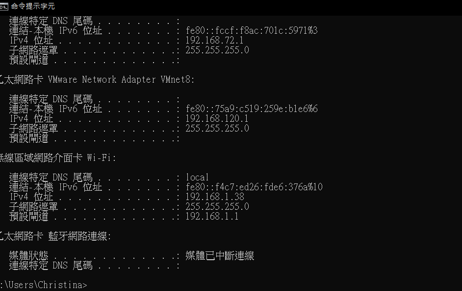
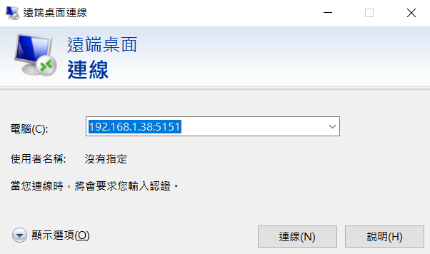
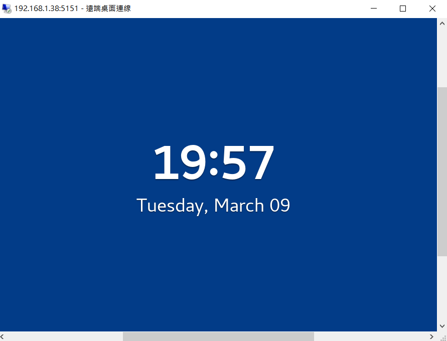

## 免密碼遠端登陸
* 1.先切到超級使用者輸入:su (輸入root的密碼)
會出現:
```
password:
```
* 2.先切到隱藏資料夾輸入: cd /root/.ssh
 會出現:
```
[root@centos1 .ssh]# 
```
* 3.產生一組金鑰輸入:ssh-keygen，會出現
```
Generating public/private rsa key pair.
Enter file in which to save the key (/root/.ssh/id_rsa): 
/root/.ssh/id_rsa already exists.
Overwrite (y/n)? y
Enter passphrase (empty for no passphrase): 
Enter same passphrase again: 
Your identification has been saved in /root/.ssh/id_rsa.
Your public key has been saved in /root/.ssh/id_rsa.pub.
The key fingerprint is:
SHA256:SOTsqDtPA8klAu3OpAFua0d2ik+WD0p1pgtksuj/w9Q root@centos1
The key's randomart image is:
+---[RSA 2048]----+
|..    .          |
|o .  +           |
|+.. . +          |
|oBoB B .         |
|*BX O + S        |
|+*o@ . E         |
|+ O O            |
| o.= =           |
|  o+o..          |
+----[SHA256]-----+

```
* 4.接者:ls，就可以找到
```
id_rsa id_rsa.pub
```
* 5.ssh-copy-id user@192.168.56.102(相要當入方的id):複製金鑰(第一次要對方的密碼)
* 6.之後，直接ssh user@192.168.56.102 :就可以免密碼登入了



## 如何用自己的windows登入別人的linux
* 1.先在virtualbox中，設定 -> 顯示 -> 遠端顯示 。將其打勾並且自己設定想要的伺服器埠號



* 2.接者，打開自己的終端機windows(cmd)輸入ipconfig，找到無線區域網路卡Wi-Fi的IPV4位置



* 3.最後，在遠端桌面連線輸入剛剛的IPV4+埠號就可以連上摟



* 4.接下來，就成功了*-*



* 注意注意!!相互連線的主機要在同一個區域網路上面喔*-*


