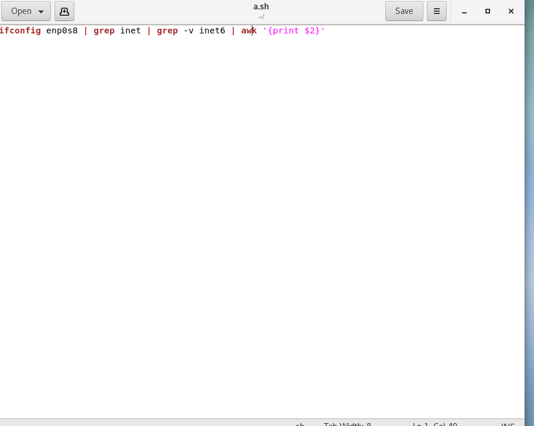
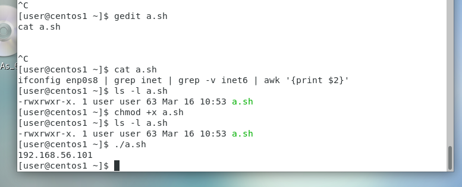

## 製作腳本，並抓取ipv6
* `gedit a.sh` :打開腳本程式，並編輯其內容
```
ifconfig enp0s8 | grep inet | grep -v inet6 | awk '{print $2}'
```



>* 接著將其儲存關掉
>* 打上 cat a.sh 
* `chmod +x a.sh` :增加可執行的功能
* `./a.sh` :就可以執行了



>* 就可輕鬆抓到IPV6的位置
## 補充
* 指令:
```
篩選:
linux:grep
windows:findstr
```
```
關機的指令:
power off
halt -p(pause)
shutdown -h(halt)
重新啟動:
reboot
shutdown -r(reboot)
```
```
cd / :回到root位置4
```
>* ctrl + alt + f2 + f3 :切到文字化界面
>* ctrl + alt + f1 :切回來

### 不同系統的管理方式
* centos7... :
* `systemctl restart httpd` :重起伺服器
>* restart(start,stop,reload...)
>* httpd(sshd,httpd...)

* ubuntu,service... :
* `ssh restart sshd`:重起伺服器
>* restart(start,stop,reload...)
>* httpd(sshd,httpd...)

```
ifconfig enp0s8 | grep -v inet6:篩選除了ipv6以外的
ifconfig enp0s8 | grep  inet6 :篩選ipv6
-v :用於忽視某東西
ifconfig enp0s8 | grep inet | grep -v inet6 | awk '{print $2}'
:想要指印出第2個字串
ls -l a.sh :可以看到這個檔案的更多資訊
chmod +x :加上可執行權限
```


