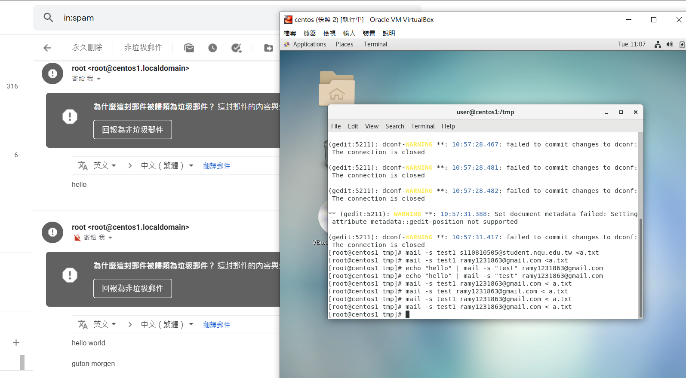
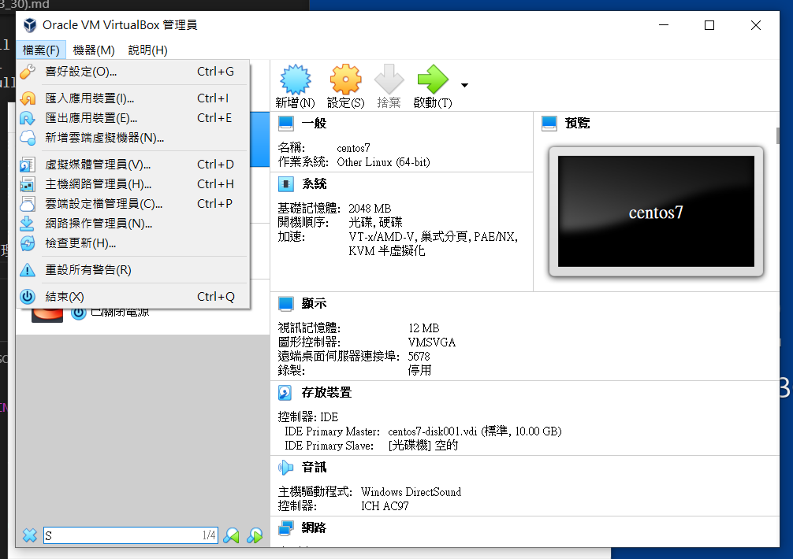
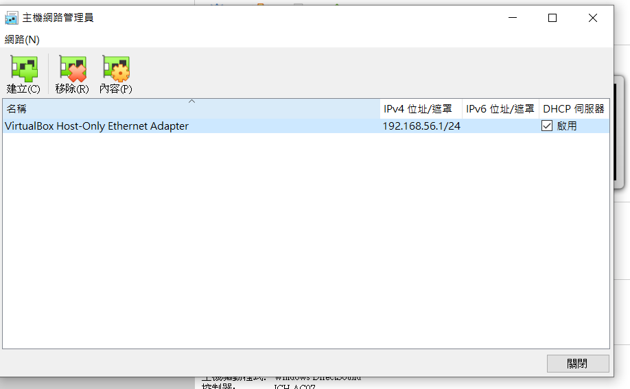

* `pwd`:相要知道現在在哪裡
* `echo $PWD`:相要知道現在在哪裡
* `touch a.txt`:創建一個空白檔案
* `echo $?`:知道程式執行有沒有成功

### 檔案管理
* /etc :Linux中最重要目錄之一，主要系統設定，配置和使用者的密碼
* /sbin:超級使用者的使用檔
* /dev:存放裝置和目錄
* 絕對路徑 vs 相對路徑
>* 絕對路徑:由根目錄開始描述的檔案(e.g: ls -al /tmp/a.txt)
>* 相對路徑:(e.g:ls -al ../../tmp/a.txt)

### 運用linux寄信到信箱
* `echo "hello" | mail -s "test" ramy1231863@gmail.com`:寄test裡面內容為hello給別人
* `mail -s test1 ramy1231863@gmail.com < a.txt`:可以順利將郵件寄給別人
，這個是腳本的傳送方式 
* 以下為成功的結果

### 當發生hostonly錯誤時，找不到網路卡，解決方法
* 在virtualbox --> 檔案 -- >主機網路管理員

* 按下建立，它就會自動幫我們建立，然後按下DHCP伺服器，接者，就可以順利打開了，假設，還是開不了，建議再從新關機，再開機

