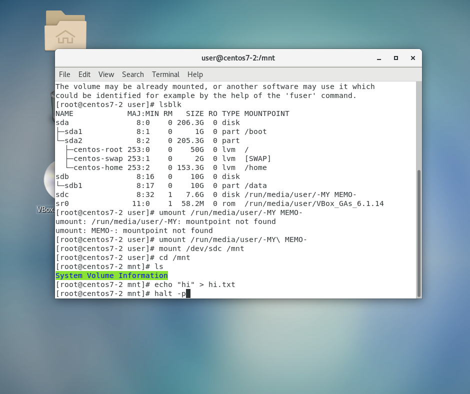
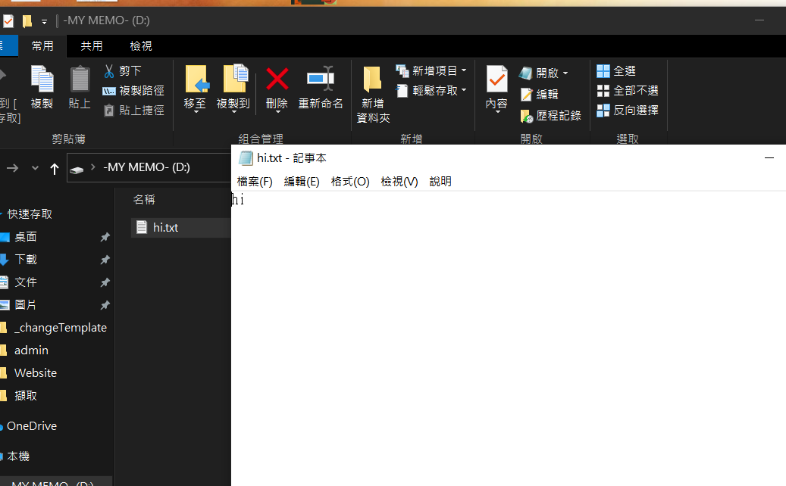
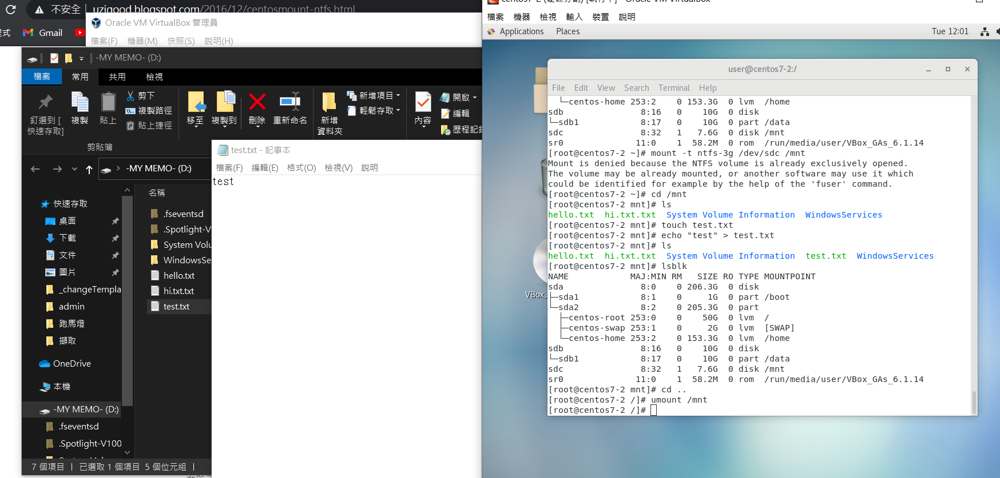
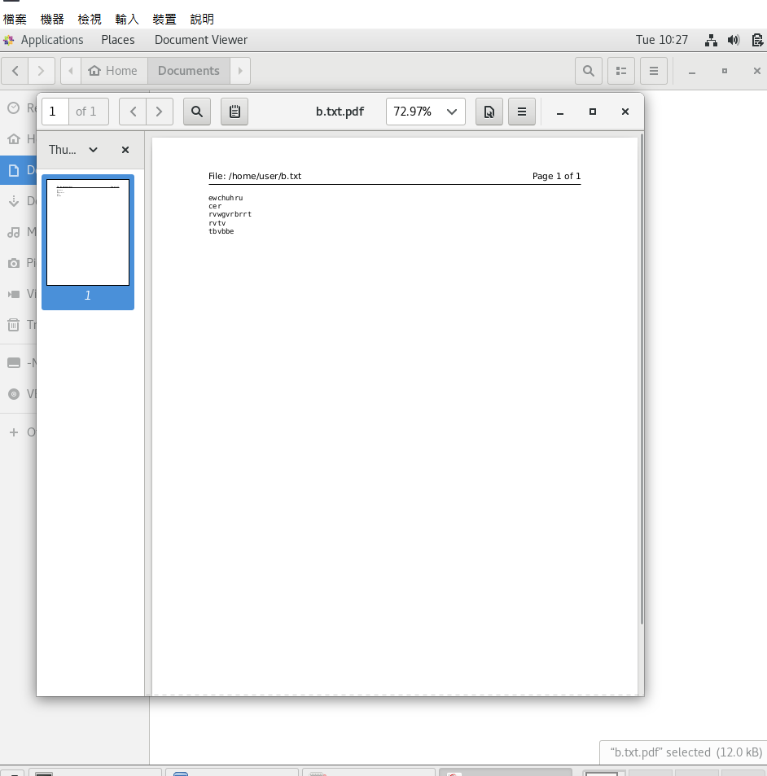

## USB mount 到 linux上
### (1)使用NTFS類型來mount到Linux上
* 首先先`lsblk`來確認是否有掛載到?
* 我這個有成功掛載是sdc
* 先把已經綁訂的地方卸載`umount /run/media/user/-MY\ MEMO-`
* 接者掛載到我們想要的位置`mount /dev/sdc /mnt`
* 切到我們想要的位置`cd /mnt`
* `ls`:看看現在USB底下的東西，目前是空的
* `echo "hi" > hi.txt`:創建一個hi.txt的資料夾，並寫入hi到裡面
* `halp -p`:做關機的動作，接者到windows該USB check

* 就可以成功看到我們所創建的hi.txt及裡面內容

### (2)使用FAT32類型來mount到Linux上
* 先`yum install ntfs-3g`來安裝
* 如果不行先做`yum install -y epel-release`
* 然後在做`yum install -y ntfs-3g`
* `mount -t ntfs-3g" /dev/sdc /mnt`:來掛載ntf
* 切到/mnt:`cd /mnt`
* `touch test.txt`:建立一個資料夾
* `echo "test" > test.txt`:把test放到test.txt中
* `cd ..`:要先離開/mnt才能卸載
* `umount /mnt`:卸載它
* 在旁邊就看到結果了，成功寫入到USB中

## 匯出PDF
* 先做`yum install cups-pdf`
* 先touch 一個b.txt
* 然後在`gedit b.txt`
* 接者編輯
* 然後在`gedit b.txt`
* 然後exit
* 然後在旁邊按下有印表機的符號print出來
* 然後就可以成功匯出PDF格式了
