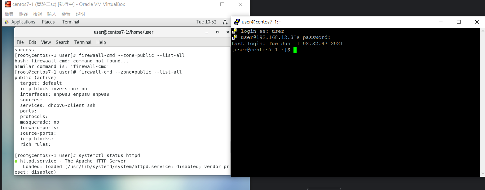
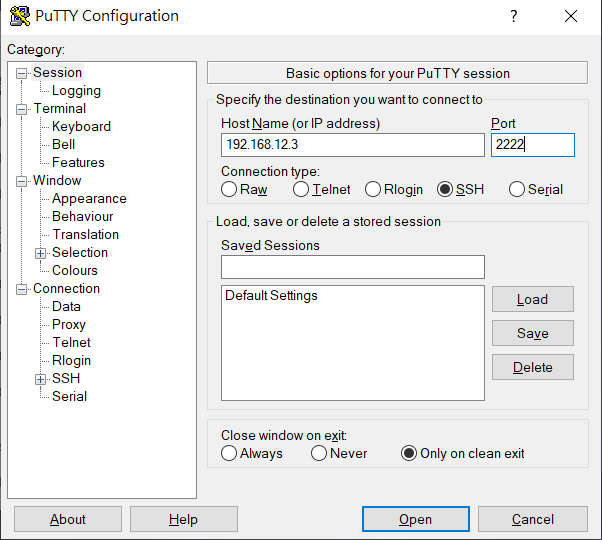
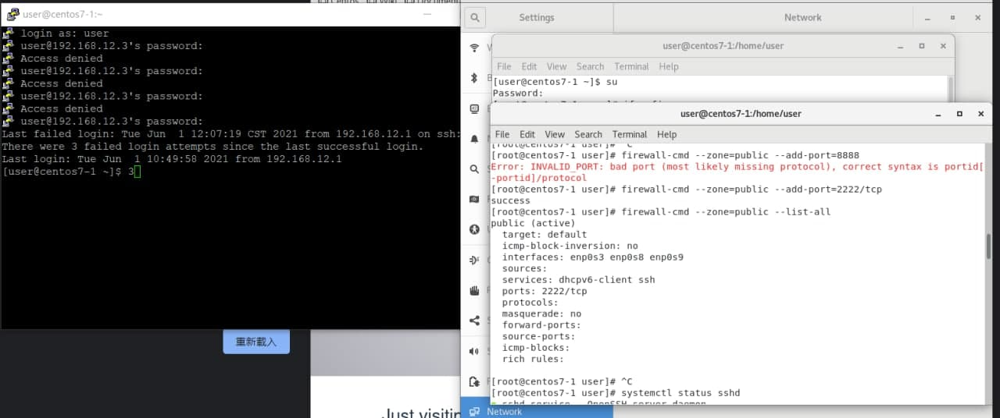
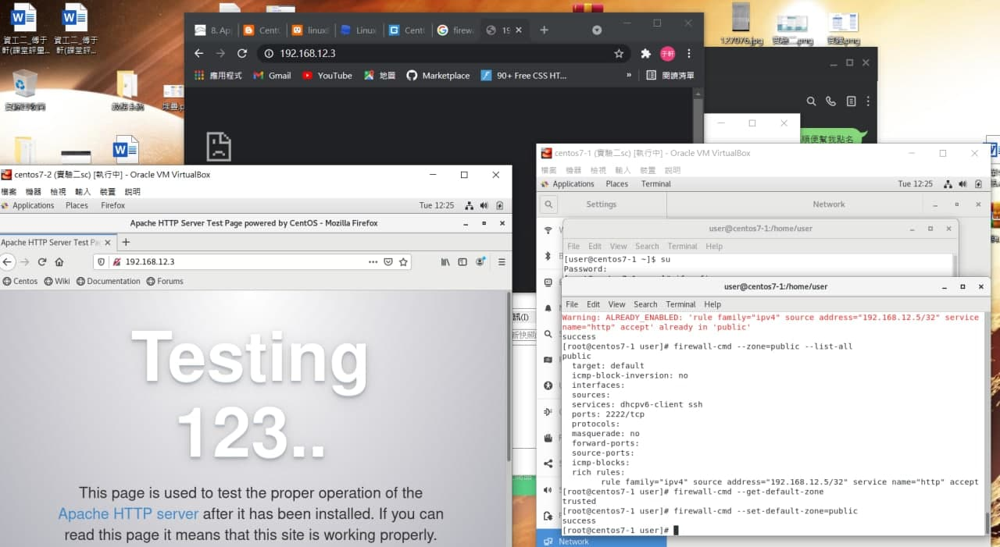

## 使用putty可以連線
* 使用 `systemctl start httpd` 去打開httpd

* 輸入 `systemctl status httpd` 確認httpd是否打開，耴果有打開會有以下結果

    ```
    ● httpd.service - The Apache HTTP Server
    Loaded: loaded (/usr/lib/systemd/system/httpd.service; disabled; vendor preset: disabled)
    Active: active (running) since Tue 2021-06-01 21:28:25 CST; 2s ago
        Docs: man:httpd(8)
            man:apachectl(8)
    Main PID: 3401 (httpd)
    Status: "Processing requests..."
        Tasks: 6
    CGroup: /system.slice/httpd.service
            ├─3401 /usr/sbin/httpd -DFOREGROUND
            ├─3406 /usr/sbin/httpd -DFOREGROUND
            ├─3407 /usr/sbin/httpd -DFOREGROUND
            ├─3408 /usr/sbin/httpd -DFOREGROUND
            ├─3409 /usr/sbin/httpd -DFOREGROUND
            └─3410 /usr/sbin/httpd -DFOREGROUND

    Jun 01 21:28:24 centos7-3 systemd[1]: Starting The Apache HTTP Server...
    Jun 01 21:28:25 centos7-3 httpd[3401]: AH00558: httpd: Could not reliably d...ge
    Jun 01 21:28:25 centos7-3 systemd[1]: Started The Apache HTTP Server.
    Hint: Some lines were ellipsized, use -l to show in full.

    ```

* 使用 `firewall-cmd --zone=public --list-all` 可以列出zone的詳細設定

* 使用 `firewall-cmd --zone=public --list-all` 

    

## 更改port為2222
* `firewall-cmd --zone=public --add-port=2222/tcp`:設定Port為2222

    * 執行結果

    ```
    [root@centos7-1 user]# firewall-cmd --zone=public --add-port=2222/tcp
    success
    ```
* ` firewall-cmd --zone=public --list-all` :可以看到是否讓port=2222可以通過防火牆

    * 執行結果

    ```
        [root@centos7-1 user]# firewall-cmd --zone=public --list-all
    public (active)
    target: default
    icmp-block-inversion: no
    interfaces: enp0s8 enp0s9
    sources: 
    services: dhcpv6-client http ssh
    ports: 2222/tcp
    protocols: 
    masquerade: no
    forward-ports: 
    source-ports: 
    icmp-blocks: 
    rich rules: 
    ```
* putty連進去，輸入他的IP(enp0s8(僅限主機介面卡))


* 接者，打上user然後輸入user的密碼就可以直皆通過了


## windows不可連，linux可連
* `firewall-cmd --zone=public --add-rich-rule 'rule family="ipv4" source address="192.168.12.5/32" service name="http" accept'` :設定另一台虛擬機可以通過防火牆去存取http伺服器

    ```
    [root@centos7-1 user]# firewall-cmd --zone=public --add-rich-rule 'rule family="ipv4" source address="192.168.12.5/32" service name="http" accept'

    success
    ```

* `firewall-cmd --zone=public --list-all` :看看現在防火牆狀況

    ```
    [root@centos7-1 user]# firewall-cmd --zone=public --list-all
    public (active)
    target: default
    icmp-block-inversion: no
    interfaces: enp0s3 enp0s8 enp0s9
    sources: 
    services: dhcpv6-client http ssh
    ports: 2222/tcp
    protocols: 
    masquerade: no
    forward-ports: 
    source-ports: 
    icmp-blocks: 
    rich rules: 
        rule family="ipv4" source address="192.168.12.5/32" service name="http" accept
    ```

* `systemctl start httpd` :打開httpd伺服器

* `systemctl status httpd` :確認是否打開
    ```
    [root@centos7-1 user]# systemctl status httpd
    ● httpd.service - The Apache HTTP Server
    Loaded: loaded (/usr/lib/systemd/system/httpd.service; disabled; vendor preset: disabled)
    Active: active (running) since Fri 2021-06-04 21:27:07 CST; 7s ago
        Docs: man:httpd(8)
            man:apachectl(8)
    Main PID: 11609 (httpd)
    Status: "Processing requests..."
        Tasks: 6
    CGroup: /system.slice/httpd.service
            ├─11609 /usr/sbin/httpd -DFOREGROUND
            ├─11614 /usr/sbin/httpd -DFOREGROUND
            ├─11615 /usr/sbin/httpd -DFOREGROUND
            ├─11616 /usr/sbin/httpd -DFOREGROUND
            ├─11617 /usr/sbin/httpd -DFOREGROUND
            └─11618 /usr/sbin/httpd -DFOREGROUND

    Jun 04 21:27:07 centos7-1 systemd[1]: Starting The Apache HTTP Server...
    Jun 04 21:27:07 centos7-1 httpd[11609]: AH00558: httpd: Could not reliably det...ge
    Jun 04 21:27:07 centos7-1 systemd[1]: Started The Apache HTTP Server.
    Hint: Some lines were ellipsized, use -l to show in full.

    ```

* 在另外一台電腦輸入他的port號就可以順利連上去

