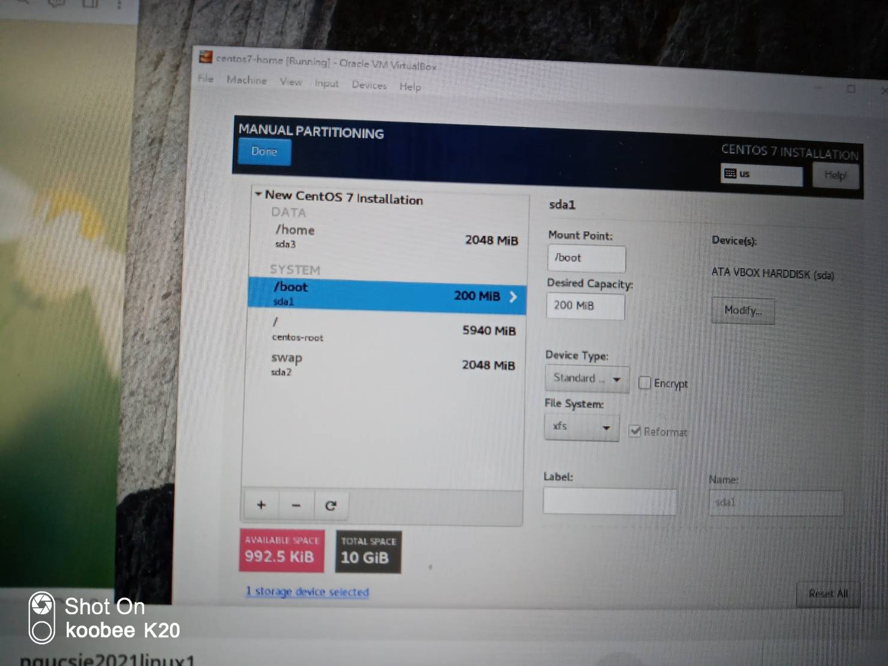
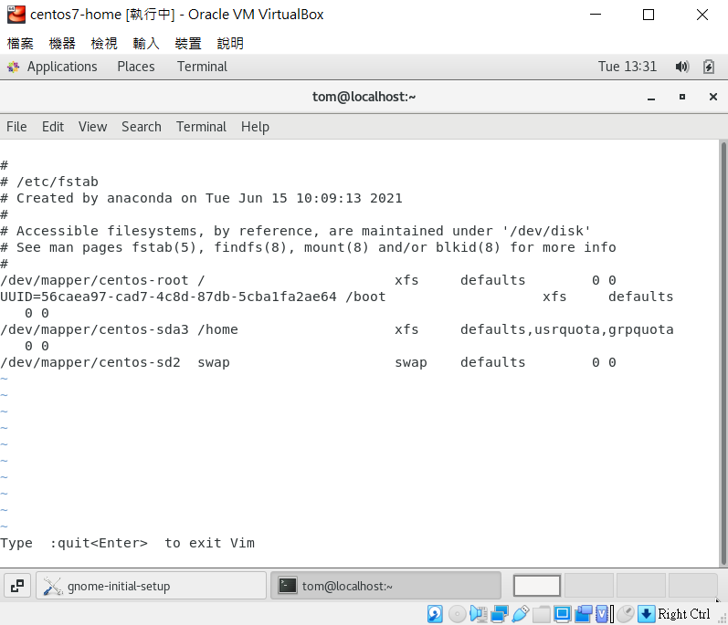
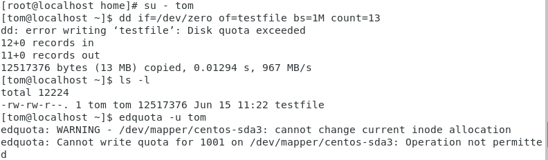
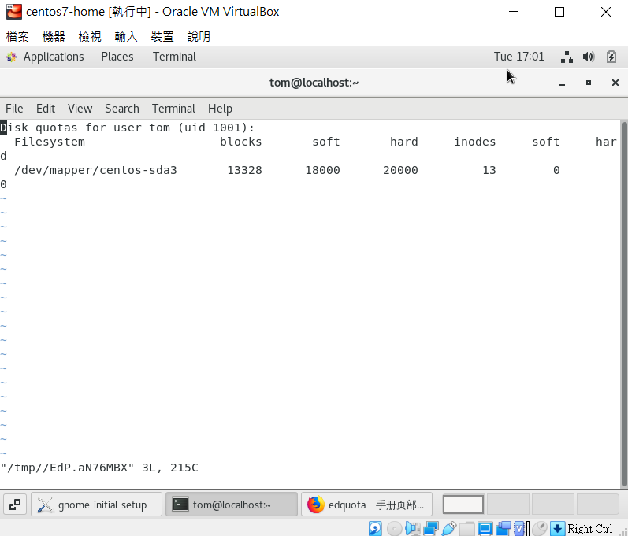
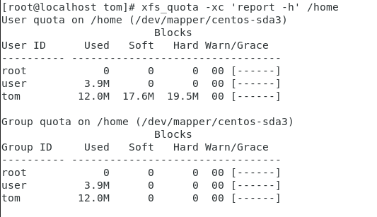
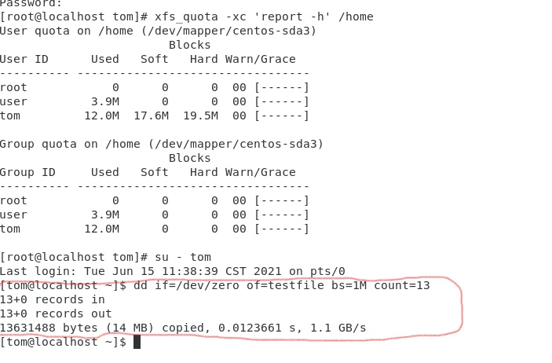

# 設定與管理磁碟配額quota

## 實驗一，如何手動切割分割區

*  首先要重新配置一台虛擬機並在設置時，分割區這樣設置

    

* 打開虛擬機，先`vi /etc/fstab` 在`/dev/mapper/centos-sda3 /home`的後面的`defaults`後面加上`usrquota,grpquota`如下圖所示
    

接者，`mount | grep /home`會看到以下結果
```
/dev/mapper/centos-sda3 on /home type xfs (rw,relatime,seclabel,attr2,inode64,usrquota,grpguota)
```

* 假設沒有看到`usrquota,grpguota`在最後那就`reboot`一次

* 接下來，增加使用者，使用`useradd tom`，然後增加密碼`passwd tom`

* 在/home中就可以看到目前有哪些使用者

* 接者`su - tom`進入到tom這個使用者

* 接下來，試試看改變一下硬碟空間`dd if=/dev/zero of=testfile bs=1M count=13`

* 但是會失敗，因為他沒權限，所以就會出現以下訊息



* 接下來輸入`su`進入超級使用者並輸入`edquota -u tom`就可以更改磁碟大小，如下圖所示，我將soft更改為18000，hardware變成20000
    


* 接下來輸入`xfs_quota -xc 'report -h' /home`看到剛剛所更改的空間
    

*  最後輸入 `su - tom` 在 `dd if=/dev/zero of=testfile bs=1M count=13`就看到我們成功配置了


---
*** 參考網址 ***

https://www.linuxtechi.com/enable-user-group-disk-quota-on-centos-7-rhel-7/