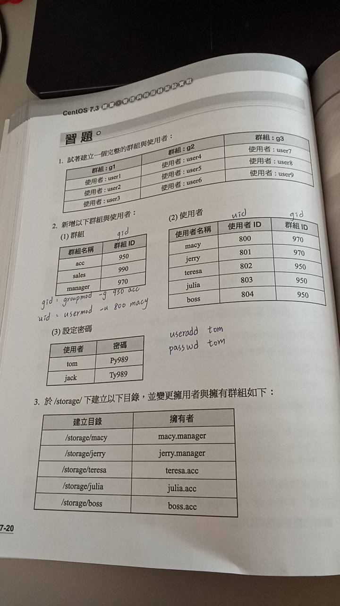
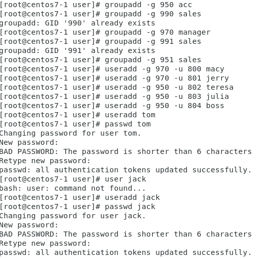
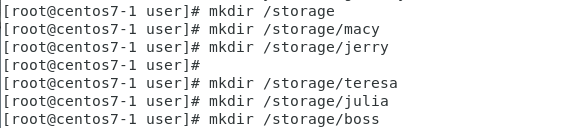

# 題目


# 答案
## 1.適者建立完整的群組
* 新增群組使用:`group 群組名稱`
```
groupadd g1
groupadd g2
groupadd g3
```
* 建立新帳號並指定已存在的群組
* `-g`可以指定新建立帳號並指定群組
* `useradd -g 群組`
```
useradd -g g1 user1
useradd -g g1 user2
useradd -g g1 user3
useradd -g g2 user4
useradd -g g2 user5
useradd -g g2 user6
useradd -g g3 user7
useradd -g g3 user8
useradd -g g3 user9
```
* 結果截圖


## 2新增以下群組與使用者
### (1)
* 新增群組並社群組ID(GID)
* `groupadd -g GID 群組名`
```
groupadd -g 950 acc
groupadd -g 951 sales   //我在這邊使用951是因為990在我這已被使用過了
groupadd -g 970 manager
```
### (2)
* 新增使用者到指定群組並更改使用者ID(UID)
* `useradd -g GID -u UID 使用者`
```
useradd -g 970 -u 800 macy
useradd -g 970 -u 801 jerry
useradd -g 950 -u 802 teresa
useradd -g 950 -u 803 julia
useradd -g 950 -u 804 boss
```
### (3)
* 新增使用者，並設定密碼
```
useradd tom
passwd tom
useradd jack
passwd jack
```



## 3.新增以下群組與使用者到/storage，並變更擁有者與擁有群組
### (1)於storage下建立以下目錄
* 以絕對路徑建立目錄
```
mkdir /storage/macy
mkdir /storage/jerry
mkdir /storage/teresa
mkdir /storage/julia
mkdir /storage/boss
```


### (3)_2變更擁有者與擁有群組
* 變更檔案擁有者
```
chown macy:manager /storage/macy
chown jerry:manager /storage/jerry
chown teresa:acc /storage/teresa
chown julia:acc /storage/julia
chown boss:acc /storage/boss
```
* 最後在`ls -l`就可以看到結果
