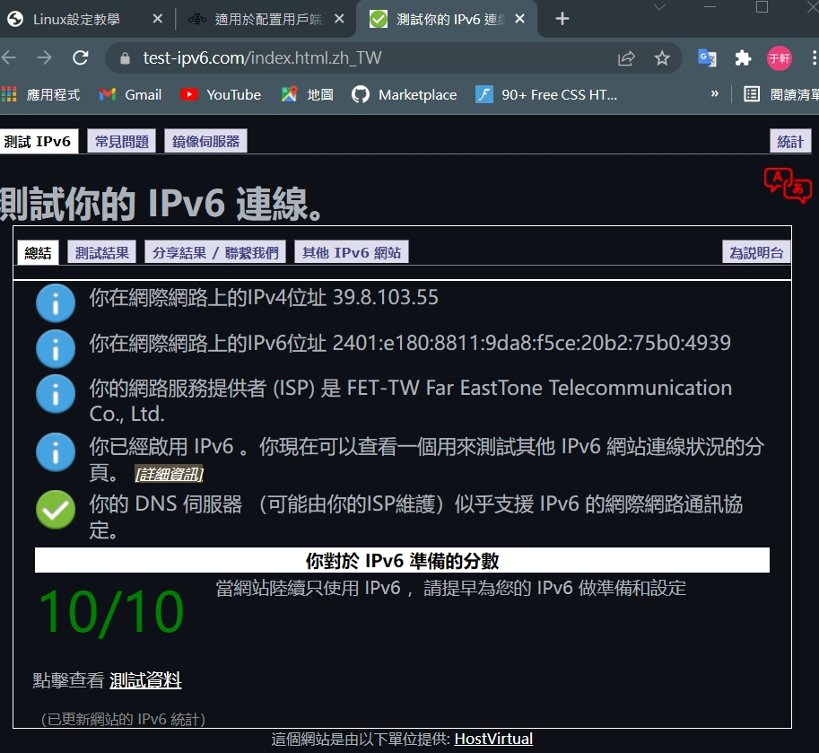
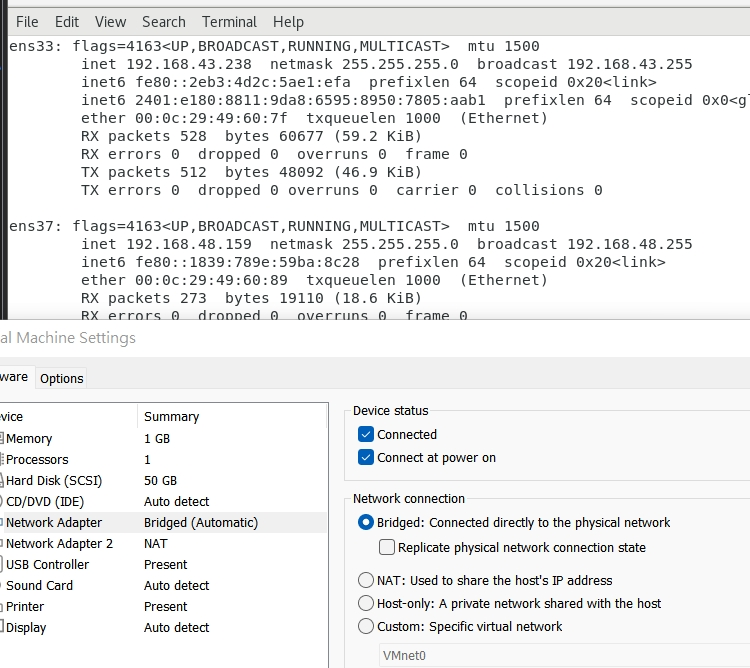
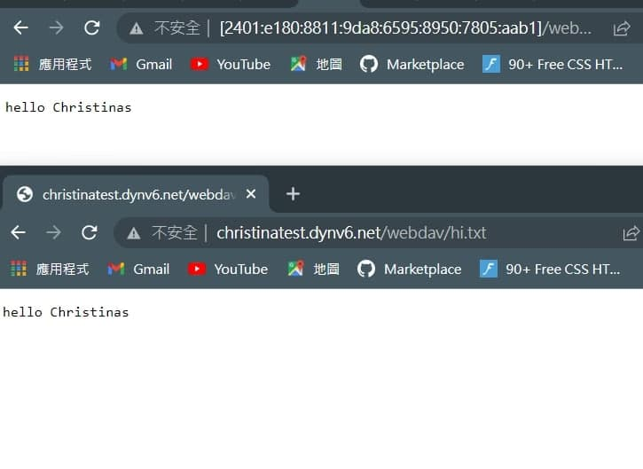

# for linux
1. 首先需要在/var/www/html裡面創建webdav及hi.txt
    ```
    cd /var/www/html
    mkdir webdav
    cd webdav
    vi hi.txt

    ```
# IpV6從windows連接到Linux
1. 首先，將電腦網路連接到自己的手機網路

2. 並且，對手機及電腦進行測試，並確認是否能使用IpV6(我的遠傳是可以使用的)

    * [測試網站](https://test-ipv6.com/index.html.zh_TW)
    
    * 當出現以下圖示，表示成功測試支援到IPV6了
     

3. 接著設定linux電腦為橋接器

    

4. 接下來透過IPV6連上網路上，就輸入linux上ipV6的位置，如以下為我的ipv6
http://[2401:e180:8811:9da8:6595:8950:7805:aab1]/webdav/hi.txt  

5. 這種需要一大串的太麻煩了，所以有辦法縮短
去[dynv6](https://dynv6.com/zones)創辦即可使用ipv6的網域

6. 最後就可以使用自己的名稱來去該網域
    * 


---

* 我有遇到的小問題
>* Q: 我的電腦一直都連不上IPV6
>* 但是我怎樣測試，我的電腦都支援IPV6
>* A:老師讓我試試在`vi /etc/sysconfig/network-script`，
加上以下
```
...
...
NETWORKING_IPV6=yes
IPV6_AUTOCONF=yes
```

>* 就順利完成了
