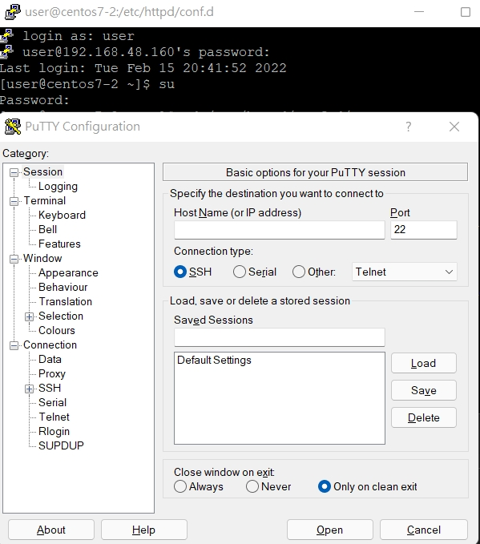
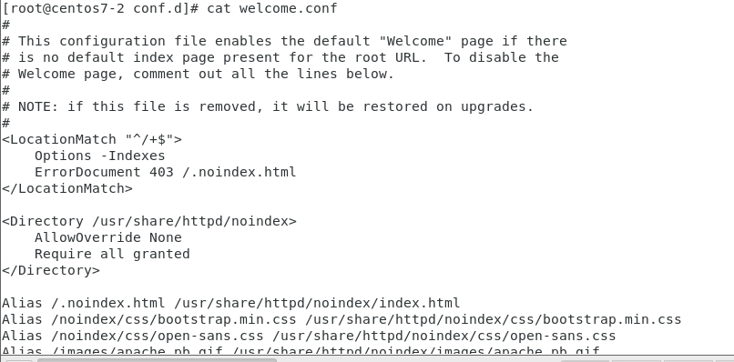
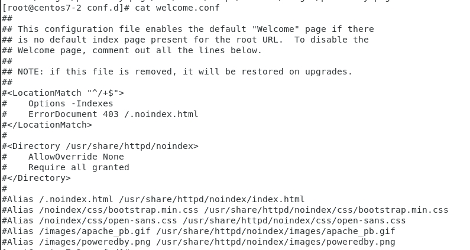

1. 切換到/etc/httpd/conf.d/
    * `cd /etc/httpd/conf.d/`

2. 複製 `welcome.conf` 到 `welcome2.conf`
    * `cp welcome.conf welcome2.conf`

3. 用putty連上這台linux，在IP位置上填上在linux上看到的ip
     

4. 在/etc/httpd/conf.d/welcome.conf地這個文件中全部加上#，如果沒有`-i`表示只會直接表示出來，文件內容沒有改變
    * `sudo sed -i 's/^/#&/g' /etc/httpd/conf.d/welcome.conf`

    * 做這個指令之前
    
    * 做這個指令之後
    

5. 接著，將welcome.conf還原
    * `cp welcome2.conf welcome.conf`
    ```
    [root@centos7-2 conf.d]# cp welcome2.conf welcome.conf
    cp: overwrite ‘welcome.conf’? y
    ```

## 解釋
* `sudo sed -i 's/^/#&/g' /etc/httpd/conf.d/welcome.conf`
* 這邊`'s/^/#&/g'`的s表示取代(substitub)的意思，`^`這個表示已甚麼甚麼所開頭，這邊後面沒寫表示，是每行前面
* 這邊`'s/^/#&/g'`表示/將甚麼東西/取代為甚麼東西/
* 其中，這邊`'s/^/#&/g'`也可以改成`'s#^##&#g'`