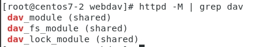
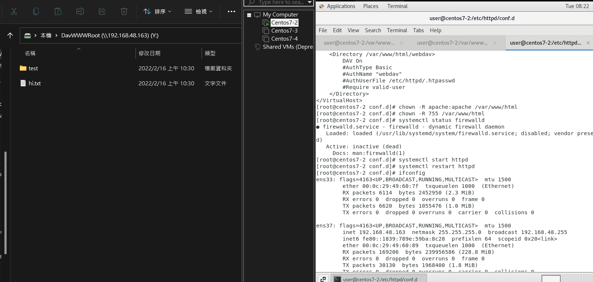

[設立WebDAV 參考資料](https://www.vultr.com/docs/how-to-setup-a-webdav-server-using-apache-on-centos-7/#Step_four__Create_a_virtual_host_for_WebDAV)
# 連接網路磁碟機
1. 安裝所需要的套件包，，用來做第三方的軟體資料庫(主要用來支援PHP，Mysql，Nginx。)，有了這個更方便安裝一些軟體
    * `yum install epel-release`

2. 進行yum的更新
    * `yum update`

3. 安裝套件包httpd(網站伺服器。)
    * `yum install httpd`

4. 檢測使否有支援dav，確認是否開啟
    * httpd -M | grep dav
    * 結果如下
    

5. 創建資料夾
    * `mkdir /var/www/html/webdav`

6. 把擁有者和使用者權限切成apache
    * `chown -R apache:apache /var/www/html`
    * `chmod -R 755 /var/www/html`
7. 編輯webdav.conf
    * `vi /etc/httpd/conf.d/webdav.conf`
    ```
    DavLockDB /var/www/html/DavLock
    <VirtualHost *:80>
        ServerAdmin webmaster@localhost
        DocumentRoot /var/www/html/webdav/
        ErrorLog /var/log/httpd/error.log
        CustomLog /var/log/httpd/access.log combined
        Alias /webdav /var/www/html/webdav
        <Directory /var/www/html/webdav>
            DAV On
            #AuthType Basic
            #AuthName "webdav"
            #AuthUserFile /etc/httpd/.htpasswd
            #Require valid-user
            </Directory>
    </VirtualHost>
    ```

9.  最後再重新啟動httpd
    * `systemctl restart httpd.service`

10. 最後打開windows的網路磁碟機，連上linux的ip位置，輸入http:\\192.168.48.163

11. 最後，就會顯示以下之圖片
    * 


// 本次遇到小問題
// 當出現Another app is currently holding the yum lock; waiting for it to exit...
//可以使用rm -f /var/run/yum.pid 來處理，因為使用kill似乎無法解決此問題