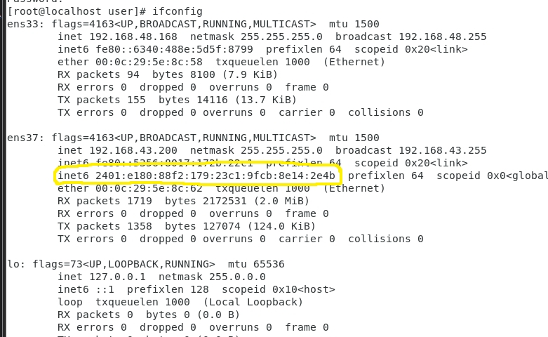
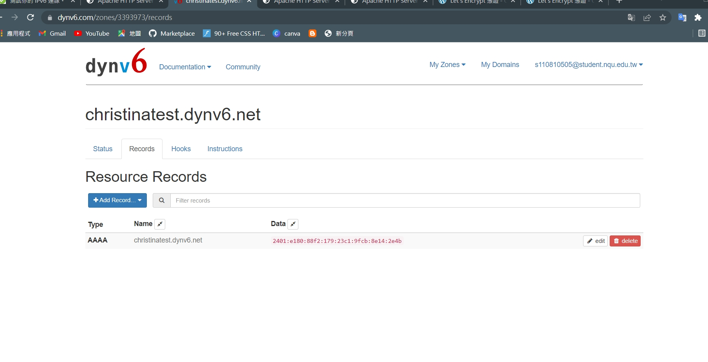
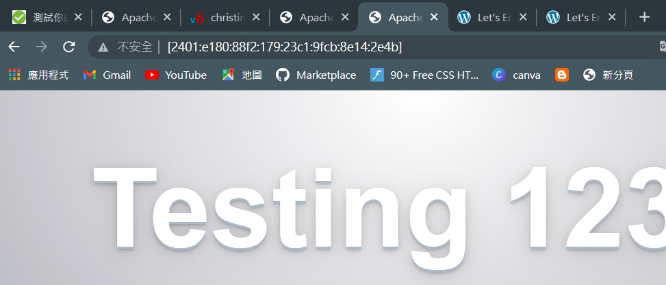
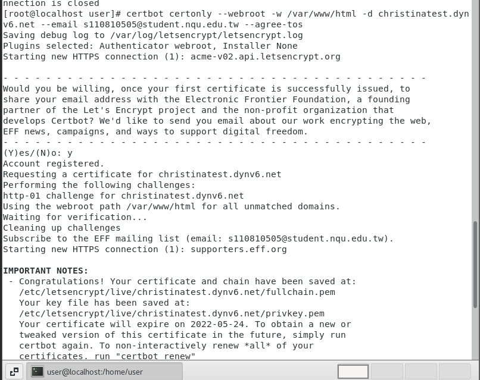

# 建立憑證並且連上https
1. 首先，先確認已經順利連上IPV6，並找到其位置


2. 接著，在[dynv6](https://dynv6.com/zones/3393973/records)上申請網域


3. 測試是否可以用IPV6


4. 申請IPV6的憑證
    * `certbot certonly --webroot -w /var/www/html -d christinatest.dynv6.net --email s110810505@student.nqu.edu.tw --agree-tos`

    * 

5. 更換憑證
    * 降certbot生成的.pem檔，更新至 /etc/httpd/conf.d/ssl.conf的 SSLCertificateFile、SSLCertificateKeyFile及SSLCACertificateFile 進行更改

    * `gedit /etc/httpd/conf.d/ssl.conf`

    ```
    SSLCertificateFile /etc/letsencrypt/live/christinatest.dynv6.net/cert.pem
    SSLCertificateKeyFile /etc/letsencrypt/live/christinatest.dynv6.net/privkey.pem
    SSLCACertificateFile /etc/letsencrypt/live/christinatest.dynv6.net/fullchain.pem
    ```


6. 重新啟動網頁伺服器(httpd)
    * `systemctl restart httpd`

7. 就可以開始使用https進行安全連線
    * https://christinatest.dynv6.net/webdav/hi.txt

