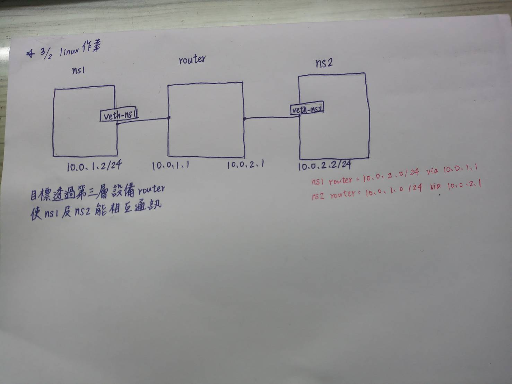
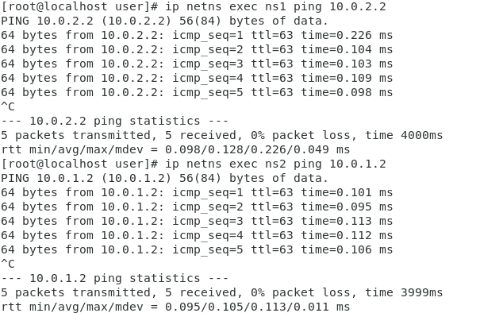

# 使用router使ns1及ns2能夠相互通訊
[參考網址](https://www.zhaohuabing.com/post/2020-03-12-linux-network-virtualization/)

1. 首先需要創建3個namespace
    ```
    ip netns add ns1
    ip netns add ns2
    ip netns add router
    ```

2. 創建veth pair，透過veth pair 將ns1和ns2連接在router上
    ```
    ip link add veth-ns1 type veth peer name veth-ns1-router
    ip link set veth-ns1 netns ns1
    ip link set veth-ns1-router netns router

    ip link add veth-ns2 type veth peer name veth-ns2-router
    ip link set veth-ns2 netns ns2
    ip link set veth-ns2-router netns router
    ```

3. 設定虛擬網卡IP位置，ns1和ns2
    ```
    ip -n ns1 addr add 10.0.1.2/24 dev veth-ns1
    ip -n ns2 addr add 10.0.2.2/24 dev veth-ns2
    ip -n router addr add 10.0.1.1/24 dev veth-ns1-router
    ip -n router addr add 10.0.2.1/24 dev veth-ns2-router
    ```

4. 將網卡的狀態設定為up
    ```
    ip -n ns1 link set veth-ns1 up
    ip -n ns2 link set veth-ns2 up
    ip -n router link set veth-ns1-router up
    ip -n router link set veth-ns2-router up
    ```

5. 嘗試連連看主機，但連不上，因為ns2的IP不在ns1的子網路上
    ```
    ip netns exec ns1 ping 10.0.2.2
    ```


6. 我們在ns1和ns2中分別加到達對方子網路的路由
    ```
    ip netns exec ns1 ip route add 10.0.2.0/24 via 10.0.1.1
    ip netns exec ns2 ip route add 10.0.1.0/24 via 10.0.2.1
    ```

7. 此時在用兩個ns中嘗試ping2對方，就可以成功了
    ```
    ip netns exec ns1 ping 10.0.2.2
    和
    ip netns exec ns2 ping 10.0.1.2
    ```

