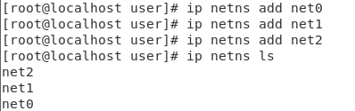
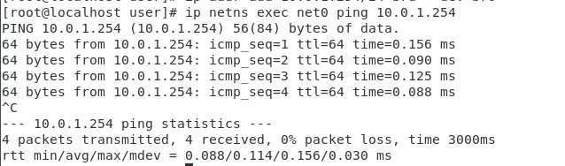

# note
docker:輕量級虛擬化技術，運用隔離的概念，可以切成到很多空間
virtual box, vmvare:中量級虛擬化技術

新增一個ip namespace
ip netns add net1
ip netns exec net1 ip add 想要在ip 

```
root@localhost user]# ip netns add net1
[root@localhost user]# ip netns ls

```
顯示所有資訊:ip netns exec net1 ifconfig
觀看詳細資料:ip netns exec net1 ip addr
顯示所有資訊:ip netns exec net1 ifconfig -a
啟動:ip netns exec net1 ifconfig lo up

---

1. 新增一個ip namespace :ip netns add net0
2. 新增另一個ip namespace :ip netns add net1
3. 顯示目前所有的ip namespace:ip netns ls
4. 新增一個區域:ip link add type veth
5.
```
ip link set veth0 netns net0
ip link set veth1 netns net1
```
6.
```
ip netns exec net0 ip link set dev veth0 name eth
ip netns exec net1 ip link set dev veth1 name eth
```
7.
```
ip netns exec net0 ip addr add 10.0.1.1/24 brd + dev eth0
ip netns exec net1 ip addr add 10.0.1.2/24 brd + dev eth1
```
8.
```
ip netns exec net0 ifconfig eth0 up
ip netns exec net0 ifconfig eth1 up
```
9. 
```
ip netns exec net0 ping 10.0.1.2
```
10. 
```
ip netns exec net1 echo "hi" > hi.htm
ip netns exec net1 python -m SimpleHTTPServer 80
```

11. 開啟這台的另一個 windows 
ip netns exec net0 curl http://10.0.1.2/hi.htm

---
[參考資料](https://segmentfault.com/a/1190000018391069)
1. 創建3個namespace
    ```
    ip netns add net0
    ip netns add net1
    ip netns add net2
    ```

    

2. 創建一對veth pair出來，3個 namespace，3個pair
    ```
    ip link add typ veth
    ip link add typ veth
    ip link add typ veth
    ```
3. 將veth1放到net3和veth1放到net1，及veth5放到net2...
```
ip link set veth1 netns net0
ip link set veth3 netns net1
ip link set veth5 netns net2
```
4. 將veth pair 一頭掛namespace，一頭掛bridge並設定IP
```
ip netns exec net0 ip link set dev veth1 name eth0
ip netns exec net0 ip addr add 10.0.1.1/24 dev eth0
ip netns exec net0 ifconfig eth0 up
ip netns exec net0 ifconfig
ip netns exec net1 ip link set dev veth3 name eth0
ip netns exec net1 ip addr add 10.0.1.2/24 dev eth0
ip netns exec net1 ifconfig eth0 up
ip netns exec net1 ifconfig
ip netns exec net2 ip link set dev veth5 name eth0
ip netns exec net2 ip addr add 10.0.1.3/24 dev eth0
ip netns exec net2 ifconfig eth0 up
ip netns exec net2 ifconfig
```
5. 安裝bridge-utils
```
yum install bridge-utils
```

6. `brctl -h`查看指令
```
[root@localhost user]# brctl -h
Usage: brctl [commands]
commands:
	addbr     	<bridge>		add bridge
	delbr     	<bridge>		delete bridge
	addif     	<bridge> <device>	add interface to bridge
	delif     	<bridge> <device>	delete interface from bridge
	hairpin   	<bridge> <port> {on|off}	turn hairpin on/off
	setageing 	<bridge> <time>		set ageing time
	setbridgeprio	<bridge> <prio>		set bridge priority
	setfd     	<bridge> <time>		set bridge forward delay
	sethello  	<bridge> <time>		set hello time
	setmaxage 	<bridge> <time>		set max message age
	setpathcost	<bridge> <port> <cost>	set path cost
	setportprio	<bridge> <port> <prio>	set port priority
	show      	[ <bridge> ]		show a list of bridges
	showmacs  	<bridge>		show a list of mac addrs
	showstp   	<bridge>		show bridge stp info
	stp       	<bridge> {on|off}	turn stp on/off

```

7. 產生一個bridge，使用addbr
```
brctl addbr br0
```
8. 綁定介面卡(addif = add interface to bridge)(brctl addif + bidge + 綁的介面)
```
brctl addif br0 veth0
brctl addif br0 veth2
brctl addif br0 veth4
```

9. 可以看到br0綁的介面
```
brctl show br0
```
10. 把br0打開
```
ifconfig br0 up
```

11. `ifconfig`
12. veth都打開
```
ifconfig veth0 up
ifconfig veth2 up
ifconfig veth4 up
```
ifconfig 
13. 測試他們是否可以開始通訊
```
ip netns exec net0 ping 10.0.1.2
ip netns exec net0 ping 10.0.1.3
```
14. 給第二層設備bridge一個ip 
```
ip addr add 10.0.1.254/24 brd + dev br0
```
15. 最後ping 10.0.1.254就可以ping到
```
ip netns exec net0 ping 10.0.1.254
```



-----
[參考網址](https://cwhu.medium.com/docker-tutorial-101-c3808b899ac6)
Image像是檔案
Container當Image跑起來時就是Container
Repository:存放Image黨的地方，類似一個小型倉庫，可以自己架設自己的倉庫

docker使用了很多的隔離技術，就會看起來更像獨離的主機
* process id = 1 是SystemD

[安裝docker](https://docs.docker.com/engine/install/centos/)

docker 一定要讓它持續跑(執行至少一件事情)，如果停下來就會結束

顯示出現在所有在執行的程式: `docker ps -a`
docker要刪除ps可以使用container id 或是 name來刪除(建議使用container id來珊，因為可以只打上前面幾個id就可刪除): 例如`docker rm 433`,
```
[root@localhost user]# docker ps -a
CONTAINER ID   IMAGE         COMMAND       CREATED          STATUS                      PORTS     NAMES
433c34b64b43   ubuntu        "bash"        4 minutes ago    Exited (0) 3 minutes ago              nice_khayyam
bec980f1ae4e   ubuntu        "echo bash"   6 minutes ago    Exited (0) 6 minutes ago              silly_chatterjee
f86b4bdbac69   ubuntu        "echo hi"     6 minutes ago    Exited (0) 6 minutes ago              thirsty_lamport
0608baafbd55   ubuntu        "echo hi"     6 minutes ago    Exited (0) 6 minutes ago              xenodochial_germain
c492f623d1d4   hello-world   "/hello"      13 minutes ago   Exited (0) 13 minutes ago             kind_dirac
e52f0461fde7   hello-world   "/hello"      13 minutes ago   Exited (0) 13 minutes ago             distracted_chatelet
[root@localhost user]# docker rm 433
433
[root@localhost user]# docker ps -a
CONTAINER ID   IMAGE         COMMAND       CREATED          STATUS                      PORTS     NAMES
bec980f1ae4e   ubuntu        "echo bash"   6 minutes ago    Exited (0) 6 minutes ago              silly_chatterjee
f86b4bdbac69   ubuntu        "echo hi"     7 minutes ago    Exited (0) 6 minutes ago              thirsty_lamport
0608baafbd55   ubuntu        "echo hi"     7 minutes ago    Exited (0) 7 minutes ago              xenodochial_germain
c492f623d1d4   hello-world   "/hello"      13 minutes ago   Exited (0) 13 minutes ago             kind_dirac
e52f0461fde7   hello-world   "/hello"      14 minutes ago   Exited (0) 14 minutes ago             distracted_chatelet
 
```