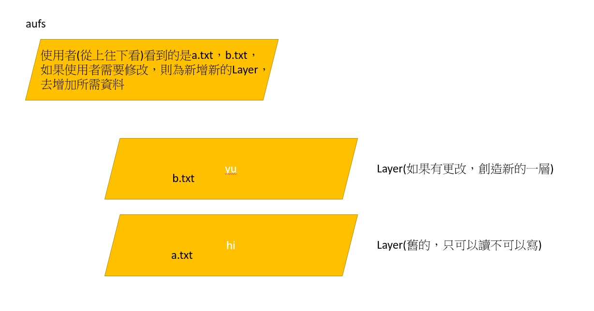
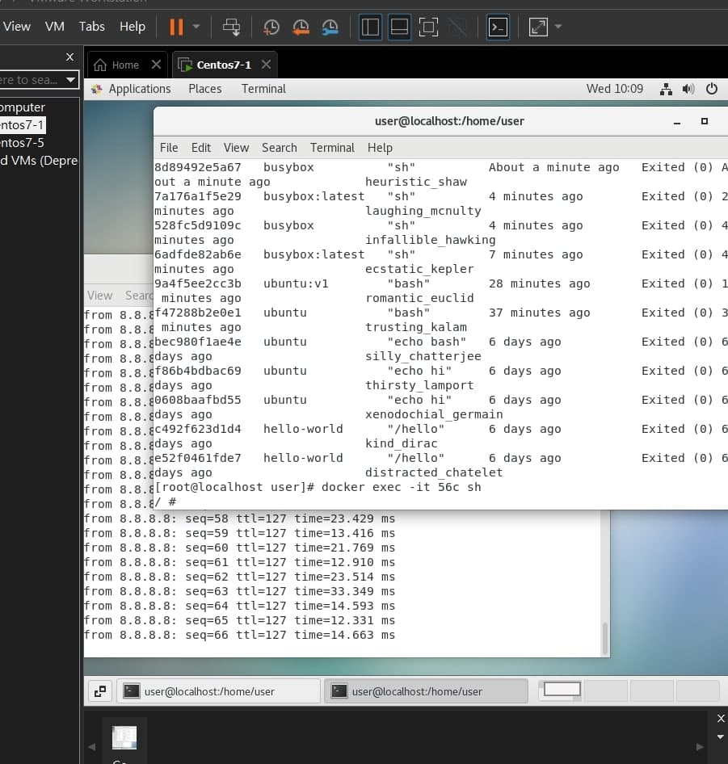
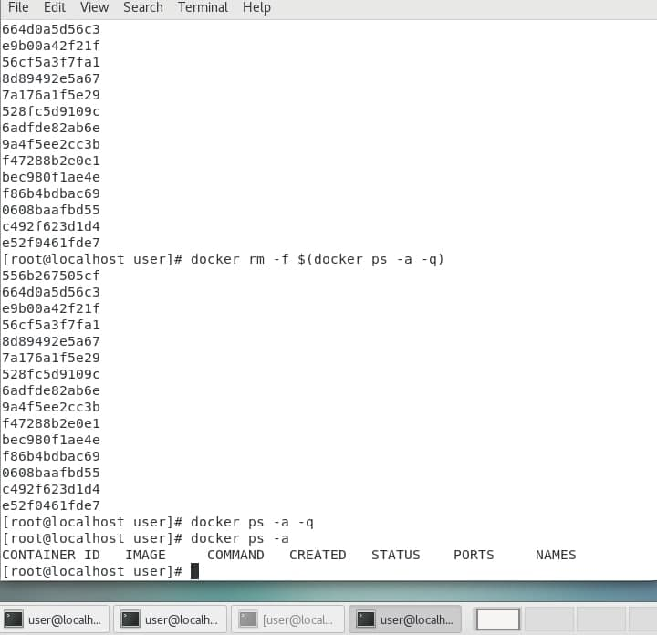
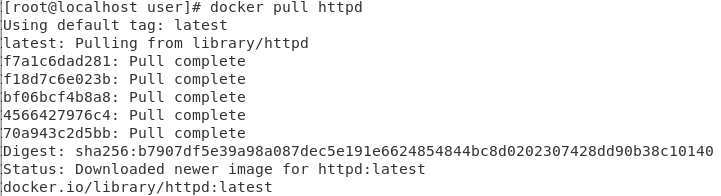
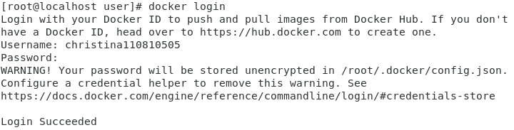
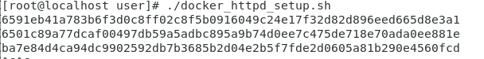
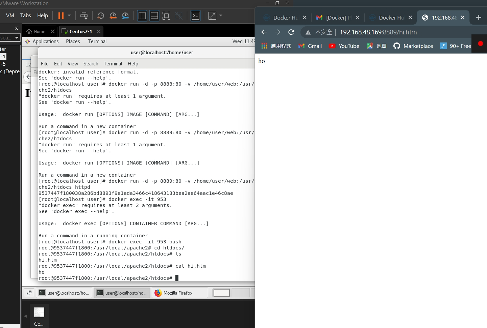

docker所使用的網路系統為一層一層的網路架構

* aufs
    

---

# docker保存鏡像
1. systemctl start docker : 先啟動docker

2. docker images : 看看現在docker的images

```
[root@localhost user]# docker images
REPOSITORY    TAG       IMAGE ID       CREATED        SIZE
ubuntu        latest    54c9d81cbb44   4 weeks ago    72.8MB
hello-world   latest    feb5d9fea6a5   5 months ago   13.3kB
```
3. 跑起docker
```
 [root@localhost user]# docker run -it ubuntu bash

```
4. ls，顯示全部
```
root@6d95e0b3d05a:/# ls
bin   dev  home  lib32  libx32  mnt  proc  run   srv  tmp  var
boot  etc  lib   lib64  media   opt  root  sbin  sys  usr

```

5. 切到/home目錄
```
root@6d95e0b3d05a:/# cd /home/

```

6. ls
```
root@6d95e0b3d05a:/home# ls
```

7. 創建一個文件，裡面加上一些內容
```
root@6d95e0b3d05a:/home# echo "hi" > hi.txt
root@6d95e0b3d05a:/home# cat hi.txt
hi
root@6d95e0b3d05a:/home# ls
hi.txt

```

8. ctrl+q,ctrl+p:暫時中離

9. 複製一個ubuntu`docker commit 6d9 ubuntu:v1`

10. docker images
```
[root@localhost user]# docker commit 6d9 ubuntu:v1
sha256:cb04d1bd239a051ab9317dca052b8a81546485c064f61f631d739a487af21a12
[root@localhost user]# docker images
REPOSITORY                  TAG       IMAGE ID       CREATED          SIZE
ubuntu                      v1        cb04d1bd239a   11 seconds ago   72.8MB
christina110810505/ubuntu   v1        9d68aacc6a22   14 hours ago     72.8MB
busybox                     latest    829374d342ae   4 days ago       1.24MB
httpd                       latest    faed93b28859   8 days ago       144MB
ubuntu                      latest    54c9d81cbb44   5 weeks ago      72.8MB
hello-world                 latest    feb5d9fea6a5   5 months ago     13.3kB

```

11. docker stop 6d9

12. docker rm 6d9
```
[root@localhost user]# docker stop 6d9
6d9
[root@localhost user]# docker rm 6d9
6d9

```
13. docker run -it cb0
14. cd /home
15. ls
16. `cat hi.txt`這時候，就可以看到剛剛保留的鏡像
```
[root@localhost user]# docker run -it cb0
root@c762d085a3fc:/# cd /home/
root@c762d085a3fc:/home# ls
hi.txt
root@c762d085a3fc:/home# cat hi.txt
hi

```


---
# 在新的tab中執行另外一個docker
>* 在linux開啟一個終端
1. docker pull busybox
2. docker images
3. docker run -it busybox:latest
4. docker run -it busybox sh

>* 在同一台linux新的tab中 
5. docker images
6. docker ps -a

7. docker exec -it 55c sh



* 這樣就順利完成在另外一個終端機上開一個tab來連

---

# 如何刪除所有執行中的docker
* 現在有需多執行中的docker，如何將其全部刪除
```
[root@localhost user]# docker ps
CONTAINER ID   IMAGE     COMMAND   CREATED          STATUS          PORTS     NAMES
556b267505cf   busybox   "sh"      18 seconds ago   Up 16 seconds             heuristic_hellman
e9b00a42f21f   busybox   "sh"      51 seconds ago   Up 48 seconds             goofy_gauss
[root@localhost user]# docker ps -a -q
556b267505cf
664d0a5d56c3
e9b00a42f21f
56cf5a3f7fa1
8d89492e5a67
7a176a1f5e29
528fc5d9109c
6adfde82ab6e
9a4f5ee2cc3b
f47288b2e0e1
bec980f1ae4e
f86b4bdbac69
0608baafbd55
c492f623d1d4
e52f0461fde7

``` 
* 使用指令`docker rm -f $(docker ps -a -q)`，就可以看到其結果，已將其刪除乾淨了
```
[root@localhost user]# docker ps -a -q
[root@localhost user]# docker ps -a
CONTAINER ID   IMAGE     COMMAND   CREATED   STATUS    PORTS     NAMES
```


---

# 將docker pull 及 push
1. docker pull httpd



2. 先登入docker
>* docker login :登入[docker hib](https://hub.docker.com/)


3. 
docker images
docker tag ubuntu:v1 christina110810505/ubuntu:v1
docker images


```
[root@localhost user]# docker images
REPOSITORY                  TAG       IMAGE ID       CREATED             SIZE
christina/ubuntu            v1        9d68aacc6a22   About an hour ago   72.8MB
christina110810505/ubuntu   v1        9d68aacc6a22   About an hour ago   72.8MB
ubuntu                      v1        9d68aacc6a22   About an hour ago   72.8MB
busybox                     latest    829374d342ae   4 days ago          1.24MB
httpd                       latest    faed93b28859   7 days ago          144MB
ubuntu                      latest    54c9d81cbb44   5 weeks ago         72.8MB
hello-world                 latest    feb5d9fea6a5   5 months ago        13.3kB
```
4. 
* `docker rmi -f 9d6`
* `docker images`
* `docker pull christina110810505/ubuntu:v1`
* `docker images`


---
# 用httpd連線docker
netstat -tunlp | grep 80

docker run -d -p 8888:80 httpd(第一個數字是本地端)
ifconfig


之後再windows和linux上分別輸入ip位址(就可以順利輸入了)
* for linux : ` curl 192.168.48.175:8888`
* for windows : `http://192.168.48.175:8888/`


---

# 寫腳本將docker自動新增，自動刪除
1. 新增自動新增的腳本`gedit docker_httpd_setup.sh`，在其中加上以下腳本
```
#!/usr/bin/bash

for i in {1..5}
do
    portno=`expr 9000 + $i`
    docker run -d -p $portno:80 httpd
done

```
2. 給其可執行職權線`chmod +x docker_httpd_setup.sh `

3. 執行他`./docker_httpd_setup.sh`


4. docker ps -a:看看所有執行
5. 創造自動刪除的腳本`gedit docker_httpd_teardown.sh`，加入以下
```
#!/usr/bin/bash

docker rm -f $(docker ps -a -q)
```
6. 給其可執行職權線`chmod +x docker_httpd_teardown.sh `

7. `./docker_httpd_teardown.sh`，執行完後就看到images中沒東西了
```
[root@localhost user]# docker ps -a
CONTAINER ID   IMAGE     COMMAND   CREATED   STATUS    PORTS     NAMES
```


--- 
* linux中docker網頁區域都放在htdocs資料夾中，我們可以使用一些方法將其mapping到我們想要的地方，以方便新增修改
1. mkdir web
2. cd web
3. echo "ho" > hi.htm
4. ls
5. docker run -d -p 8889:80 -v /home/user/web:/usr/local/apache2/htdocs httpd
```
[root@localhost user]# docker run -d -p 8889:80 -v /home/user/web:/usr/local/apache2/htdocs httpd
9537447f180038a286bd8893f9e1ada3466c418643183bea2ae64aac1e46c8ae
```

6. 接著使用`docker exec -it 953 bash`進入，並且進入到htdocs資料夾中，就可以看到剛剛所mapping的
```
[root@localhost user]# docker exec -it 953 bash
root@9537447f1800:/usr/local/apache2# cd htdocs/
root@9537447f1800:/usr/local/apache2/htdocs# ls
hi.htm
root@9537447f1800:/usr/local/apache2/htdocs# cat hi.htm
ho
```

7. 最後在網站上，輸入 ip + port，就可以看見剛剛所創建的



----

跑image時會變成docker，如果新增，刪除，修改，會產生一個新的image
如果執行完沒做任何儲存，就會不見

root@42d478dbac48:/home#  //root是現在身分

crtl + p + q :暫時離開docker，但是docker不會不見


[root@localhost user]# docker commit 42d ubuntu:v1 //在這個id底下產生新的靜巷


docker exec -it 6f5 sh:就需要使用另外一個指令進去


