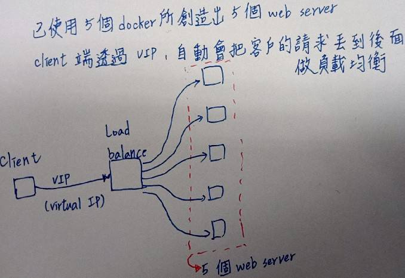
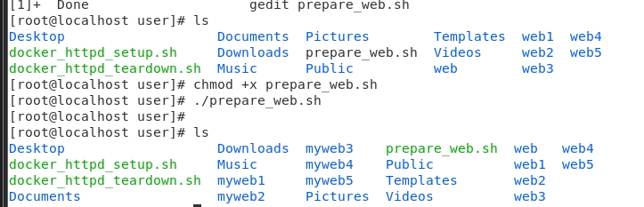
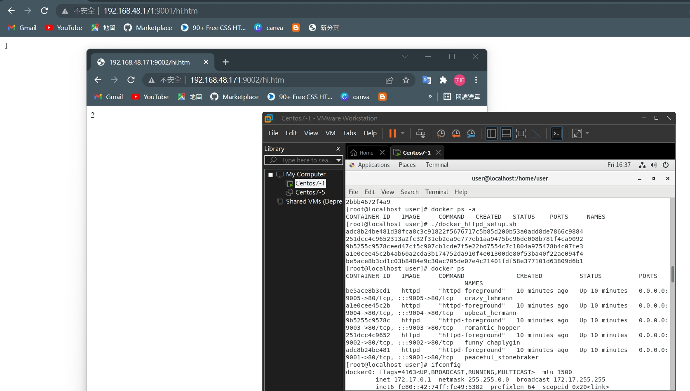
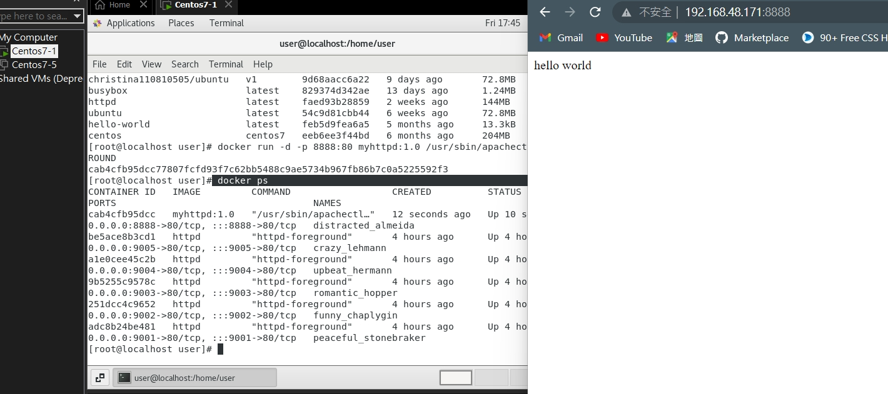
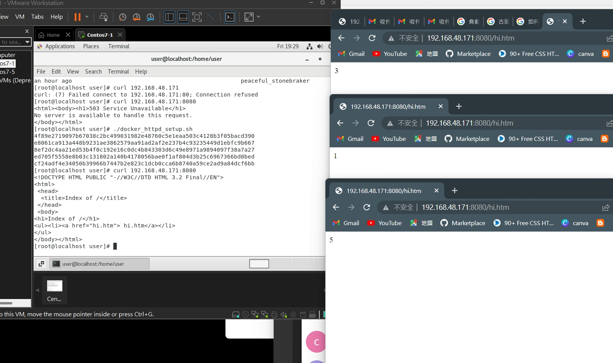
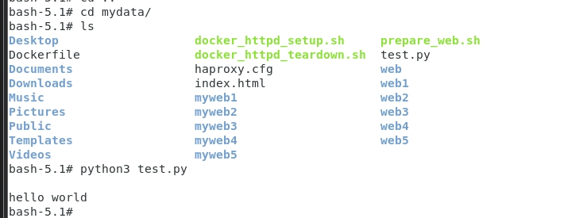

# 透過load balance做web server

## STEP1:建立五個網頁伺服器
1. 建立一個腳本`gedit prepare_web.sh`這個腳本主要是讓他自動產生web，並將每個web中加上hi.htm，其中`-p`是當出現過就不會重複產生

    ```
    #!/usr/bin/bash

    for i in {1..5};
    do 
        mkdir -p myweb$i
        cd myweb$i
        echo $i > hi.htm
        cd .. 
    done
    ```

2. `chmod +x prepare_web.sh` 增加可執行的權限

3. `./prepare_web.sh` 執行他就可以看到結果



4. 編輯掛載資料夾docker_httpd_setup.sh `gedit docker_httpd_setup.sh`

    ```
    #!/usr/bin/bash

    for i in {1..5};
    do
        portno=`expr 9000 + $i`
        docker run -d -p $portno:80 -v /home/user/myweb$i:/usr/local/apache2/htdocs httpd
    done
    ```
5. 打開docker: `systemctl start docker`

6. 先刪除所有行程
    * 執行程式
    ``` 
    docker rm -f `docker ps -a -q`
    ```

    * 執行結果
    ```
    [root@localhost user]# docker rm -f `docker ps -a -q`
    69e6d0d489df
    e78b0e1cfb09
    40ce5a1f8171
    f3870b3870d7
    458924792f83
    c762d085a3fc
    ec47c98158bd
    9537447f1800
    2bbb4672f4a9
    ```

7. 
* 執行結果
```
[root@localhost user]# docker ps -a
CONTAINER ID   IMAGE     COMMAND   CREATED   STATUS    PORTS     NAMES
[root@localhost user]# ./docker_httpd_setup.sh 
adc8b24be481d38fca8c3c91822f5676717c5b85d200b53a0add8de7866c9884
251dcc4c9652313a2fc32f31eb2ea9e777eb1aa9475bc96de008b781f4ca9092
9b5255c9578ceed47cf5c907cb1cde7f5e22bd7554c7c1804a975478b4c07fe3
a1e0cee45c2b4ab60a2cda3b174752da910f4e01300de80f53ba40f22ae094f4
be5ace8b3cd1c03b8484e9c30ac705de07e4c21401fdf58e377101d63809d6b1

```
8. 執行`./docker_httpd_setup.sh `
* 結果
    ```
    [root@localhost user]# ./docker_httpd_setup.sh 
    adc8b24be481d38fca8c3c91822f5676717c5b85d200b53a0add8de7866c9884
    251dcc4c9652313a2fc32f31eb2ea9e777eb1aa9475bc96de008b781f4ca9092
    9b5255c9578ceed47cf5c907cb1cde7f5e22bd7554c7c1804a975478b4c07fe3
    a1e0cee45c2b4ab60a2cda3b174752da910f4e01300de80f53ba40f22ae094f4
    be5ace8b3cd1c03b8484e9c30ac705de07e4c21401fdf58e377101d63809d6b1

    ```

9. 看現在執行的行程`docker ps`
    ```
    [root@localhost user]# docker ps
    CONTAINER ID   IMAGE     COMMAND              CREATED          STATUS          PORTS                                   NAMES
    be5ace8b3cd1   httpd     "httpd-foreground"   10 minutes ago   Up 10 minutes   0.0.0.0:9005->80/tcp, :::9005->80/tcp   crazy_lehmann
    a1e0cee45c2b   httpd     "httpd-foreground"   10 minutes ago   Up 10 minutes   0.0.0.0:9004->80/tcp, :::9004->80/tcp   upbeat_hermann
    9b5255c9578c   httpd     "httpd-foreground"   10 minutes ago   Up 10 minutes   0.0.0.0:9003->80/tcp, :::9003->80/tcp   romantic_hopper
    251dcc4c9652   httpd     "httpd-foreground"   10 minutes ago   Up 10 minutes   0.0.0.0:9002->80/tcp, :::9002->80/tcp   funny_chaplygin
    adc8b24be481   httpd     "httpd-foreground"   10 minutes ago   Up 10 minutes   0.0.0.0:9001->80/tcp, :::9001->80/tcp   peaceful_stonebraker

    ```

10. 接著，打上ifconfig然後到網路上查查看，是否連得上去


---
 
## STEP2.創建Dockerfile
1. 創建Dockerfile
```
FROM centos:centos7 #創建一個基礎鏡像
RUN yum -y install httpd #執行一個安裝的功能，網頁伺服器
EXPOSE 80 #要啟動是80port
ADD index.html /var/www/html/ #把本地端index.html檔案丟到/var/www/html/

```

2. 創建檔案將hello word寫入`echo "hello world" > index.html`

3. ls 可以看到剛剛創建的index.html

4. `docker build -t myhttpd:1.0 .` 其中build是建立鏡像，-t是打上標籤，myhttpd:1.0是名稱，最後的.是本地目錄(為加上任何目錄，預設為Dockerfile)

5. `docker images`就可以看到剛剛所創建的鏡像
* 執行結果
    ```
    [root@localhost user]# docker images
    REPOSITORY                  TAG       IMAGE ID       CREATED          SIZE
    myhttpd                     1.0       d19d950d9e6f   11 seconds ago   397MB
    ubuntu                      v1        cb04d1bd239a   8 days ago       72.8MB
    christina110810505/ubuntu   v1        9d68aacc6a22   9 days ago       72.8MB
    busybox                     latest    829374d342ae   13 days ago      1.24MB
    httpd                       latest    faed93b28859   2 weeks ago      144MB
    ubuntu                      latest    54c9d81cbb44   6 weeks ago      72.8MB
    hello-world                 latest    feb5d9fea6a5   5 months ago     13.3kB
    centos                      centos7   eeb6ee3f44bd   6 months ago     204MB

    ```

6. 跑剛剛鏡像`docker run -d -p 8888:80 myhttpd:1.0 /usr/sbin/apachectl -DFOREGROUND`
```
[root@localhost user]# docker run -d -p 8888:80 myhttpd:1.0 /usr/sbin/apachectl -DFOREGROUND
cab4cfb95dcc77807fcfd93f7c62bb5488c9ae5734b967fb86b7c0a5225592f3

```

7. ` docker ps`就可以看到他跑起來了，並在網站上輸入IP+PORT
* 結果如下



---

## haproxy
>* 把每次的請求跟不同人要 重複案重新整理就會出先不同畫面

1. `gedit haproxy.cfg`
```
defaults
  mode http
  timeout client 10s
  timeout connect 5s
  timeout server 10s
  timeout http-request 10s

frontend myfrontend
  bind 0.0.0.0:8080
  default_backend myservers

backend myservers
  balance roundrobin
  server server1 192.168.48.171:9001
  server server2 192.168.48.171:9002
  server server3 192.168.48.171:9003
  server server4 192.168.48.171:9004
  server server5 192.168.48.171:9005
```

2. `docker run -p 8080:8080  -d --name haproxy-master -v /home/user/haproxy.cfg:/usr/local/etc/haproxy/haproxy.cfg --privileged=true haproxy`


3. 接著打開5個server`./docker_httpd_setup.sh ` 
    ```
    [root@localhost user]# ./docker_httpd_setup.sh 
    4f89e2719097b67038c2bc499031982e48760c5e1eaa503c4128b3f05bacd390
    e8061ca913a448b9231ae3862579aa91ad2af2e237b4c93235449d1ebfc9b667
    8ef2dc4aa21ed53b4f0c192e16c0dc4b843303d6c49e8971a9894097f38a7a27
    ed705f5558e8b03c131802a140b4178056bae0f1af804d3b25c6967366bd0bed
    cf24adf4e34050b39966b7447b2e823c1dcb0cca6b8740a59ce2ad9a84dcf6bb
    ```

4. 接著爬爬看，就可以使用了`curl 192.168.48.171:8080`
    ```
    [root@localhost user]# curl 192.168.48.171:8080
    <!DOCTYPE HTML PUBLIC "-//W3C//DTD HTML 3.2 Final//EN">
    <html>
    <head>
    <title>Index of /</title>
    </head>
    <body>
    <h1>Index of /</h1>
    <ul><li><a href="hi.htm"> hi.htm</a></li>
    </ul>
    </body></html>


    ```

5. 接著，連連看網站，就可以看到load balance


---

--- 
# docker python

1. 編輯`gedit test.py`
    ```
    print("hello world")
    ```

2. `docker pull faucet/python3`

3. 啟動腳本`docker run -it -v /home/user:/mydata faucet/python3 bash`

4. 切換到剛剛所指定的資料夾
    ```
    bash-5.1# cd mydata/
    ```

5. 就可以看到python執行了
    ```
    bash-5.1# python3 test.py 

    hello world

    ```
    


---

# awk的使用方法
>* 參考網站
https://noootown.com/awk-useful-usage/


1. `vim file`
    ```
    Name Domain
    Deepak Banking
    Neha Telecom
    Vijay Finance
    Guru Migration
    ```

2. 取出第一個column出來`awk '{print $1}' file`(法一)
```
root@localhost user]# awk '{print $1}' file
me
Deepak
Neha
Vijay
Guru
```

3. 取出第一個column出來`cat file | awk '{print $1}'`(法二)
``` 
[root@localhost user]# cat file | awk '{print $1}'
me
Deepak
Neha
Vijay
Guru
```

4. 嘗試取出第二個row的第二個column `ifconfig ens33 | awk 'NR==2 {print $2 }'`
``` 
[root@localhost user]# ifconfig ens33
ens33: flags=4163<UP,BROADCAST,RUNNING,MULTICAST>  mtu 1500
        inet 192.168.48.171  netmask 255.255.255.0  broadcast 192.168.48.255
        inet6 fe80::6340:488e:5d5f:8799  prefixlen 64  scopeid 0x20<link>
        ether 00:0c:29:5e:8c:58  txqueuelen 1000  (Ethernet)
        RX packets 120700  bytes 171113063 (163.1 MiB)
        RX errors 0  dropped 0  overruns 0  frame 0
        TX packets 28005  bytes 1798022 (1.7 MiB)
        TX errors 0  dropped 0 overruns 0  carrier 0  collisions 0

[root@localhost user]# ifconfig ens33 | awk 'NR==2 {print $2 }'
192.168.48.171

```

5. `ifconfig ens33 | head -n 2 | tail -n 4` 
```
[root@localhost user]# ifconfig ens33 | head -n 2 | tail -n 4 
ens33: flags=4163<UP,BROADCAST,RUNNING,MULTICAST>  mtu 1500
        inet 192.168.48.171  netmask 255.255.255.0  broadcast 192.168.48.255

```

6. 取出第四行的全部`ifconfig ens33 | awk 'NR==4{print $0}'`和這個一樣`[root@localhost user]# ifconfig ens33 | head -n 4| tail -n1`

```
[root@localhost user]# ifconfig ens33 | awk 'NR==4{print $0}'
        ether 00:0c:29:5e:8c:58  txqueuelen 1000  (Ethernet)

```

7. 只執行有Deepak的那row
```
 [root@localhost user]# awk '/Deepak/{print $0}' file
Deepak Banking
```

>* 參考網址
https://dywang.csie.cyut.edu.tw/dywang/linuxProgram/node51.html


* 編輯腳本awk
```
[root@localhost user]# vim process.awk
[root@localhost user]# cat process.awk 
BEGIN{
  sum=0;
  i=0;
}

{
  sum+=$3;
  i++;
}

END{
  printf("total=%d\n", sum);
  printf("average=%.2f\n", sum*1.0/i);
}

```

* 執行他`awk -f process.awk file`
```
[root@localhost user]# awk -f process.awk file
total=313
average=62.60

```
* 找出最高的人和分數
```
[root@localhost user]# awk -f  process.awk file
the highest:peter score:167
[root@localhost user]# cat process.awk 
BEGIN{
  sum=0;
  max_name="";
}

{
  tmp_sum=$3+$4;
  
  if(tmp_sum > sum){
    sum=tmp_sum;
    max_name=$2;
  }
}

END {
  printf("the highest:%s score:%d\n", max_name, sum);
}

```

* 使用逗號分隔並取出第二個`awk -F, '{print $2}' file`
```
[root@localhost user]# cat file
11,dywang,81,12,A
152,linda,90,58,C
[root@localhost user]# awk -F, '{print $2}' file
dywang
linda

```

* 用冒號分隔的`awk -F: '{print $1}' /etc/passwd`使用這種方式取
```
[root@localhost user]# cat /etc/passwd
root:x:0:0:root:/root:/bin/bash
bin:x:1:1:bin:/bin:/sbin/nologin
daemon:x:2:2:daemon:/sbin:/sbin/nologin
adm:x:3:4:adm:/var/adm:/sbin/nologin
lp:x:4:7:lp:/var/spool/lpd:/sbin/nologin
sync:x:5:0:sync:/sbin:/bin/sync
shutdown:x:6:0:shutdown:/sbin:/sbin/shutdown
halt:x:7:0:halt:/sbin:/sbin/halt
mail:x:8:12:mail:/var/spool/mail:/sbin/nologin
operator:x:11:0:operator:/root:/sbin/nologin
games:x:12:100:games:/usr/games:/sbin/nologin
ftp:x:14:50:FTP User:/var/ftp:/sbin/nologin
nobody:x:99:99:Nobody:/:/sbin/nologin
systemd-network:x:192:192:systemd Network Management:/:/sbin/nologin
dbus:x:81:81:System message bus:/:/sbin/nologin
polkitd:x:999:998:User for polkitd:/:/sbin/nologin
libstoragemgmt:x:998:995:daemon account for libstoragemgmt:/var/run/lsm:/sbin/nologin
colord:x:997:994:User for colord:/var/lib/colord:/sbin/nologin
rpc:x:32:32:Rpcbind Daemon:/var/lib/rpcbind:/sbin/nologin
saned:x:996:993:SANE scanner daemon user:/usr/share/sane:/sbin/nologin
gluster:x:995:992:GlusterFS daemons:/run/gluster:/sbin/nologin
saslauth:x:994:76:Saslauthd user:/run/saslauthd:/sbin/nologin
abrt:x:173:173::/etc/abrt:/sbin/nologin
setroubleshoot:x:993:990::/var/lib/setroubleshoot:/sbin/nologin
rtkit:x:172:172:RealtimeKit:/proc:/sbin/nologin
pulse:x:171:171:PulseAudio System Daemon:/var/run/pulse:/sbin/nologin
radvd:x:75:75:radvd user:/:/sbin/nologin
chrony:x:992:987::/var/lib/chrony:/sbin/nologin
unbound:x:991:986:Unbound DNS resolver:/etc/unbound:/sbin/nologin
qemu:x:107:107:qemu user:/:/sbin/nologin
tss:x:59:59:Account used by the trousers package to sandbox the tcsd daemon:/dev/null:/sbin/nologin
sssd:x:990:984:User for sssd:/:/sbin/nologin
usbmuxd:x:113:113:usbmuxd user:/:/sbin/nologin
geoclue:x:989:983:User for geoclue:/var/lib/geoclue:/sbin/nologin
ntp:x:38:38::/etc/ntp:/sbin/nologin
gdm:x:42:42::/var/lib/gdm:/sbin/nologin
rpcuser:x:29:29:RPC Service User:/var/lib/nfs:/sbin/nologin
nfsnobody:x:65534:65534:Anonymous NFS User:/var/lib/nfs:/sbin/nologin
gnome-initial-setup:x:988:982::/run/gnome-initial-setup/:/sbin/nologin
sshd:x:74:74:Privilege-separated SSH:/var/empty/sshd:/sbin/nologin
avahi:x:70:70:Avahi mDNS/DNS-SD Stack:/var/run/avahi-daemon:/sbin/nologin
postfix:x:89:89::/var/spool/postfix:/sbin/nologin
tcpdump:x:72:72::/:/sbin/nologin
user:x:1000:1000:Centos7-1:/home/user:/bin/bash
apache:x:48:48:Apache:/usr/share/httpd:/sbin/nologin

[root@localhost user]# awk -F: '{print $1}' /etc/passwd
root
bin
daemon
adm
lp
sync
shutdown
halt
mail
operator
games
ftp
nobody
systemd-network
dbus
polkitd
libstoragemgmt
colord
rpc
saned
gluster
saslauth
abrt
setroubleshoot
rtkit
pulse
radvd
chrony
unbound
qemu
tss
sssd
usbmuxd
geoclue
ntp
gdm
rpcuser
nfsnobody
gnome-initial-setup
sshd
avahi
postfix
tcpdump
user
apache
```