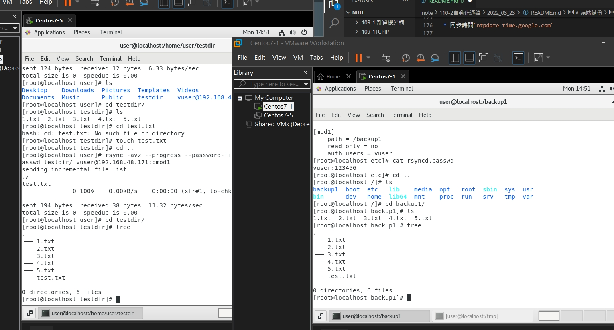
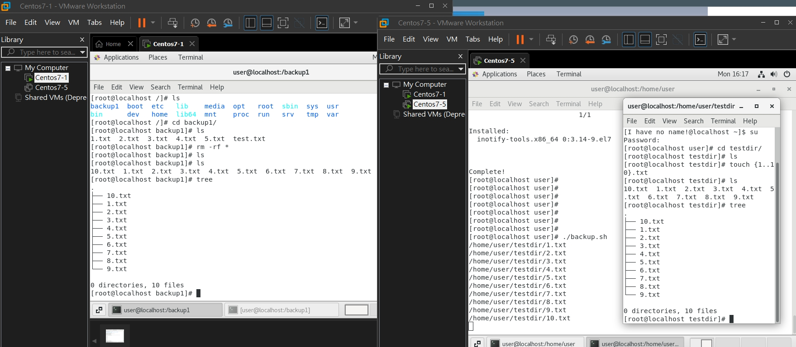

rsync:支援差異是備份及完整性備份，類似cp跟scp用法雷同

inotify:當event,crept,modify,,,當以上事情發生，就會進行rsync備份

當駭客入侵，inotify發現，然後呼叫(rsync)backup server立即將其還原


`rsync 參數 來源檔 目的檔`

-v : 比較詳細的訊息
-r : 遞迴備份所有子目錄資料夾檔案等
-a(archive)
-z : 傳輸時進行壓縮時才傳

rsync -avh --delete testdir/ /tmp : 同步刪除，使用起來要特別小心
rsync -avh testdir/ /tmp:同步備份

## part one本必備份

* 底下，進行實作，並將其進行備份即刪除等
```
[root@localhost testdir]# rsync -avh testdir/ /tmp
sending incremental file list
rsync: change_dir "/home/user/testdir//testdir" failed: No such file or directory (2)

sent 20 bytes  received 12 bytes  64.00 bytes/sec
total size is 0  speedup is 0.00
rsync error: some files/attrs were not transferred (see previous errors) (code 23) at main.c(1179) [sender=3.1.2]
[root@localhost testdir]# cd ..
[root@localhost user]# rsync -avh testdir/ /tmp
sending incremental file list
./
1.txt
10.txt
2.txt
3.txt
4.txt
5.txt
6.txt
7.txt
8.txt
9.txt

sent 591 bytes  received 209 bytes  1.60K bytes/sec
total size is 0  speedup is 0.00
[root@localhost user]# cd testdir/
[root@localhost testdir]# echo "1" > 1.txt
[root@localhost testdir]# cd ..
[root@localhost user]# cd testdir/
[root@localhost testdir]# md5sum 1.txt
b026324c6904b2a9cb4b88d6d61c81d1  1.txt
[root@localhost testdir]# echo "11" > 1.txt
[root@localhost testdir]# md5sum 1.txt
166d77ac1b46a1ec38aa35ab7e628ab5  1.txt
[root@localhost testdir]# echo 11.txt 12.txt
11.txt 12.txt
[root@localhost testdir]# cd ..
[root@localhost user]# rsync -avh testdir/ /tmp
sending incremental file list
./
1.txt

sent 255 bytes  received 38 bytes  586.00 bytes/sec
total size is 3  speedup is 0.01
[root@localhost user]# cd testdir/
[root@localhost testdir]# ls
10.txt  1.txt  2.txt  3.txt  4.txt  5.txt  6.txt  7.txt  8.txt  9.txt
[root@localhost testdir]# touch 11.txt 12.txt
[root@localhost testdir]# cd ..
[root@localhost user]# rsync -avh testdir/ /tmp
sending incremental file list
./
11.txt
12.txt

sent 323 bytes  received 57 bytes  760.00 bytes/sec
total size is 3  speedup is 0.01
[root@localhost user]# cd testdir/
[root@localhost testdir]# rm 4.txt 5.txt
rm: remove regular empty file ‘4.txt’? y
rm: remove regular empty file ‘5.txt’? y
[root@localhost testdir]# cd ..
[root@localhost user]# rsync -avh testdir/ /tmp
sending incremental file list
./

sent 216 bytes  received 19 bytes  470.00 bytes/sec
total size is 3  speedup is 0.01

```

---

## part2 遠端備份

1.  `mkdir a/b/c -p`:`-p`如果沒有則會自動幫你創建
2.  `tree` : 看看現在分之
    * 執行結果
    ```
    [root@localhost testdir]# tree
.
├── 10.txt
├── 11.txt
├── 12.txt
├── 1.txt
├── 2.txt
├── 3.txt
├── 6.txt
├── 7.txt
├── 8.txt
├── 9.txt
└── a
    └── b
        └── c


## part 2
# 遠端備份

[參考資料-CentOS 7.6 上安裝 Rsyncd 遠端檔案同步伺服器](https://blog.tomy168.com/2019/01/centos-76x64-rsync-daemon.html)

### server端

* 安裝`yum install rsync`

* 備份原始設定`cp /etc/rsyncd.conf /etc/rsyncd.conf-bak`

* 編輯rsyncd.conf檔`gedit rsyncd.conf`

    ```
    # /etc/rsyncd: configuration file for rsync daemon mode

    # See rsyncd.conf man page for more options.

    # configuration example:

    # uid = nobody
    # gid = nobody
    # use chroot = yes
    # max connections = 4
    # pid file = /var/run/rsyncd.pid
    # exclude = lost+found/
    # transfer logging = yes
    # timeout = 900
    # ignore nonreadable = yes
    # dont compress   = *.gz *.tgz *.zip *.z *.Z *.rpm *.deb *.bz2

    # [ftp]
    #        path = /home/ftp
    #        comment = ftp export area

    uid=root
    gid=root
    pid file = /var/run/rsyncd.pid
    log file = /var/log/rsyncd.log
    secrets file = /etc/rsyncd.passwd

    [mod1]
        path = /backup1
        read only = no
        auth users = vuser

    ```

* 編輯rsyncd.passwd`gedit rsyncd.passwd`
    ```
    [root@localhost etc]# cat rsyncd.passwd 
    vuser:123456

    ```
* 將密碼檔設置只有root可讀取`chmod 600 /etc/rsyncd.paswd`

* 同步時間`ntpdate time.google.com`


* `systemctl restart rsyncd`

## client端
* 編輯密碼檔`gedit /root/rsync_user.passwd`
```
123456
```
* 將密碼檔設置只有root可讀取`chmod 600 /root/rsync_user.passwd`

*  試試同步遠端備份`rsync -avz --progress --password-file=/etc/rsync_vuser.passwd testdir/ vuser@192.168.48.171::mod1`



---

# rsync inotify

### centos7-5
* 安裝inotify-tools`yum install inotify-tools -y`

* 編輯backup.sh`gedit backup.sh` ，server那邊的ip記得要填上另外一台的
    ```
    #!/bin/bash
    path=/home/user/testdir
    server=192.168.48.171
    
    inotifywait -mrq $path --timefmt "%d-%m-%y %H:%M" --format "%w%f" -e create,modify,delete,move | while read line
    do
        if [ -f $line ];then
        echo $line
        rsync -az --delete $line vuser@$server::mod1 --password-file=/etc/rsync_vuser.passwd
        fi
    done


    ```

* 加上可以執行的權限`chmod +x backup.sh`

* 並且執行他`./backup.sh`

* 開啟另一台虛擬機(centos7-1)

### centos7-1
* 切到/backup1`cd /backup1`

* 刪除裡面所以檔案`rm -rf *`

* 確認都清空了`ls`

### centos 7-5
* 並且切回另一台機器(centos7-2)上開一個新的windows，打上`cd /home/user/testdir/`

* 刪除全部檔案 `rm -rf *`


* 創建檔案 `touch {1..10}.txt`

* 最後就可以看到成功完成了inotify
