# Centos編譯核心
`uname -r` :現在使用的版本

* 參考網站:https://www.ltsplus.com/linux/rhel-centos-7-compile-kernel

* 想使用新的kernel，建議穩定安裝版
https://www.kernel.org/


* `wget https://cdn.kernel.org/pub/linux/kernel/v4.x/linux-4.19.237.tar.xz`

* `ls`

* 解壓縮`tar xvJf linux-4.19.237.tar.xz`

* `ll -h` :看看linux kernel 的大小

* 有些軟體需要安裝:`yum install -y ncurses-devel make gcc bc bison flex elfutils-libelf-devel openssl-devel grub2`

* `cd /usr/local/src/linux-4.19.237`

*  只需要改變一些東西，不cp -v /boot/config-3.10.0-1127.19.1.el7.x86_64 .config

```
[root@localhost linux-4.19.237]# uname -r
3.10.0-1160.el7.x86_64
[root@localhost linux-4.19.237]# cp -v /boot/config-3.10.0-1160.el7.x86_64 .config
‘/boot/config-3.10.0-1160.el7.x86_64’ -> ‘.config’

```

* make menuconfig

* make bzImage

* make modules

* make

* make modules_install

* make install

* grub2-mkconfig -o /boot/grub2/grub.cfg

* reboot

* 就可以看到順利安裝好心的核心
`uname -r`
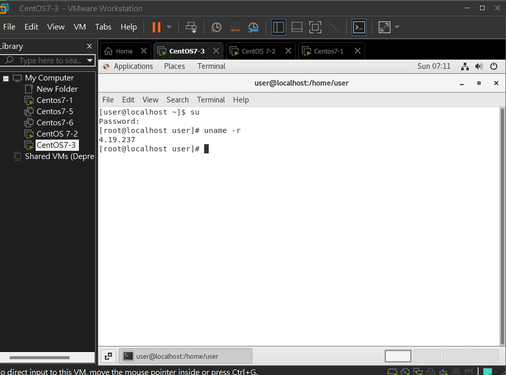

---


# jumpserver

先在第一台虛擬機打開(CentOS7-2)
*  sudo curl -L "https://github.com/docker/compose/releases/download/1.29.2/docker-compose-$(uname -s)-$(uname -m)" -o /usr/local/bin/docker-compose

* 給他增加權限:`sudo chmod +x /usr/local/bin/docker-compose`

* git clone --depth=1 https://github.com/wojiushixiaobai/Dockerfile.git
* cd Dockerfile
* cp config_example.conf .env
* gedit .env
要把 DOCKER_SUBNET=172.20.0.0/16

* docker-compose -f docker-compose-redis.yml -f docker-compose-mariadb.yml -f docker-compose.yml up

* docker rm -f $(docker ps -a -q)

* docker-compose down 
* docker -a
* docker rm -f `docker ps -a -q`


---

接著切到google打開chrome瀏覽器
輸入linux上的ip位置


 
1. create user (Tom) :在用戶列表裡新增

    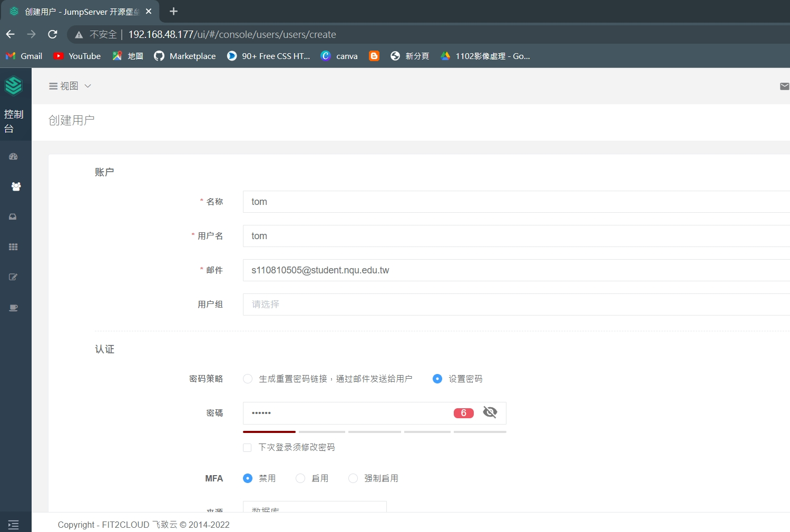

    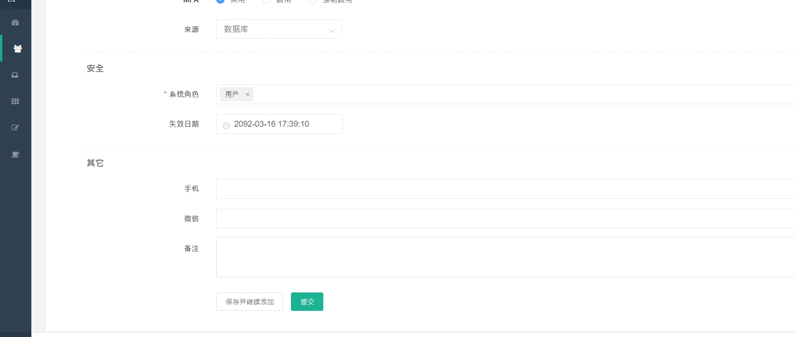

2. System users (Centos7-1, user, root)
    * user
    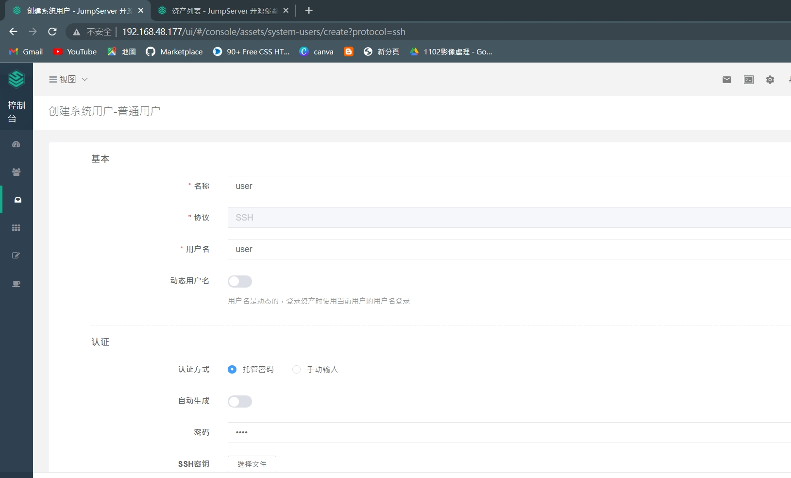
    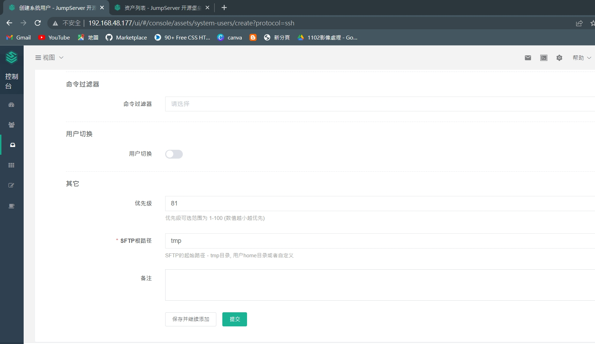
    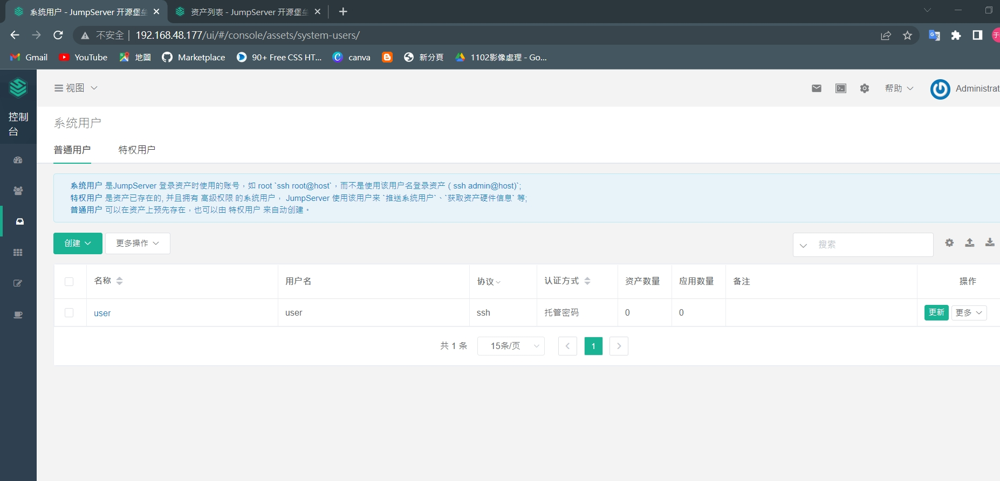
    * root
    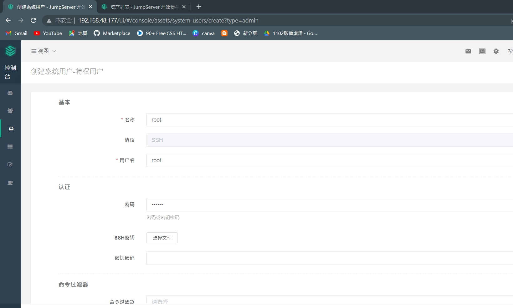
    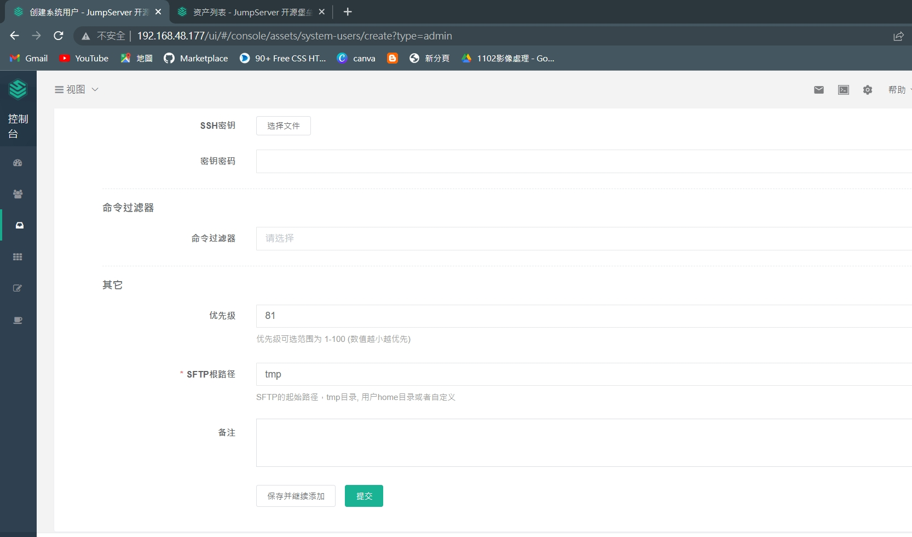
    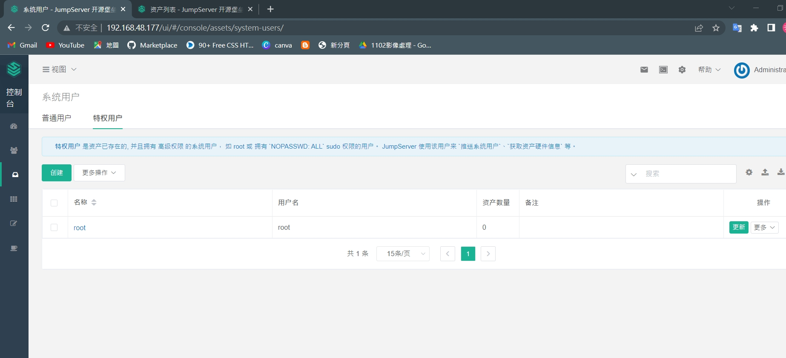

3. 創建資產，開啟另外一台虛擬機(我使用Centos7-1)

    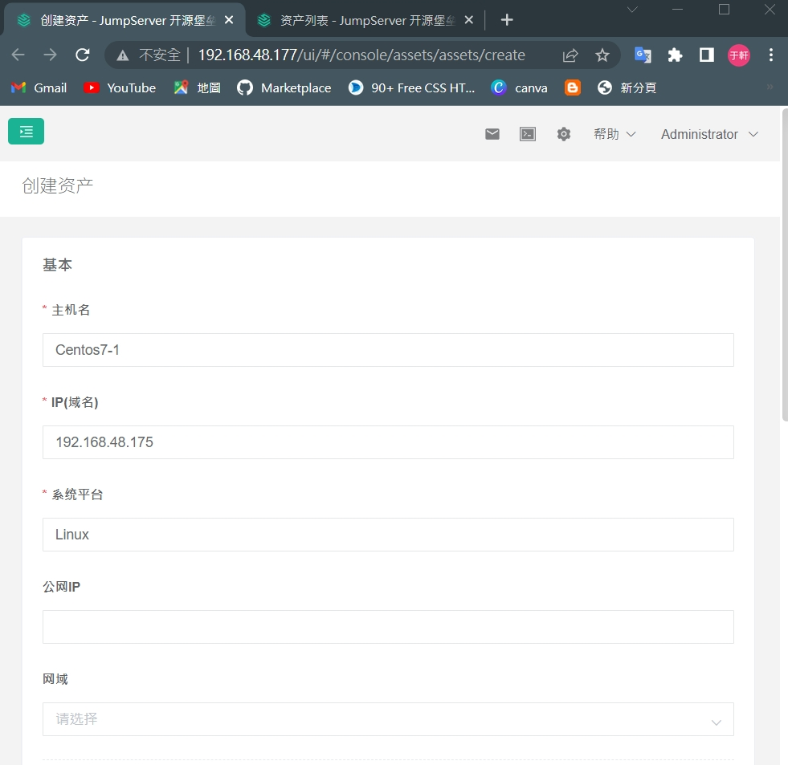
    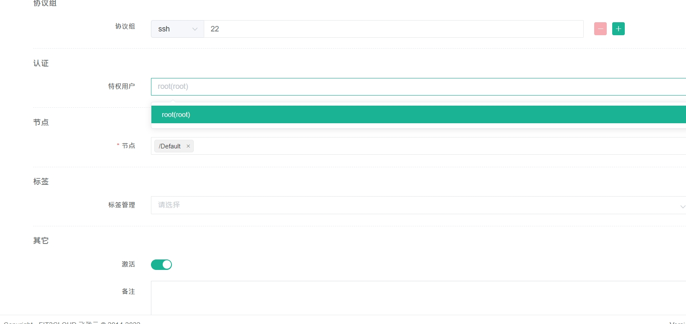
    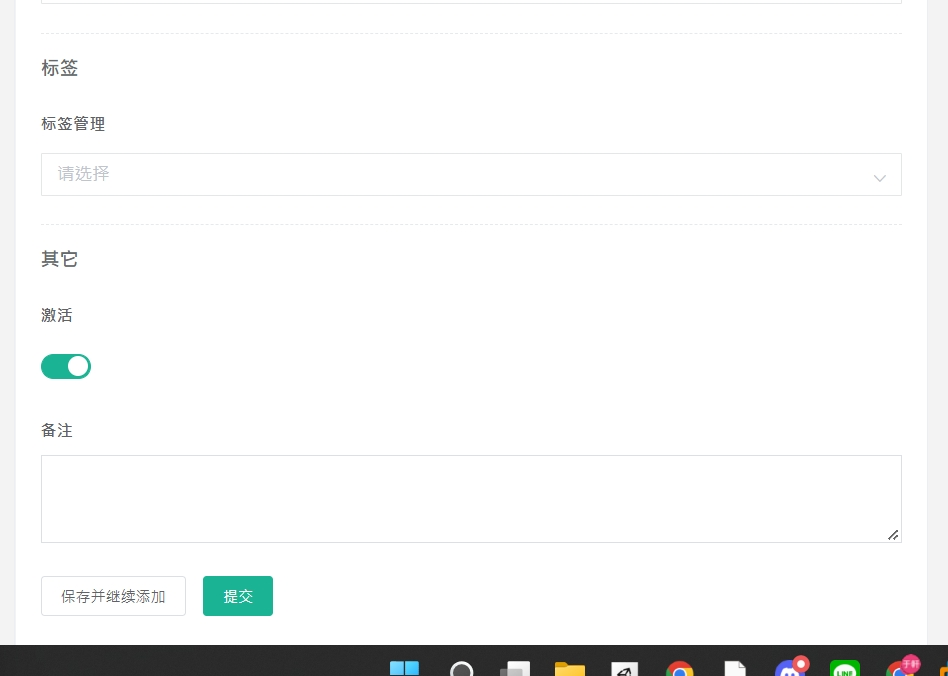

4. Asset Permissions
    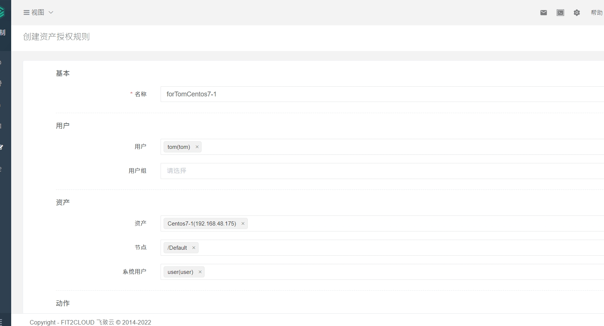
    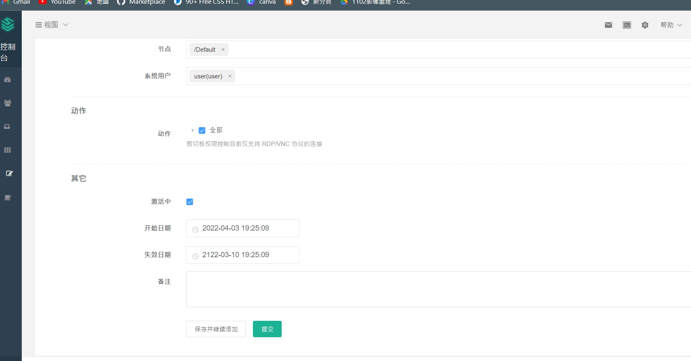


* 接著，試試在jumpserver上登出，並登入tom 
```
tom
123456
```

* 在視圖那邊切換到工作台，並且點擊web終端

* 接著，試試在jumpserver上登出，並登入admin
切換到審計台的命令紀錄

### deny the actions for Tom

>* 試試看讓tom不能使用一些特定指令例如rm -f

* 創建一個ForTom:在命令過濾 -> 創建
    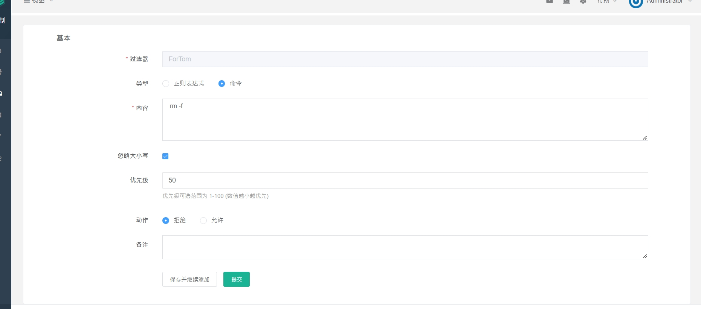

* 創建完後點選 ForTom -> 命令過濾器規則
 
    

* 重開一次putty

    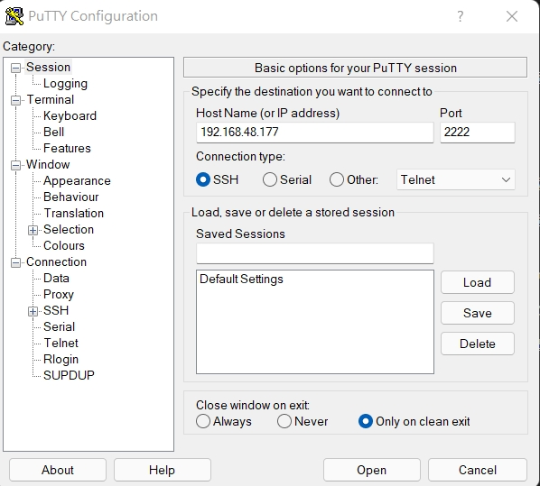

* 這時就發現tom不能使用`rm -f` 來刪除東西了
 
    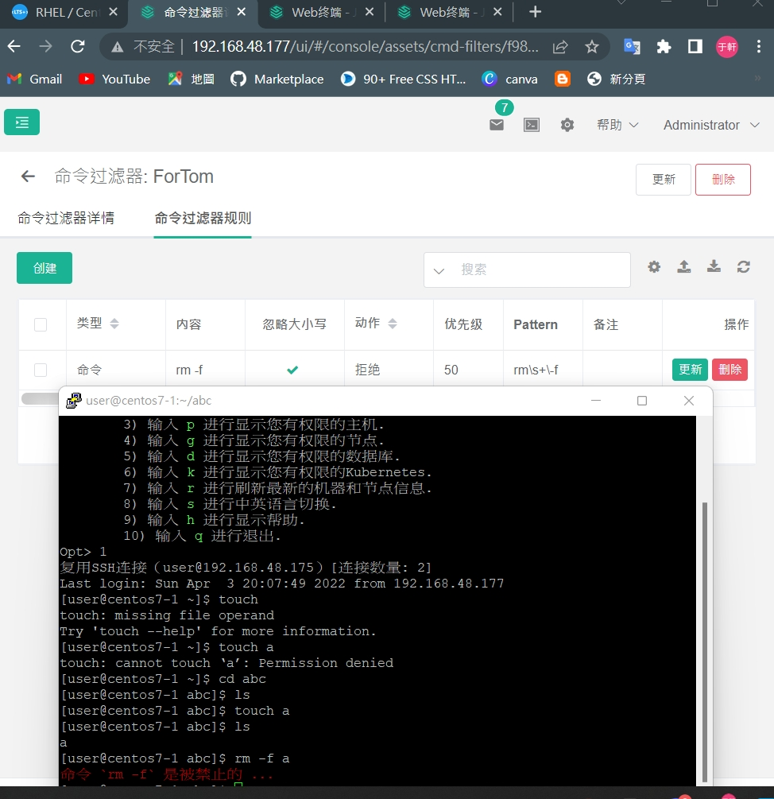