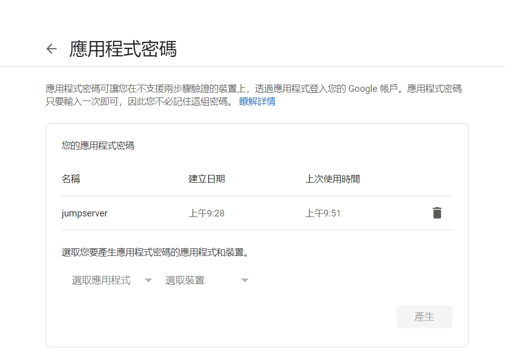
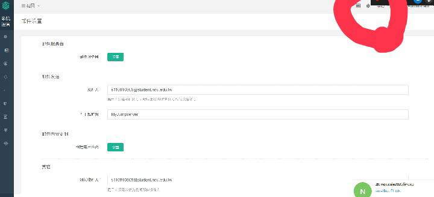
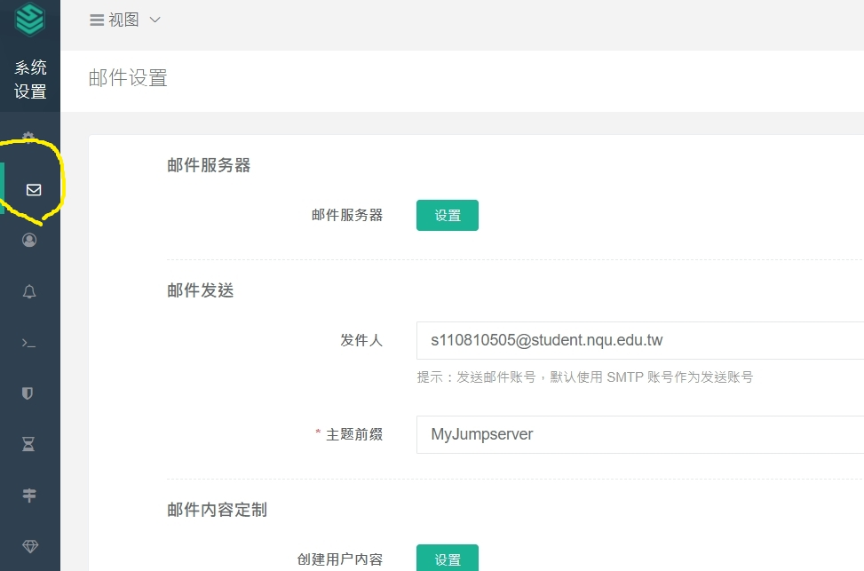
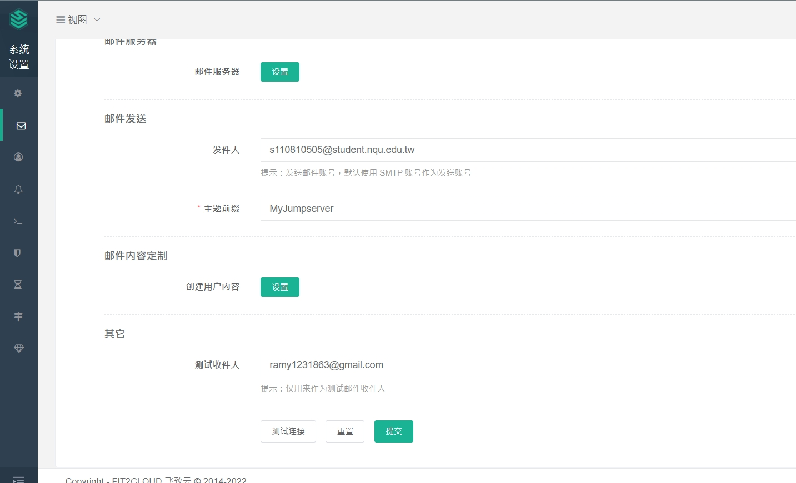
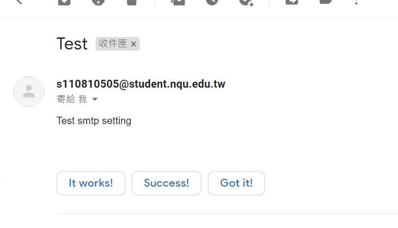

# jumpservere send gmail
### 1. 首先，先在google的安全性上打開二次認證，和應用程式密碼

### 2. 應用程式密碼開啟方式，點選應用程式密碼


### 3. 接著，點選 選取應用程式 -> 其他 ->打上需要的名稱(eg:jumpserver)



### 4. 一開始需要打開jumpserver(在linux上輸入以下指令)
    ```
    cd Dockerfile
    docker-compose -f docker-compose-redis.yml -f docker-compose-mariadb.yml -f docker-compose.yml up

    ```

### 5. 接著，到windows上面輸入IP，登入jumpserver
### 6. 打開系統設定，在左上角那



### 7. 接下來，開啟右邊的郵件，並且點選郵件設定


### 8. 打開郵件服務器之後，填入基本資料，並且，將剛剛應用程式密碼填上，並且勾選使用


### 9. 最後在填上以下訊息即可正確發送成功


### 並且在自己郵件中也能找到結果呦



---
[參考網址](https://tw511.com/a/01/11537.html)

# 實際練習grep之用法

    ```m
    [root@centos7-2 user]# cat test 
    aaa
    bbbbb
    AAAaaa
    BBBBASDABBDA
    [root@centos7-2 user]# grep -A2 b test
    bbbbb
    AAAaaa
    BBBBASDABBDA
    [root@centos7-2 user]# grep -B1 b test
    aaa
    bbbbb
    [root@centos7-2 user]# grep -C1 b test
    aaa
    bbbbb
    AAAaaa
    [root@centos7-2 user]# grep -c aaa test
    2
    [root@centos7-2 user]# grep -e AAA -e bbb test
    bbbbb
    AAAaaa
    [root@centos7-2 user]# grep -in b test
    2:bbbbb
    4:BBBBASDABBDA
    [root@centos7-2 user]# grep -o ASDA test
    ASDA
    [root@centos7-2 user]# grep -q aa test
    [root@centos7-2 user]# echo $?
    0
    [root@centos7-2 user]# grep -v aaa test
    bbbbb
    BBBBASDABBDA
    [root@centos7-2 user]# grep -w aaa test
    aaa
    [root@centos7-2 user]# cat grep.txt
    cat: grep.txt: No such file or directory
    [root@centos7-2 user]# vi grep.txt
    [root@centos7-2 user]# cat grep.txt 
    aaa
    [root@centos7-2 user]# grep -f grep.txt test
    aaa
    AAAaaa

    ```
* `grep -B1 b test`

* 找到匹配的那行，前後都看得到`grep -C1 b test`

* 找到幾筆匹配到`grep -c1 b test`

* 匹配兩個，用-e來做，想要匹配AAA或bbb
    ```
    grep -e AAA -e bbb test
    grep -e AAA -e bbb -e aa test
    ```

* -i 忽視大小寫，所以無論大小寫都可以被匹配到`grep -i b test`

* -n 顯示第幾行 : `grep -i -n b test` 和 `grep -in b test`

* -o 把東西找到，並且顯示出來
`grep -o ASDA test`

* 顯示整行
grep -e ASDA test
grep ASDA test

* -q 是否找到，但是不會顯示結果 
grep -q aa test

* 確保是否執行成功，執行成功返回值為0
 echo $?

* -v 排除在外(不包含)
grep -v aaa test 


vim grep1.txt

grep 
```
aaa 
```

* 查詢匹配到的grep -f grep1.txt test


---

統計網頁IP存取量
systemctl start httpd


cat 1.txt
grep [0-9] 1.txt
echo 12 > 1.txt
grep "[0-9]\{1,3\}" 1.txt


---

[Linux 三劍客參考網站grep、sed、awk](https://tw511.com/a/01/11537.html)

# sed
* stream editor
* 不需要打開即可編輯


