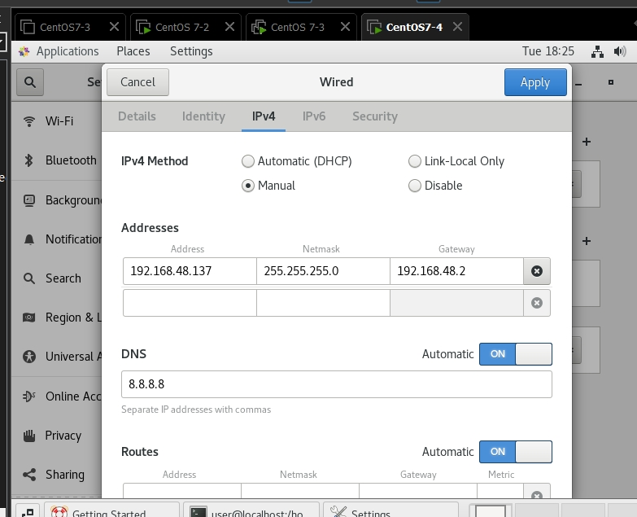
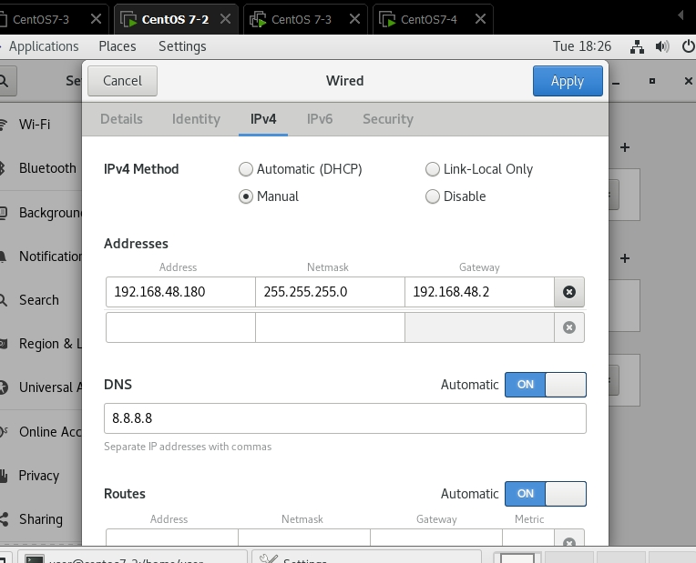
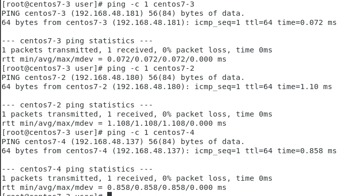
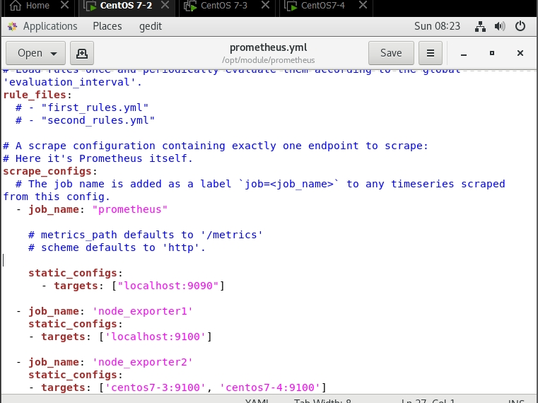
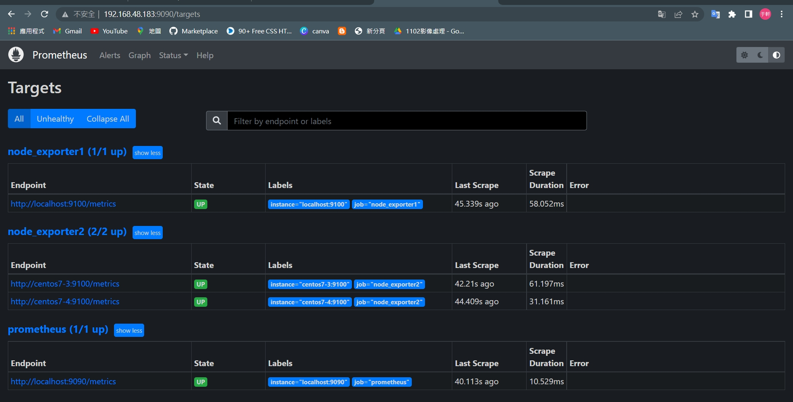
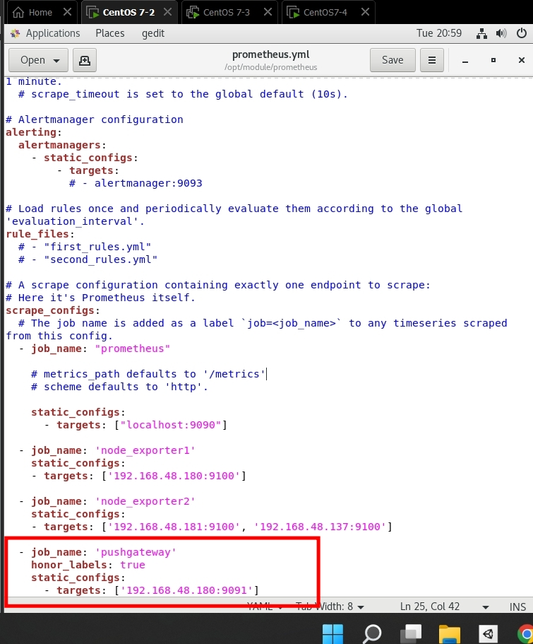
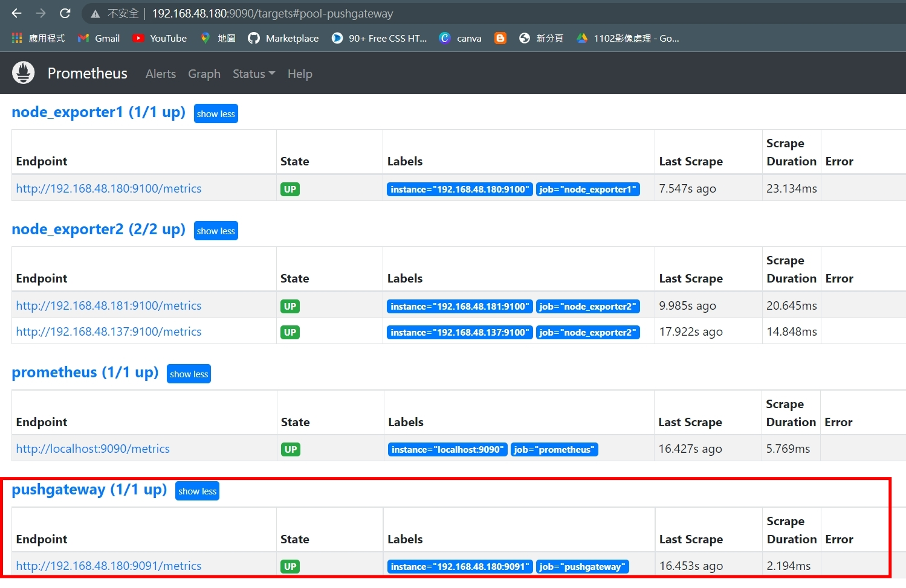

[參考資料 - Prometheus配置圖](https://codingnote.cc/zh-tw/p/150392/)


---

# 普羅米修斯(Prometheus)
## 首先需要準備三台機器

* 我使用centos7-2,centos7-3,centos7-4
* 分別將他重新命名好使用`hostnamectl set-hostname centos7-2` 和 `hostnamectl set-hostname centos7-3` 及 `hostnamectl set-hostname centos7-4`

## 進行綁定IP
* 避免下次IP位址亂改變
* 到設定裡面調整




## 接下來進行編輯/etc/hosts

* `gedit /etc/hosts`，這邊要分別存取那三台的ip和hostname
```
192.168.48.180 centos7-2
192.168.48.181 centos7-3
192.168.48.137 centos7-4
```

## 接下來試試看可不可以通訊
`ping -c 1 centos7-3`和
`ping -c 1 centos7-3`和
`ping -c 1 centos7-3`


## 嘗試將每一台進行免密碼登入，每一台都需要免密碼登入(可做可不做)
* 第一台
>* `ssh-keygen`

* 其他台
>* `ssh-keygen`
>* `ssh-copy-id user@192.168.48.138`(第一次需要密碼)
>* `ssh user@192.168.48.149`(後面這一個是IP)

## 進行prometheus的設定
### centos7-2
* cd /usr/lib/systemd/system

* 編輯配置檔`gedit prometheus.service `

```
[Unit]
Description=Prometheus
After=network-online.target

[Service]
Type=simple
Restart=on-failure
ExecStart=/opt/module/prometheus/prometheus --config.file=/opt/module/prometheus/prometheus.yml --storage.tsdb.path=/opt/module/prometheus/data --storage.tsdb.retention=30d --web.enable-lifecycle --log.level=debug

[Install]
WantedBy=multi-user.targe

```
* 切到Download進行下載`cd Downloads/`
* 下載prometheus，
* 記得要下載linux的，不要搞錯瞜(當時就是搞錯，想了很久) : `wget https://github.com/prometheus/prometheus/releases/download/v2.35.0/prometheus-2.35.0.linux-amd64.tar.gz`

* 解壓縮 : `tar xf prometheus-2.35.0.linux-amd64.tar.gz`

* 將其改名字 : `mv prometheus-2.35.0.linux-amd64 prometheus`

* 並且移動到/opt/module/底下 :  `mv prometheus /opt/module/`

* 切換到 /opt/module/ : `cd /opt/module/`

* 更改腳本時需要執行這一行 : `systemctl daemon-reload`

* 接著，並且打開它和確認他的狀態 : `systemctl start prometheus.service` 和 `systemctl status prometheus.service`

## 進行node_exporter的設定
>* 三台電腦都需要安裝centos7-2、centos7-3、centos7-4

* `gedit /usr/lib/systemd/system/node_exporter.service`
```
[Unit]
Description=node_exporter
Documentation=https://github.com/prometheus/node_exporter
After=network.target
 
[Service]
Type=simple
ExecStart=/opt/module/node_exporter/node_exporter
Restart=on-failure

[Install]
WantedBy=multi-user.target
```

* 下載node_exporter : `wget https://github.com/prometheus/node_exporter/releases/download/v1.3.1/node_exporter-1.3.1.linux-amd64.tar.gz`

* 解壓縮node_exporter : `tar xf node_exporter-1.3.1.linux-amd64.tar.gz`

* 將其移動到/opt/module : `mv node_exporter-1.3.1.linux-amd64 /opt/module/`

* 將其改成較簡單的名字 : `mv node_exporter-1.3.1.linux-amd64 node_exporter`


* 更改腳本時需要執行這一行 :`systemctl daemon-reload`

接著，並且打開它和確認他的狀態 :`systemctl start node_exporter` 和 `systemctl status node_exporter`

## 編輯prometheus.yml
>* for centos7-2
* 編輯prometheus.yml : `gedit /opt/module/prometheus/prometheus.yml`
```
  - job_name: 'node_exporter1'
    static_configs:
    - targets: ['192.168.48.180:9100']

  - job_name: 'node_exporter2'
    static_configs:
    - targets: ['192.168.48.181:9100', '192.168.48.137:9100']
```


* 更改腳本時需要執行這一行 :`systemctl daemon-reload`

接著，並且打開它和確認他的狀態 :`systemctl start node_exporter` 和 `systemctl status node_exporter`

* 最後在windows上打上 http://IP:9090/targets/target(eg. http://192.168.48.183:9090/targets)




## 進行pushgateway設定
*  下載pushgateway`wget https://github.com/prometheus/pushgateway/releases/download/v1.4.2/pushgateway-1.4.2.linux-amd64.tar.gz`

* 進行解壓縮`tar xf pushgateway-1.4.2.linux-amd64.tar.gz`

* 改名 : `mv pushgateway-1.4.2.linux-amd64.tar.gz pushgateway`

* 移動到 /opt/module :`mv pushgateway /opt/module/`

* cd /opt/module/

* 進行pushgateway的修改: `gedit /usr/lib/systemd/system/pushgateway.service`
  ```
  Description=pushgateway
  After=network.target

  [Service]
  Type=simple
  ExecStart=/opt/module/pushgateway/pushgateway 
  Restart=on-failure

  [Install]
  WantedBy=multi-user.target
  ```

* 進行prometheus.yml的修改 `gedit /opt/module/prometheus/prometheus.yml`，增加以下
  ```
  - job_name: 'pushgateway'
      honor_labels: true
      static_configs:
        - targets: ['192.168.48.180:9091']
  ```


* 重新載入、重開和確認狀態
  ```
    systemctl daemon-reload
    systemctl retsart pushgateway
    systemctl restsart pushgateway
    systemctl restart pushgateway
    systemctl status pushgateway
    systemctl restart prometheus
    systemctl status prometheus

  ```

* 最後在windows中輸入http://IP:9090，就可以看到剛剛


---

- up{ instance=~"192.168.48.*"} : `=~`政則表達式，`.*`:表示匹配全部`!=~`:正則表達式取反

* graph: 圖形化介面


