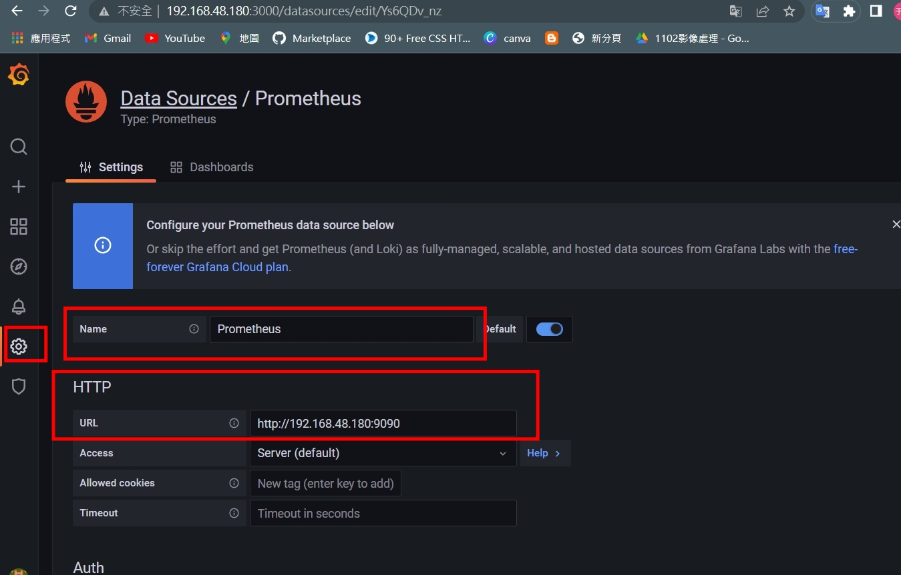
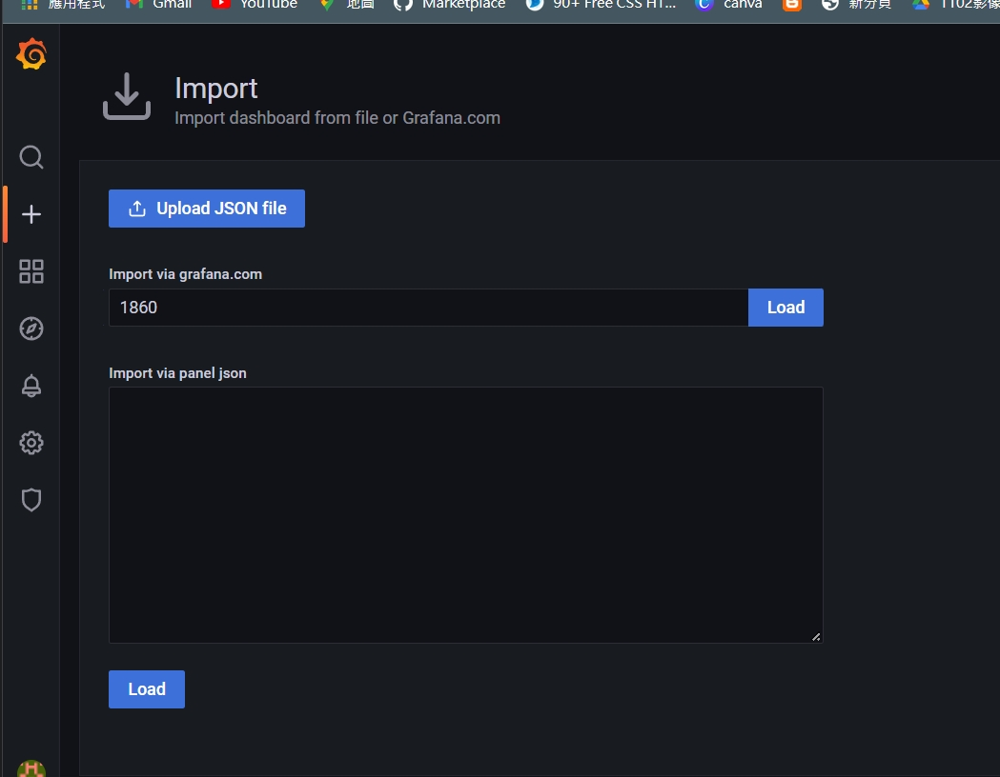
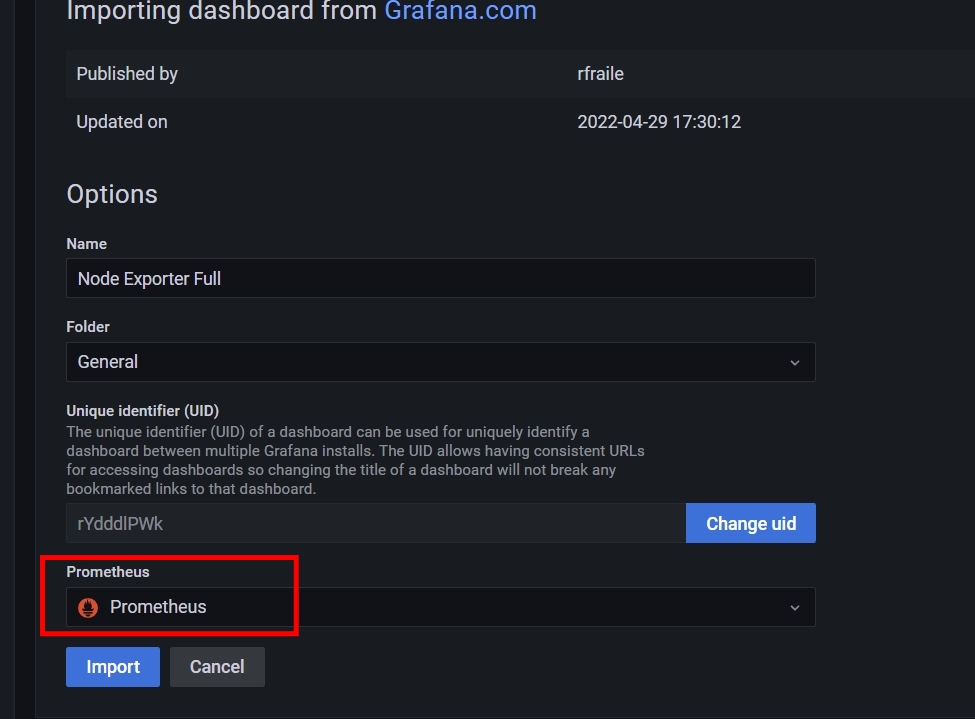
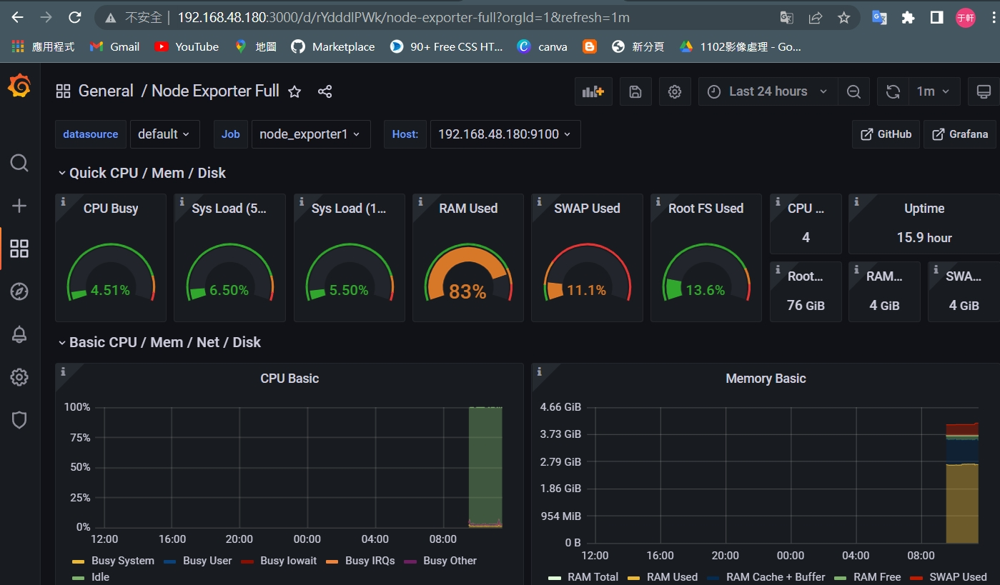

# 進行Grafana的設定

## Step1.新增Grafana Repository
- `gedit /etc/yum.repos.d/grafana.repo`

    ```
    [grafana]
    name = grafana
    baseurl = https://packages.grafana.com/oss/rpm
    repo_gpgcheck = 1
    enabled = 1
    gpgcheck = 1
    gpgkey = http://packages.grafana.com/gpg.key
    sslverify = 1
    sslcacert = /etc/pki/tls/certs/ca-bundle.crt
    ```

## Step2.安裝grafana、reload及開啟grafana-server
- 安裝: `yum install grafana`
- reload: `systemctl daemon-reload`
- 開啟: `systemctl start grafana-server`
- 確認狀態: `systemctl status grafana-server`

## Step3.在windows上開啟
- 在windows上入自己電腦的IP位置加上3000 port(http://192.168.48.180:3000)

- 就可以打開grafana，預設的帳號密碼都是admin，我進去後改成123456

- 以下是我的登入畫面


[這個參考資料裡面可以找到，我們需要的](https://grafana.com/grafana/dashboards/1860)

* 接下來，點選data sources - > configuration -> Prometheus，並且將URL改成本機設定的IP位置




* 點選 Create -> import
upload 1863



* 接著，會跳到以下頁面，並且，點選Prometheus
 

* 最後就會跳到以下頁面

