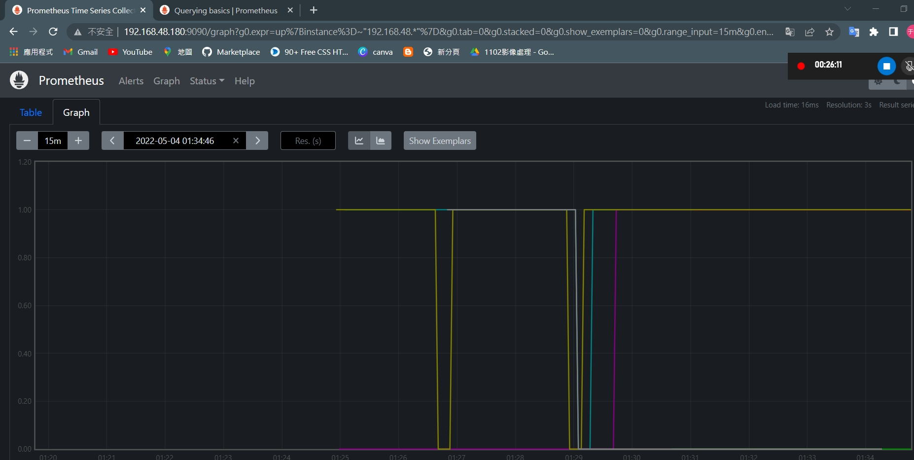
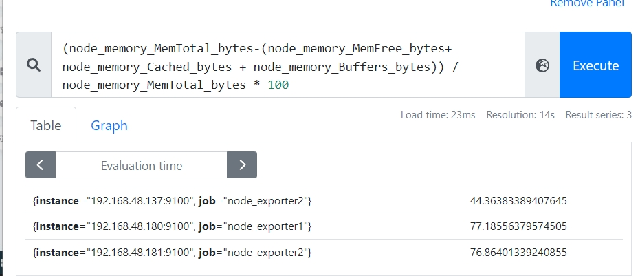
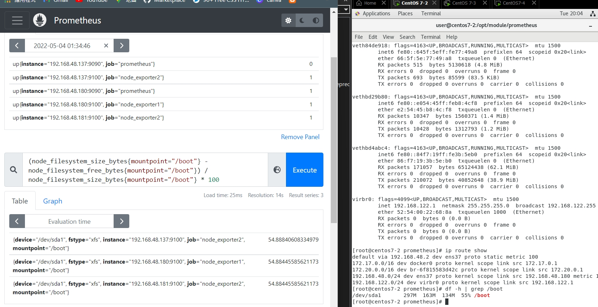

在普羅米修施的介面graph可以進行即時監控

時間為序列的資料庫系統，每抓一筆都是當下的資料


只有取立即性的資料才能繪圖


* 從目前為止前五分鐘的變化率
    ```
    increase(node_cpu_seconds_total{mode="idle"}[5m])
    ```

* 依據每台獨立機器閒置時間的加種，依據核心加總出idle time
```
sum(increase(node_cpu_seconds_total{mode="idle"}[5m])) by (instance)
```


* (全部 - (total idle時間/ cpu總共運行所有狀態的時間，包含閒置，運行，軟硬體中斷等時間)) * 100 =CPU 運行時間的百分比
```
(1- sum(increase(node_cpu_seconds_total{mode="idle"}[5m])) by (instance)/sum(increase(node_cpu_seconds_total[5m])) by (instance))*100

```


* memory真正在使用的情況

```
(node_memory_MemTotal_bytes-(node_memory_MemFree_bytes+ node_memory_Cached_bytes + node_memory_Buffers_bytes)) / node_memory_MemTotal_bytes * 100
```



* 看見每一台的使用率
```
(node_filesystem_size_bytes{mountpoint="/boot"} - node_filesystem_free_bytes{mountpoint="/boot"}) / node_filesystem_size_bytes{mountpoint="/boot"} * 100
```
