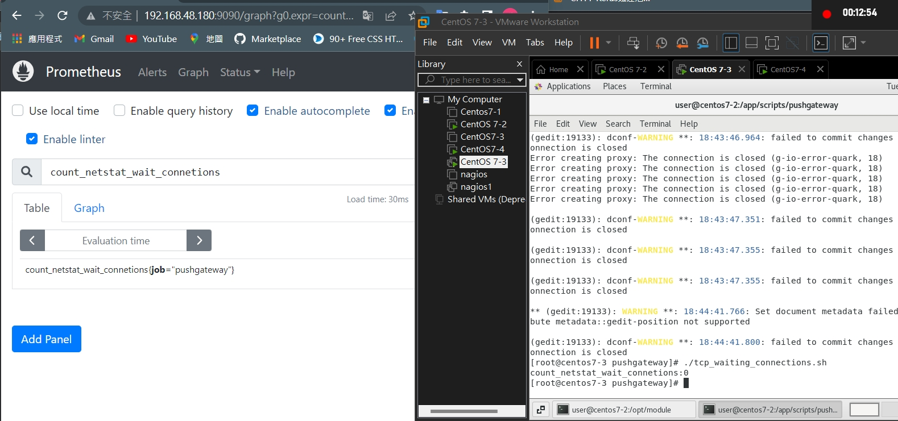
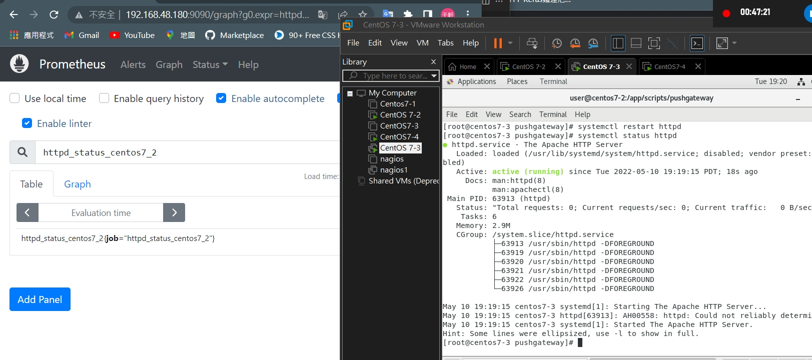

參考資料:
https://blog.51cto.com/root/3033785

---
## Memo
- ctrl - alt -F1 : 切到圖形化介面

- ctrl -alt -F2 : 切到文字化界面
- AIOPs AIDevOps : 可以解結合AI來做運維
- cat 會去讀他，並顯示在螢幕上

```
[root@centos7-2 system]#  cat <<EOF
> hello 
> world
> EOF
hello 
world
```

- 會將打入的東西存到/tmp/a.txt
```
[root@centos7-2 system]# cat <<EOF > /tmp/a.txt
> hello
> world
> 1234
> EOF
[root@centos7-2 system]# cat /tmp/a.txt 
hello
world
1234
```
```
[root@centos7-2 system]# cat <<< "hi" > /tmp/a.txt
[root@centos7-2 system]# cat /tmp/a.txt
hi
```

---
- count_netstat_wait_connetions : 有沒有近來等待的連線，例如TCP有三軸交握，如果還沒完成，就是在做等待的動作。如果等待太多，可騰就是在做攻擊。
- `netstat -an | grep -i wait | wc -l` : 統計正在等待的比數。`i` : 不分大小寫，`l` :幾行

* 編輯小型腳本，讓其可執行
>* `cd /app/scripts/pushgateway`
>* `gedit  tcp_waiting_connections.sh `
- `chmod +x tcp_waiting_connections.sh `
    ```
    #!/bin/bash

    # For waiting connections
    label="count_netstat_wait_connetions"
    count_netstat_wait_connetions=`netstat -an | grep -i wait | wc -l`
    echo "$label:$count_netstat_wait_connetions"
    echo "$label $count_netstat_wait_connetions" | curl --data-binary @- http://192.168.48.180:9091/metrics/job/pushgateway/instance/$instance_name

    ```

- 接著，./tcp_waiting_connections.sh
- 並且開啟IP:9090，打開prometheus -> Graph
   


* 編寫腳本`gedit check_httpd_centos7-2.sh` : 用其檢查網頁伺服器是否工作正常
```
#!/bin/bash

# For waiting connections
label="httpd_status_centos7_2"
curl -q  http://192.168.48.180 >/dev/null 2>&1 
status=`echo $?`
if [ $status -eq 0 ];then
   result=1
else
   result=0
fi
#echo $label $result
echo "$label $result" | curl --data-binary @- http://192.168.48.180:9091/metrics/job/$label
```

>* 如果執行httpd failed ，檢查80 port 是否被占用
`netstat -tulnp | grep 80`
>* 如果有的話就kill該行程 `kill -9 xxx`

* 變可執行
`chmod +x t check_httpd_centos7-2.sh`
* 執行他
`./check_httpd_centos7-2.sh`




### 定期任務
- 15，30，45秒分別會執行一次

- `crontab -e`
* * * * * /app/scripts/pushgateway/check_httpd_centos7-2.sh
* * * * * sleep 15;/app/scripts/pushgateway/check_httpd_centos7-2.sh
* * * * * sleep 30;/app/scripts/pushgateway/check_httpd_centos7-2.sh
* * * * * sleep 45;/app/scripts/pushgateway/check_httpd_centos7-2.sh

- 寫完後 : -> wq 就儲存完畢

- 回到prometheus，就可以看到其順利監控了

