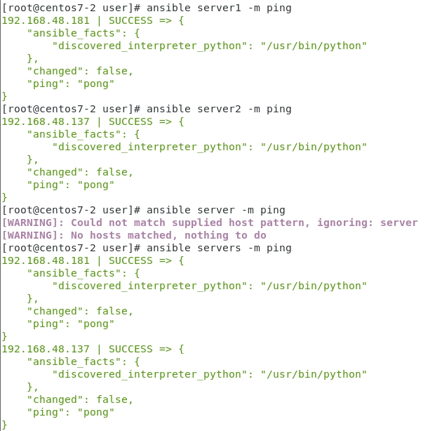

# Ansible
[參考資料](https://tw511.com/a/01/32123.html)


- centos7-3 , centos7-4 systemctl start sshd
- centos7-2 : yum install ansible
- centos7-2 : gedit /etc/ansible/hosts

```
[server1]
192.168.48.181
[server2]
192.168.48.137

[servers]
192.168.48.181
192.168.48.137
```
- 首先要先確認彼此間可以互相ssh...(注意:一定要是ssh root，ssh user是沒用的)
```
ssh-copy-id root@192.168.48.137
ssh-copy-id root@192.168.48.181
ssh root@192.168.48.137
```

- ansible server1 -m ping
```
ansible server2 -m ping
ansible servers -m ping
```



