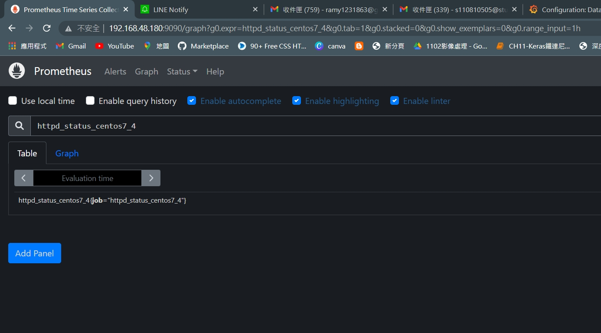
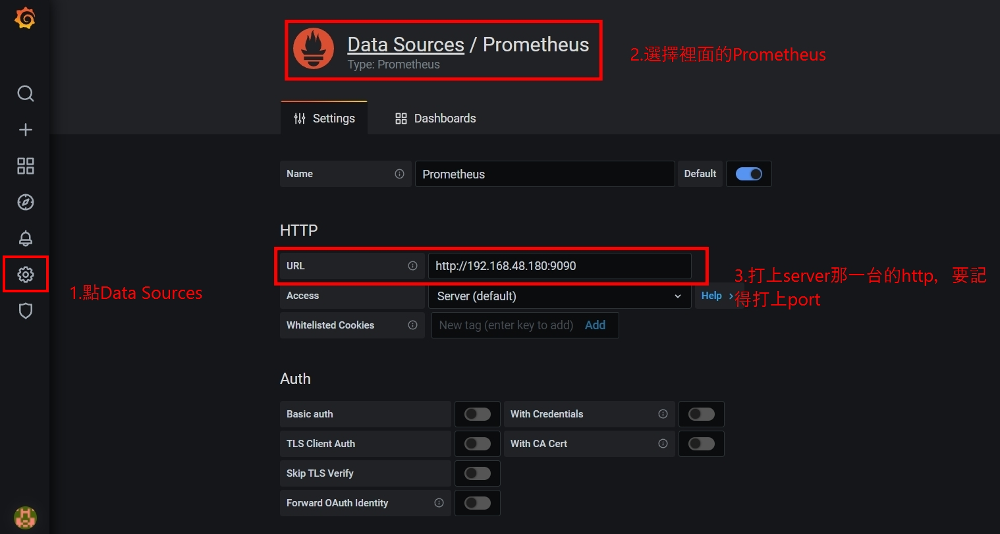
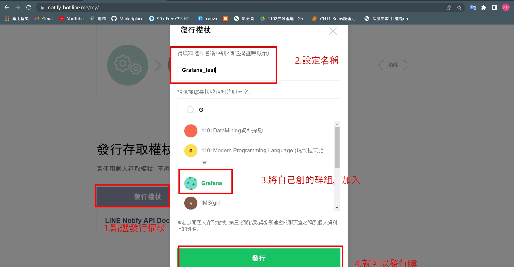
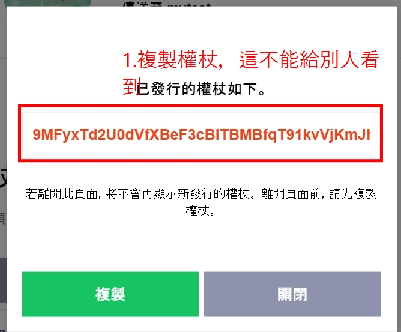
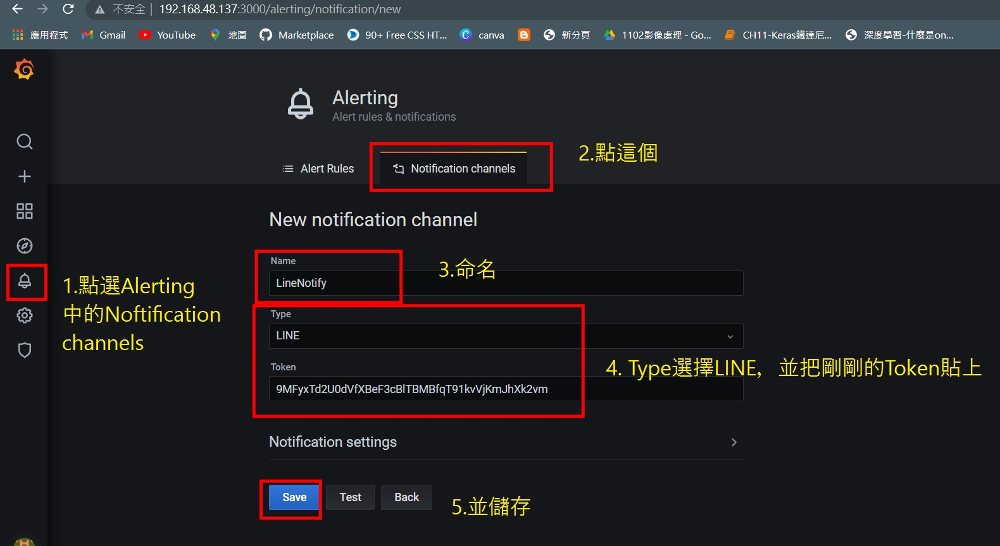
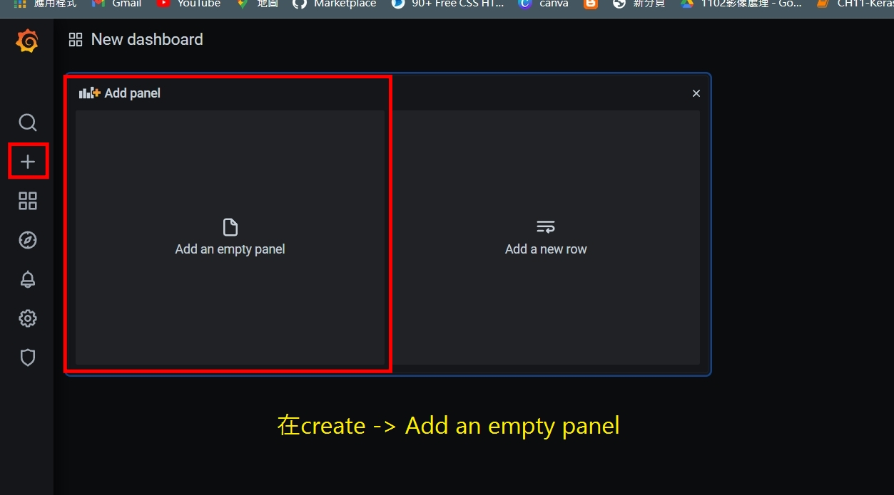
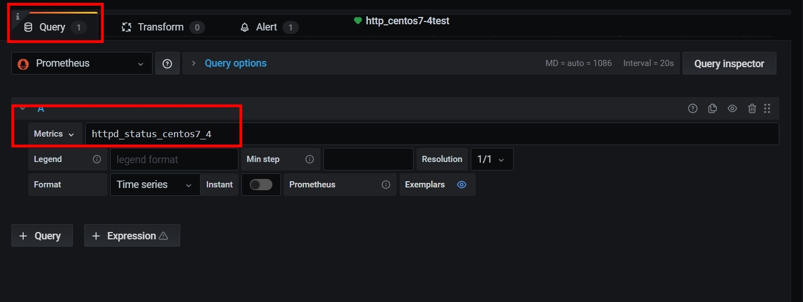
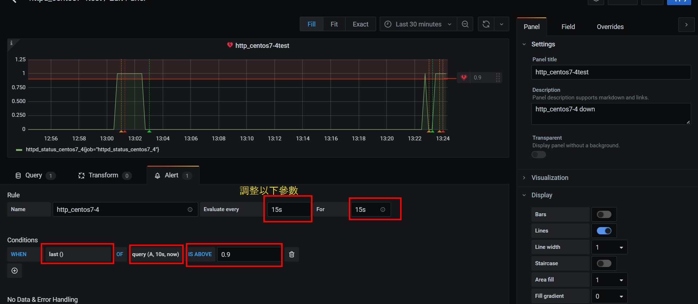
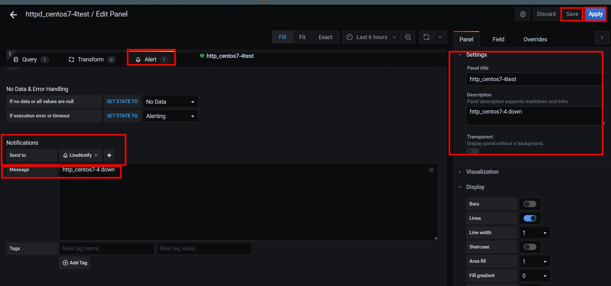
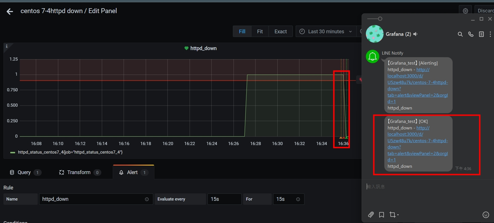

# Gragana with Linebot
crontab -e
```
* * * * * /app/scripts/pushgateway/check_httpd_centos7-2.sh
* * * * * sleep 15;/app/scripts/pushgateway/check_httpd_centos7-2.sh
* * * * * sleep 30;/app/scripts/pushgateway/check_httpd_centos7-2.sh
* * * * * sleep 45;/app/scripts/pushgateway/check_httpd_centos7-2.sh
```

mkdir -p /app/scripts/pushgateway
cd /app/scripts/pushgateway
gedit check_httpd_centos7-2.sh
```
#!/bin/bash

# For waiting connections
label="httpd_status_centos7_4"
curl -q  http://127.0.0.1 >/dev/null 2>&1 
status=`echo $?`
if [ $status -eq 0 ];then
   result=1
else
   result=0
fi
#echo $label $result
echo "$label $result" | curl --data-binary @- http://192.168.48.180:9091/metrics/job/$label
```

chmod +x check_httpd_centos7-2.sh 
./check_httpd_centos7-2.sh 
systemctl stop httpd
systemctl start httpd


- 打開Prometheus


- 打開Grafana
- 帳號密碼預設都是admin，進去後我將密碼改成123456


- 打開 LINE notify ，點擊發行權杖 -> 設定名稱 -> 將創好的LINE群組加入


- 複製權杖


- 點擊Alert -> Notification channels -> Type選擇LINE -> 並儲存起來 


- 在create中Add an empty panel

- 調整Query成http_status_centos7_4(之前設定過), Alert(挑整一些參數，並且將剛剛的LineNotify加入)




- 接著在linux上嘗試輸入`systemctl stop httpd`就可以順利看到其收到通知
