# Ansible的使用筆記
- 參考資料 : https://tw511.com/a/01/32123.html
- 先確認這個是否設定好 : `ansible servers -m ping`


- 1. 確認主機的開機時間
```
[root@centos7-2 user]# ansible server1 -m command -a "uptime"
192.168.48.181 | CHANGED | rc=0 >>
 18:27:38 up 16:32,  3 users,  load average: 0.20, 0.23, 0.29

[root@centos7-2 user]# ansible -m command -a "uptime" 'server1'
192.168.48.181 | CHANGED | rc=0 >>
 18:28:31 up 16:33,  3 users,  load average: 0.08, 0.19, 0.27
```
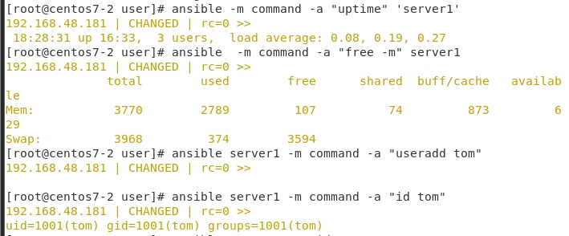
- 2. 了解機器內部的情形，檢查記憶體情況
```
[root@centos7-2 user]# ansible  -m command -a "free -m" server1
192.168.48.181 | CHANGED | rc=0 >>
              total        used        free      shared  buff/cache   available
Mem:           3770        2789         107          74         873         629
Swap:          3968         374        3594

```

- 3. 新增使用者
```
[root@centos7-2 user]# ansible server1 -m command -a "useradd tom"
192.168.48.181 | CHANGED | rc=0 >>

[root@centos7-2 user]# ansible server1 -m command -a "id tom"
192.168.48.181 | CHANGED | rc=0 >>
uid=1001(tom) gid=1001(tom) groups=1001(tom)

```

- 4.  確認使用者是否存在，以下訊息代表使用者不存在
```
[root@centos7-2 user]# ansible server1 -m command -a "id peter"
192.168.48.181 | FAILED | rc=1 >>
id: peter: no such usernon-zero return code

```
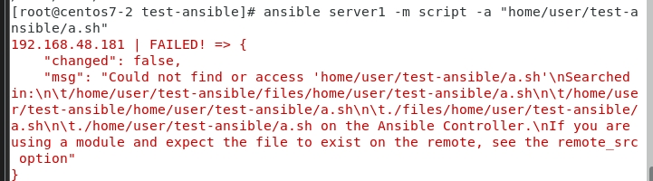

- 5. 新增完後的樣子
```
[root@centos7-2 user]# ansible server1 -m command -a "useradd peter"
192.168.48.181 | CHANGED | rc=0 >>

[root@centos7-2 user]# ansible server1 -m command -a "id peter"
192.168.48.181 | CHANGED | rc=0 >>
uid=1002(peter) gid=1002(peter) groups=1002(peter)
[root@centos7-2 user]# ansible server1 -m command -a "id peter"
192.168.48.181 | CHANGED | rc=0 >>
uid=1002(peter) gid=1002(peter) groups=1002(peter)

```

---
# ansible的高階使用方法
## 常使用的模組
### script模組
- 先創造一個資料夾 : `mkdir test-ansible`
- 進入該資料夾 : `cd test-ansible/`
- 寫一個腳本將以下內容寫進a.sh : `gedit a.sh`
    ```
    #!/usr/bin/bash
    date
    hostname

    echo "hello world"
    ```
- 給a.sh可執行的權限 : `chmod +x a.sh`
- 執行它 : `./a.sh`
- 檢視結果法一(相對路徑) : `ansible server1 -m script -a "./a.sh"`

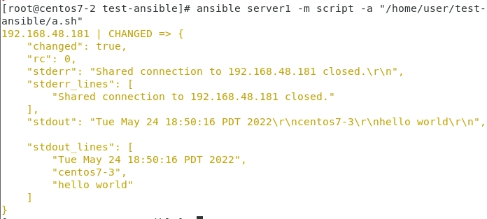

- 檢視結果法二(絕對路徑，可以透過pwd來確認位置) : `ansible server1 -m script -a "/home/user/test-ansible/a.sh"`

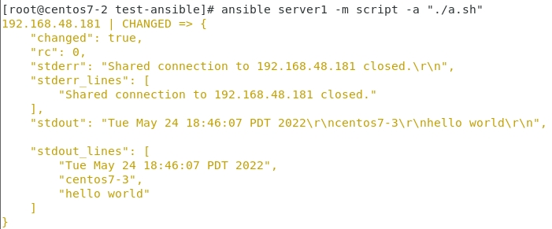


---
## 遠端複製
- 將hello放入hello.txt中 : `echo "hello" > hello.txt`
- 查看hello.txt裡面的內容 : `cat hello.txt`
- 把ansible主機的hello.txt放到另一台的/tmp/hello.txt中 : `ansible server1 -m copy -a "src=./hello.txt dest=/tmp/hello.txt owner=user group=user mode=0644"`
- 確認內容 : `ansible server1 -m command -a "ls -l /tmp/hello.txt"`

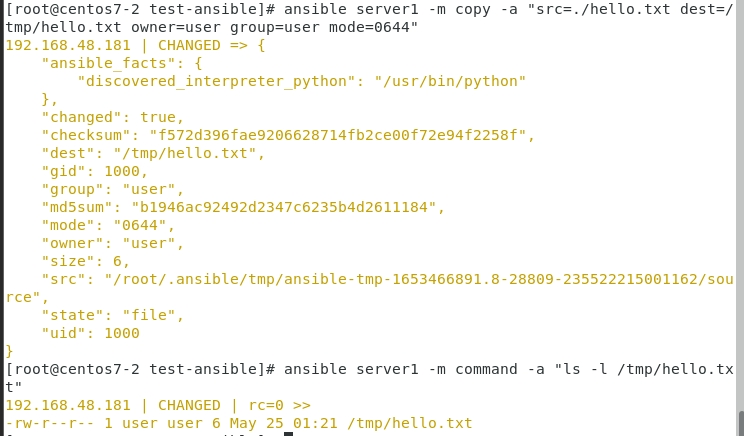

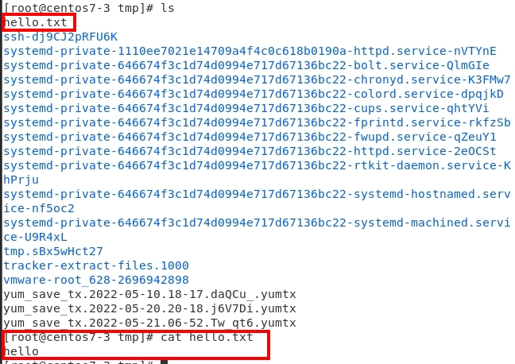

---

## file 模組
- `ansible server1 -m file -a "path=/tmp/hello.txt owner=tom group=tom mode=0755"`
- `ansible server1 -m command -a "ls -l /tmp/hello.txt"`

- `ansible server1 -m file -a "path=/tmp/testdir state=directory"`
- `ansible server1 -m file -a "path=/tmp/testdir state=absent"`
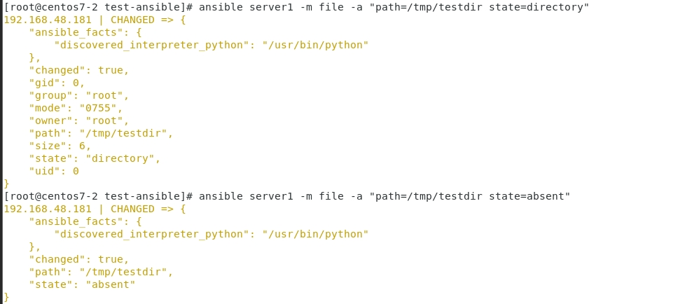
---
## yum & service 模組
* 用來查看檔案的屬性，獲取遠端檔案的資訊
`ansible server1 -m command -a "systemctl status httpd"`
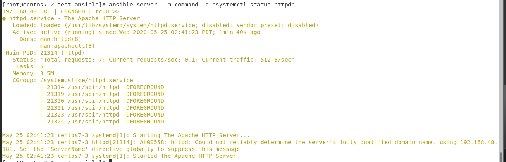
`ansible server1 -m service -a "name=httpd state=started"`
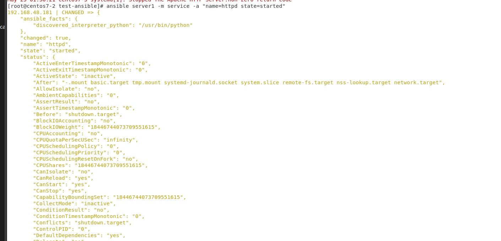
`curl http://centos7-3`
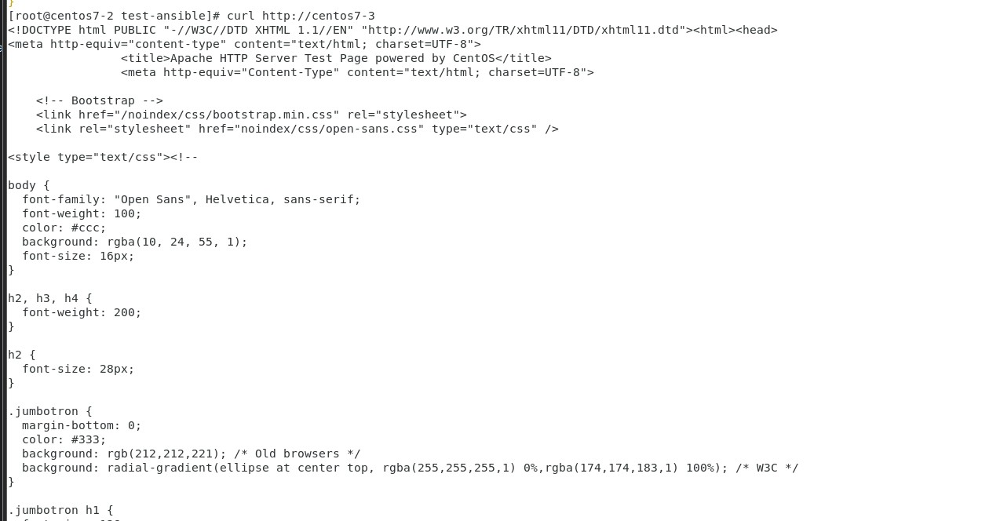
`ansible server1 -m service -a "name=httpd state=stopped"`
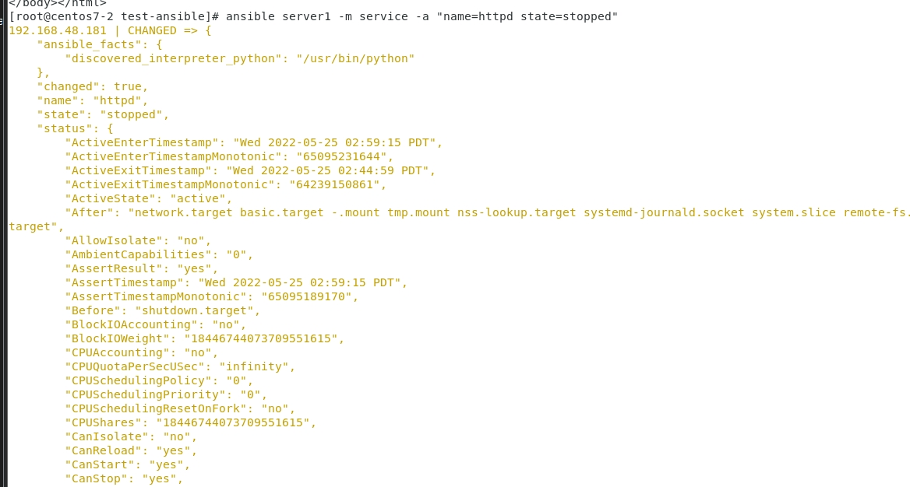
`curl http://centos7-3`
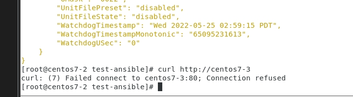

- 卻認裡面的cpu狀況`ansible server1 -m setup | grep cpu`
- 卻認裡面的記憶體狀況`ansible server1 -m setup | grep mem`
