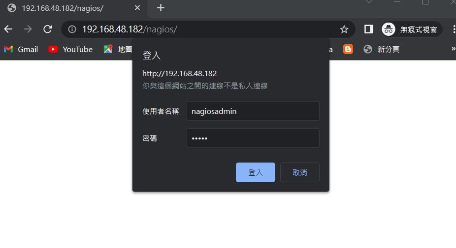
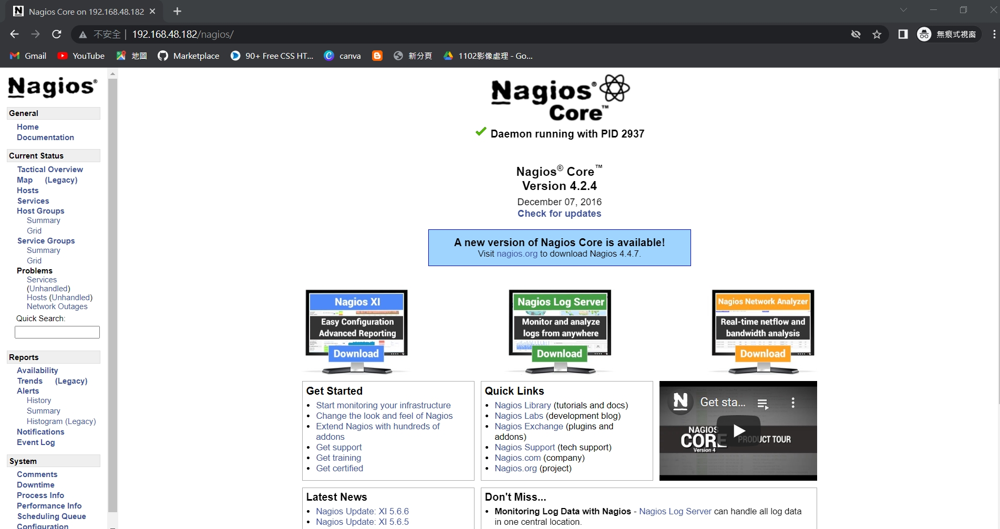
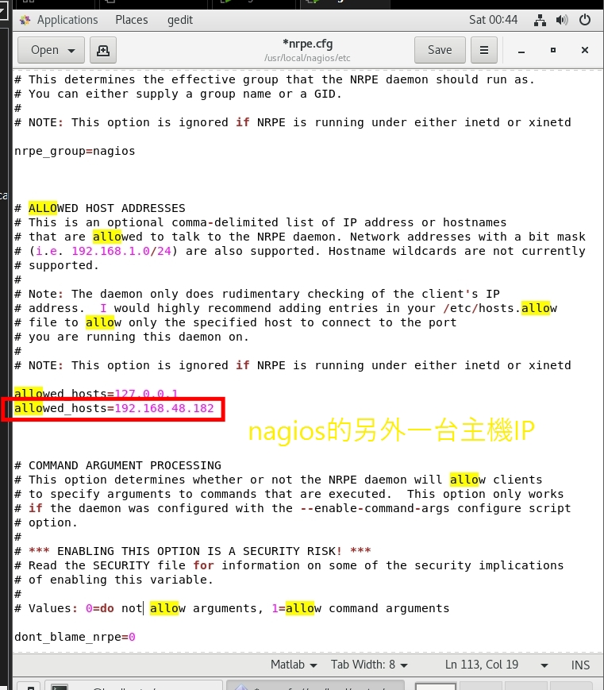
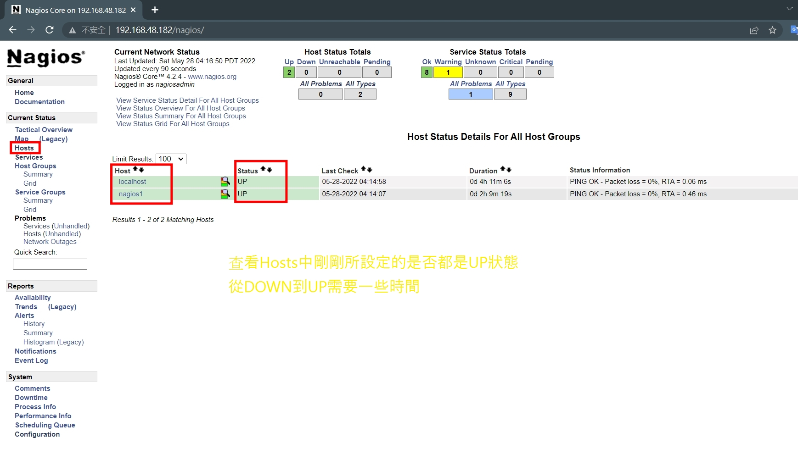

# nagios
## 前言

## 安裝步驟
### 1. 安裝Nagios的主程式

* (a) 安裝套件 : 
    ```
    yum install wget httpd php glibc glibc-common gd gd-devel make net-snmp unzip openssl-devel gcc
    ```


* (b) 新增使用者(將Apache加入到Nagios組中)
    ```
    useradd nagios -p nagios

    usermod -a -G nagios apache
    ```


* (c) 下載Nagios的主程式(主要使用C語言)，並且將其解壓縮，及切換到剛剛解壓縮的資料夾中
    * -f : 建立指定檔案名稱
    * -z : 具有gzip的屬性
    * -v : 顯示建立過程
    * -x : 解壓縮

    ```
    wget https://assets.nagios.com/downloads/nagioscore/releases/nagios-4.2.4.tar.gz

    tar zxvf nagios-4.2.4.tar.gz

    cd nagios-4.2.4
    ```

* (d) 製造出設定檔案，並且編譯原始檔
    ```
    ./configure
    make all
    make install
    make install-init
    make install-config
    make install-commandmode
    make install-webconf

    ```

### 2. 安裝Nagios Plugin

1. 安裝所需要的套件
```
yum install epel-release
yum install perl-Net-SNMP

yum install openssl-devel radiusclient-ng-devel libdbi libdbi-devel samba-devel libsmbclient-devel samba-client net-snmp-devel net-snmp-utils gnutls-devel openldap-devel postgresql-devel
```

2. 下載，解壓縮，並且切換到該檔案
```
wget https://nagios-plugins.org/download/nagios-plugins-2.1.4.tar.gz

tar zxvf nagios-plugins-2.1.4.tar.gz

cd nagios-plugins-2.1.4.tar
```

3. 製造出設定檔案並且編譯原始檔
```
./configure
make
make install
```

4. 記得要重新啟動
```
reboot
```

5. 接著啟動Nagios
```
systemctl start nagios
```

6. 建立登入Nagios的帳號密碼(我設定為 nagiosadmin 和 admin)
```
htpasswd -c /usr/local/nagios/etc/htpasswd.users nagiosadmin
```
7. 最後http://IP/nagios




---

# 使用方法

## 監控httpd
### 安裝NRPE
>* 安裝在Nagios主機上(nagios)
>* 安裝在遠端主機上，被監控之主機(nagios1)

### 首先安裝在被監控主機上(nagios1)
- 新增要執行指令的使用者 : `useradd nagios -p nagios`

- 下載並解壓縮NRPE
```
cd ~
wget https://github.com/NagiosEnterprises/nrpe/archive/nrpe-3.0.1.tar.gz
tar zxvf nrpe-3.0.1.tar.gz
cd nrpe-nrpe-3.0.1/
```
- 製造出設定檔，並且編譯原始檔
```
./configure
make all
make install
make install-config
make install-inetd
make install-init

make install-groups-users
```
- 啟動NRPE和xinetd服務(如果沒有xinetd記得安裝`yum install xinetd -y`)
```
systemctl restart xinetd
systemctl enable nrpe
systemctl start nrpe

```

- 檢查服務是否已啟動
```
ss -at | egrep "nrpe|5666"
或
netstat -at | egrep "nrpe|5666"
```

- 檢查服務是否正常
```
/usr/local/nagios/libexec/check_nrpe -H 127.0.0.1
/usr/local/nagios/libexec/check_nrpe -H 127.0.0.1 -c check_users
```

- 修改nrpe.cfg，允許其他IP來訪問
```
vi /usr/local/nagios/etc/nrpe.cfg
```


---
- 監控那台的電腦記得要重新啟動nrpe`systemctl restart nrpe`
### 安裝在Nagios主機上(nagios)
- 下載並解壓縮NRPE
```
cd ~
wget https://github.com/NagiosEnterprises/nrpe/archive/nrpe-3.0.1.tar.gz
tar zxvf nrpe-3.0.1.tar.gz
cd nrpe-nrpe-3.0.1/
```
- 製造出設定檔並編譯
```
./configire
make check_nrpe
make install-plugin
```
- 檢查NRPE運作是否正常
```
/usr/local/nagios/libexec/check_nrpe -H 192.168.48.147
```
- 新增監控裝置
    - 新增監控裝置 `gedit /usr/local/nagios/etc/nagios.cfg`

    - 新增下列文字
        ```
        cfg_file=/usr/local/etc/nagios/objects/hosts
        ```

    - 新增hosts設定檔 `gedit /usr/local/nagios/etc/objects/hosts`

    - 新增下列文字
        ```
        define host{
            use linux-server
            host_name nagios1
            address 192.168.48.187
        }

        define service{
            use local-service
            host_name nagios1
            service_description HTTP
            check_command check_http
            notifications_enabled 0
        }
        ```
    
    - 檢查設定檔 `/usr/local/nagios/bin/nagios -v /usr/local/nagios/etc/nagios.cfg`
    
- 到網站上查看是否成功新增host及service

    - 若是發現http warning是因為需要在/var/www/html下新增index.html




## 參考資料
http://bigpxuan.blogspot.com/2016/12/centos-7-nagios-4.html

https://www.tutorialspoint.com/nagios/nagios_nrpe.htm


