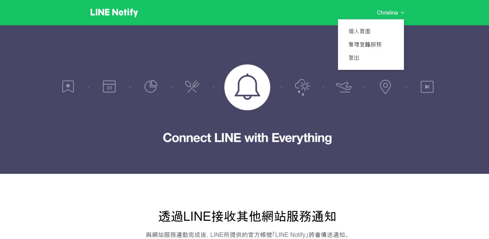
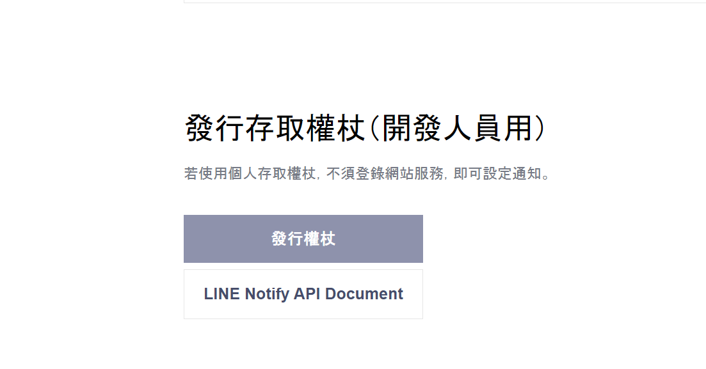
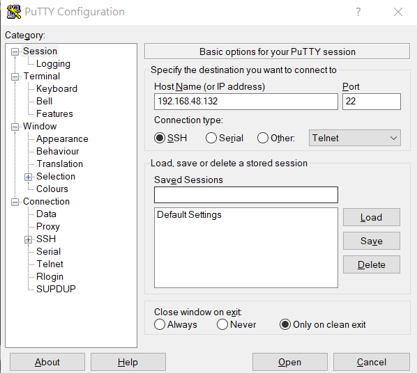
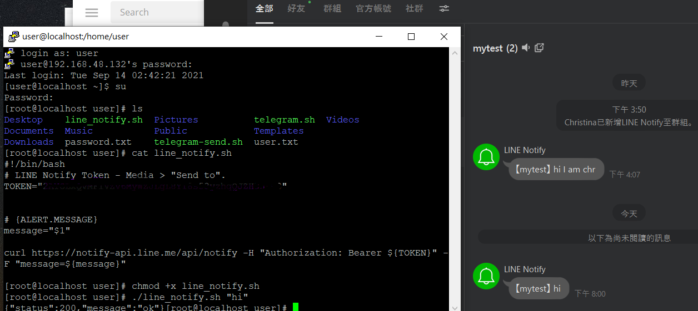

# 使用linux發訊行給Line
### STEP1.先登入LINE notify

* 登入 -> 個人頁面 ->發行權杖(找到想要的那個群組(須包含自己和Line notify))
    

    

* 連動完如下圖所示
    

### STEP2.使用putty連上自己的虛擬機打上IP輸入帳號密碼

* 如圖
    

* 接著登入，並創建`gedit line_notify.sh`打上以下指令
    ```
    #!/bin/bash
    # LINE Notify Token - Media > "Send to".
    TOKEN="填入申請好的權杖"


    # {ALERT.MESSAGE}
    message="$1"

    curl https://notify-api.line.me/api/notify -H "Authorization: Bearer ${TOKEN}" -F "message=${message}"

    ```
* 增加可執行`chmod +x line_notify.sh`
* 輸入 `./line_notify.sh "hello"` 就可以傳資料了 
    
