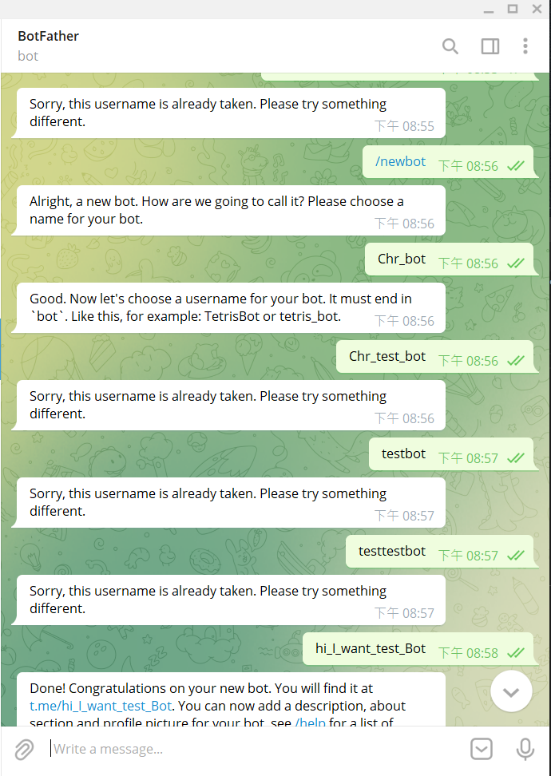
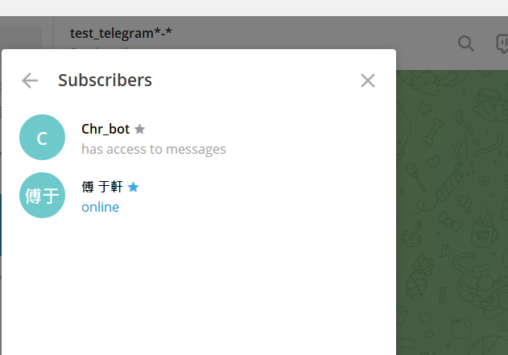
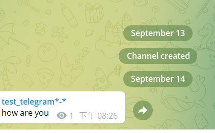
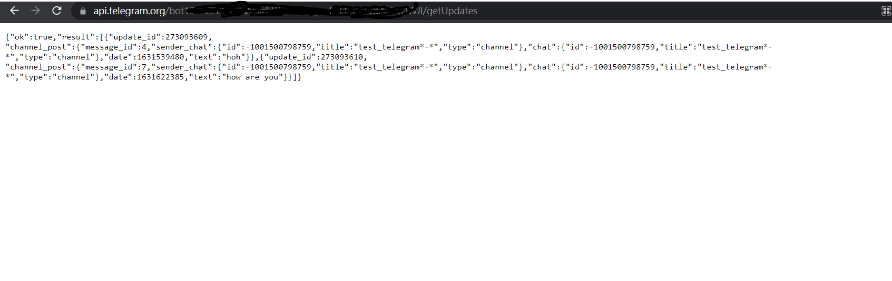

# 補充作業(telegram機器人製作)

>* 運用putty連接linux來發送訊息給telegram

### STEP1.先在telegram上搜尋@BotFathert
* 找到@BotFather輸入/newbot接者輸入Bot名稱，然後需要輸入使用者名字(這個使用者名字不能跟任何人重複，所以我出現了error多次，最後找到)
>* 注意:結尾需要是bot
    

* 當出現Done...代表成功，並且他會給我一個Token

### STEP2.創建群組，並且加入剛剛的Bot為成員
* 如圖
    

### STEP3.找出channel id
* 接者，試著在群組中傳訊息，並在 https://api.telegram.org/bot<輸入剛剛的TOKEN>/getUpdates 找到channel_id

    

    

### STEP4.在Putty上傳訊息登入方式跟剛剛的[LineBot](https://github.com/FUYUHSUAN/note/blob/master/110-%E4%BC%BA%E6%9C%8D%E5%99%A8%E6%9E%B6%E8%A8%AD/W1/Line%E6%A9%9F%E5%99%A8%E4%BA%BA(linux%E7%99%BC%E8%A8%8A%E6%81%AF%E7%B5%A6Line).md)一樣

* 在putty上創建`gedit telegram-send.sh`並輸入Bot的Token和channel(group)_id
    ```
    #!/bin/bash
        
    GROUP_ID=<group_id>
    BOT_TOKEN=<bot_token>

    # this 3 checks (if) are not necessary but should be convenient
    if [ "$1" == "-h" ]; then
    echo "Usage: `basename $0` \"text message\""
    exit 0
    fi

    if [ -z "$1" ]
    then
        echo "Add message text as second arguments"
        exit 0
    fi

    if [ "$#" -ne 1 ]; then
        echo "You can pass only one argument. For string with spaces put it on quotes"
        exit 0
    fi

    curl -s --data "text=$1" --data "chat_id=$GROUP_ID" 'https://api.telegram.org/bot'$BOT_TOKEN'/sendMessage' > /dev/null
    ```

### SEEP5.最後就可以成功發送訊息了
* 接者，給權限`chmod +x telegram-send.sh`
* 然後就可以成功發出訊息了`./telegram-send.sh "test"`
    


-------------
參考自[Send message to Telegram on any SSH login](https://bogomolov.tech/Telegram-notification-on-SSH-login/)