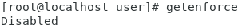
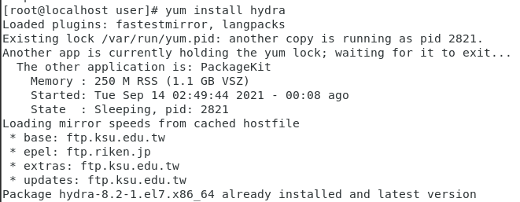
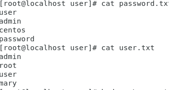
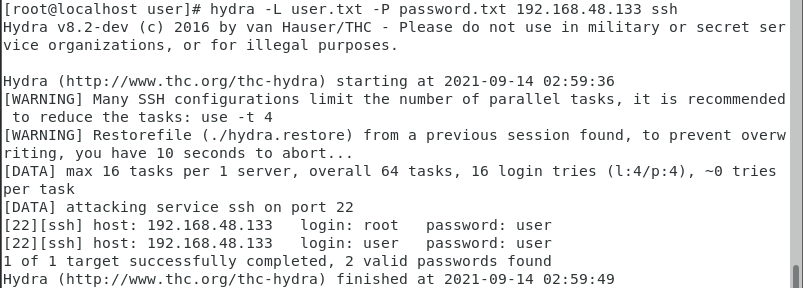

# 網路攻防

>* 需求:需要兩台虛擬機

>* 攻擊方:Centos7-1 

>* 防守方:Centos7-2

## 網路攻擊

### STEP1.首先先設定(Centos7-2)需要先將防火牆關起來

* 確認防火牆狀態輸入: `systemctl status firewalld` ，如下圖，即為開啟狀態

    

* 將防火牆關起: `systemctl stop firewalld`，並且輸入 `systemctl status firewalld`再次確認狀態，如關上會如下圖

    

### STEP2.接著確認SELinux模式(Centos7-2)

* 使用 `getenforce`卻認為 Disabled

    

* 如果顯示Enforcing則輸入`gedit /etc/selinux/config`去修改成SELINUX=disabled

    

    

### STEP3.接著切換成(Centos7-1)來安裝破解工具

* 使用指令 `yum install epel-release
`和 `yum install hydra`

    

    

### STEP4.在(Centos7-1)創建密碼檔(password.txt和user.txt)

* 創建password.txt和user.txt，使用 `gedit password.txt` 和 `gedit user.txt`，並在其中輸入自己想要的密碼檔(內容)，盡量不要有空白行。
    * e.g
    ```
    user
    mary
    centos
    ```

* 使用`cat password.txt`和`cat user.txt`來確認內容

    

### STEP5.在(Centos7-1)輸入指令攻擊，定找出其密碼

    

## 網路防守

### STEP6.在(Centos7-2)找出所有linux上的紀錄

* 先 `cd /var/log`並打開secure `gedit secure`就可以看到許多的失敗的攻擊

    

* 接者，我們寫一個程式來抓出測試太多次且失敗的IP，於是我們創建 `gedit blockip-ssh.sh`並加入以下程式碼

    ```
    #!/usr/bin/bash

    awk '/auth_basic:error/ {print $10}' /var/log/httpd/error_log | tr ":" " " | awk '{print $1}' | awk '{i=$1;ips[i]++}END{for(i in ips)if(ips[i]>=3)print(i)>"hosts.deny"}'

    while read line
    do
    echo $line "is blocked"
    iptables -I INPUT -s $line -p tcp --dport 80 -j DROP
    done < hosts.deny


    ```
    

* 接下來就給其可執行權限`chmod +x blockip-ssh.sh`，並且執行他`./blockip-ssh.sh`，就可以在防火牆中已將它設為黑名單了`cat /etc/hosts.deny`

    

## 最後在(Centos7-1)上攻擊就發現無法攻擊，所以就防守成功了

* 看見無法再猜出密碼了
    
    