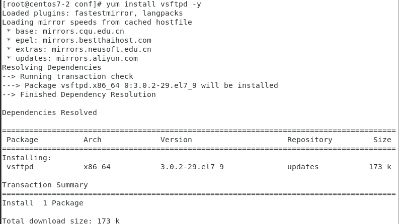
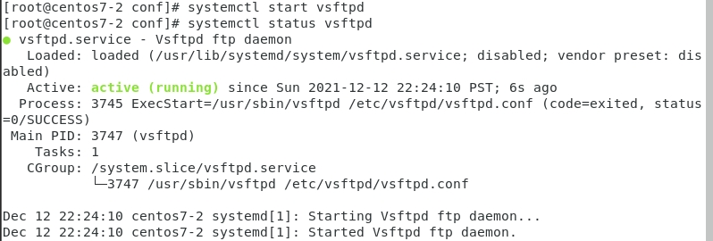
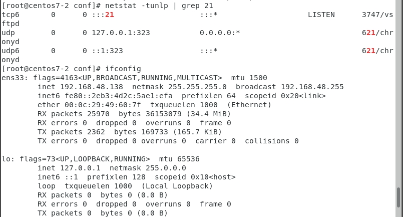
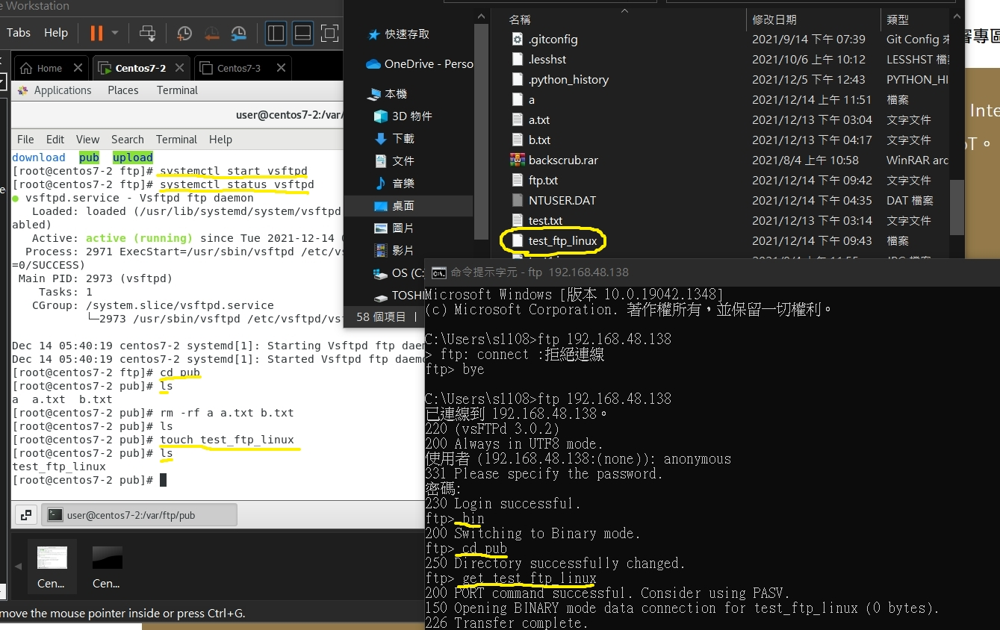
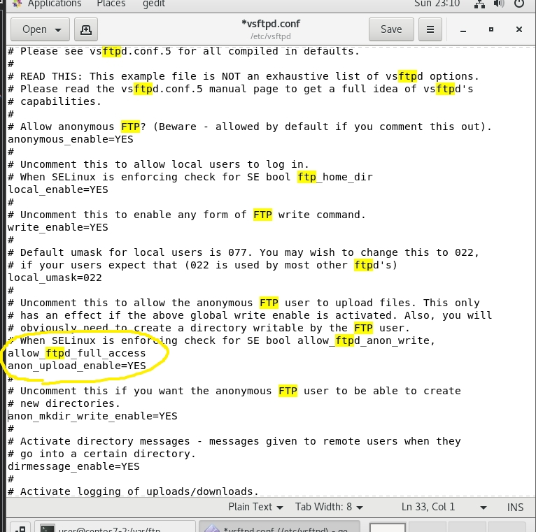
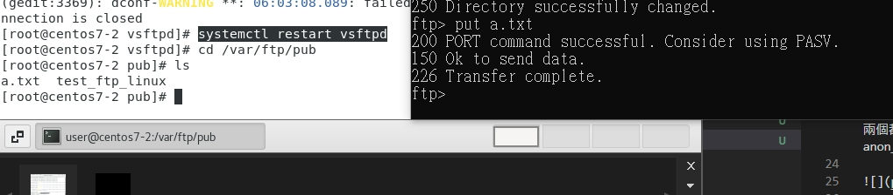
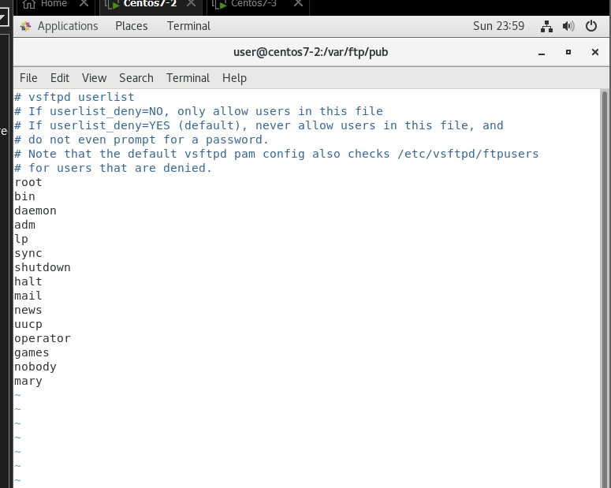
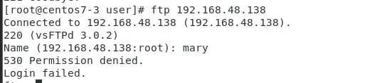

# ftp 

1. 安裝vsftp`yum install vsftpd -y`

2. 打開vsftpd並確認其狀況`systemctl start vsftpd`和`systemctl status vsftpd`

3. 確認21port 已經是使用ftp了

4. `cd pub `在裡面新增文件`touch 文件`

5. 接著開啟cmd，輸入`ftp 192.168.48.138`(這是linux那台主機的ip位置)

6. 使用者輸入:anonymous 密碼輸入:a.b.c@gmail.com

7. 接下來，切到binary mode使用`cd bin` (for cmd)

8. `cd pub` 讓後使用 `get test_for_linux` 來抓取檔案，然後檔案就下來了

9. 回到linux使用`cd /etc/vsftpd` 編輯 `gedit vsftpd.conf`這個文件將這兩個都allow_ftpd_full_access,anon_mkdir_write_enable=YES和 anon_mkdir_write_enable=YES的註解都拿掉

10. `systemctl restart vsftpd`重啟vsftpd

11. 使用`put a.txt`就可以順利將本機上的東西傳到linux中

12. 注意注意注意，名字不可相同，會失敗，做之前建議都先bin(在cmd)中

# 如何防止別的主機的user ftp進去

1. `cd /etc/vsftpd`
2. `vi user_list`
3. 將使用者名稱加上去
4. 就成功了

systemctl start vsftpd
systemctl status vsftpd
gedit /etc/vsftpd/vsftpd.conf
取消註解 anon_upload_enable=YES
         anon_mkdir_write_enable=YES

cd /var/ftp/pub
chmod 777 pub
systemctl restart vsftpd
netstat -tunlp | grep 21
cd /var/ftp/pub
touch a
touch b{1..5}
cd ..
gedit /etc/vsftpd/vsftpd.conf &

找到chroot_local_user=YES
在下面加入allow_writeable_chroot=YES

chmod 777 pub
systemctl start vsftp

到CMD
ftp 192.168.56.XX
anonymous
user abc@gmail.com
pwd
cd pub
bin
get a     桌面有下載
prompt off
mget b*
put c

再加分********* 
cd /var/ftp
mkdir download
mkdir upload
chmod 777 upload
cd download  
echo "hi" > hi.txt
cd upload
echo "hey" > a.txt
echo "hola" > a2

systemctl restart vsftpd
到第二台 開網路 關防火牆
ls
echo "upup" > up.txt

ftp 192.168.56.XXX
anonymous
1
cd download
ls
get XXX
put XXX
cd .. 
cd upload
get XXX
put XXX

