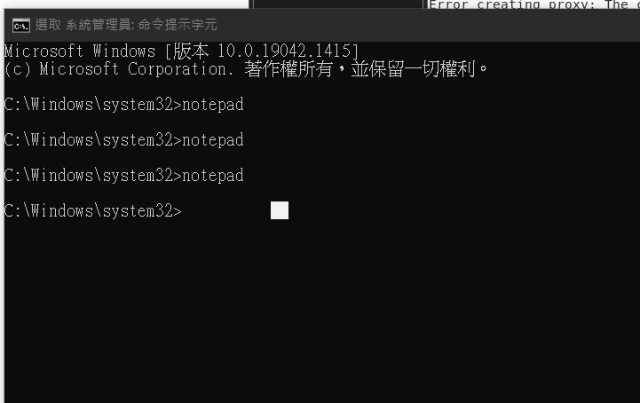
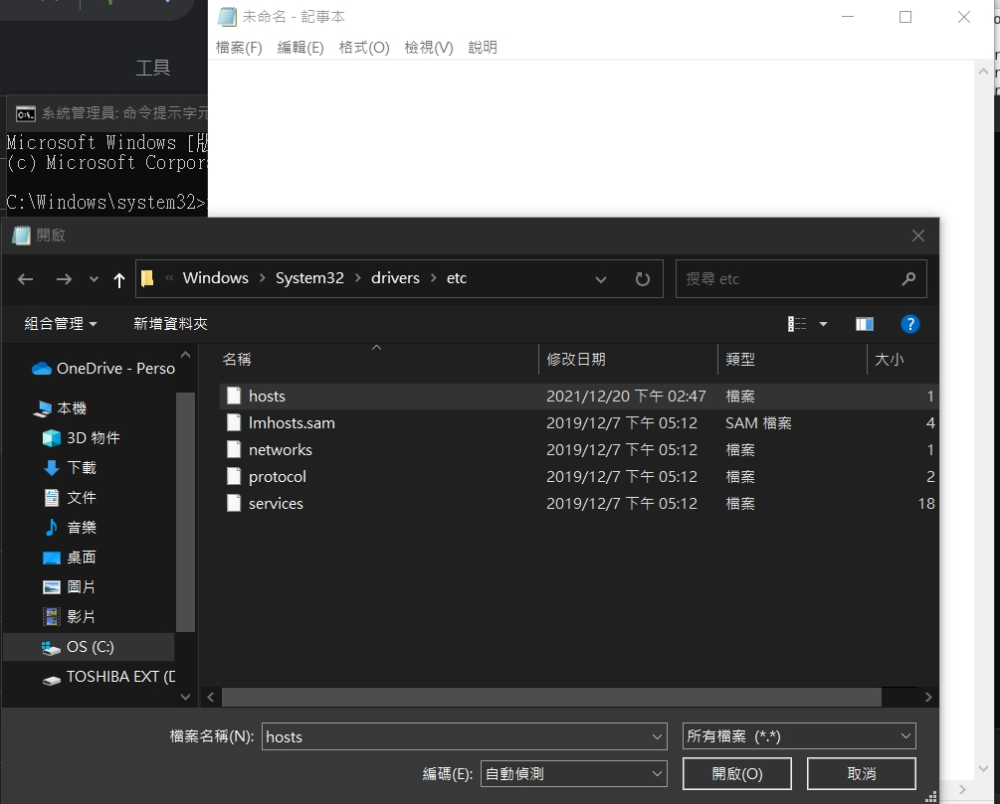
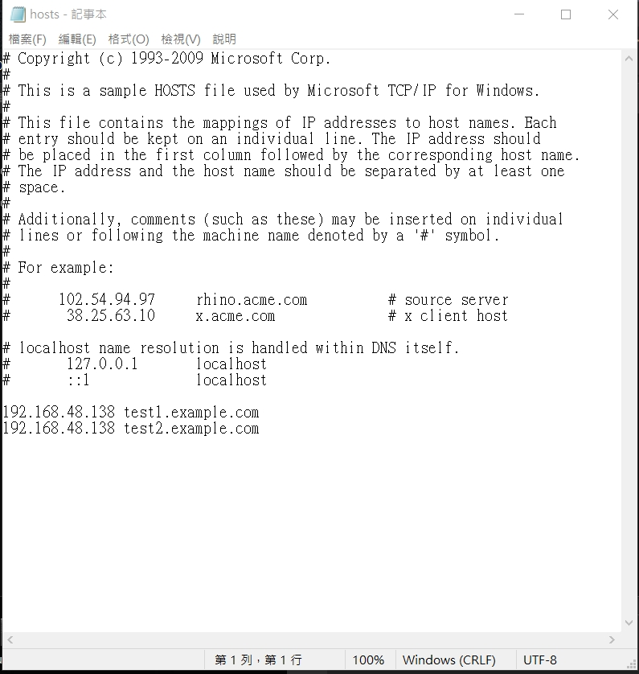
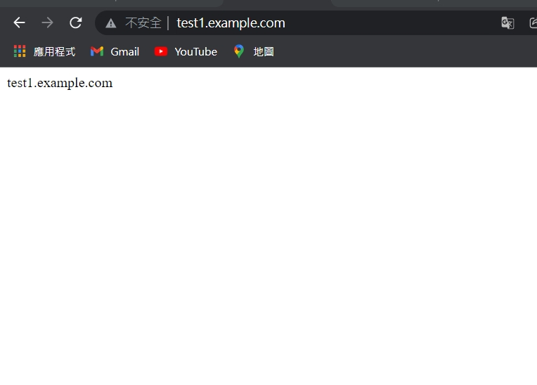
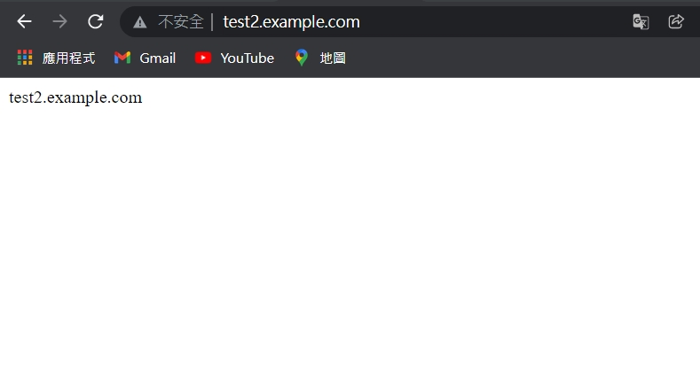

for linux(centos7-2)

1. cd /etc/httpd/conf.d

2. gedit vhosts.conf


```
<VirtualHost _default_:80>
   ServerName www.example.com
   DocumentRoot /var/www/html
</VirtualHost>
<VirtualHost *:80>
   ServerName test1.example.com
   DocumentRoot /var/www/vhosts/test1
</VirtualHost>
<VirtualHost *:80>
   ServerName test2.example.com
   DocumentRoot /var/www/vhosts/test2
</VirtualHost>
```

3. mkdir -p /var/www/vhosts/test1
  mkdir -p /var/www/vhosts/test2

4. cd /var/www/vhosts/test1

5. echo "test1.example.com" > index.html

6. cd /var/www/vhosts/test2

7. echo "test2.example.com" > index.html

8. systemctl restart httpd

for windows
1. 以系統館理員身分打開cmd，輸入notpad


2. 接著打開路徑的C:\Windows\System32\drivers\etc中的hosts



3. 編輯裡面的內容增加該IP+剛剛編輯的網站名稱test1.example.com 之類

```

192.168.48.138 test1.example.com
192.168.48.138 test2.example.com

```

4. 最後在windows網頁上輸入剛剛的網址名稱就成功了

