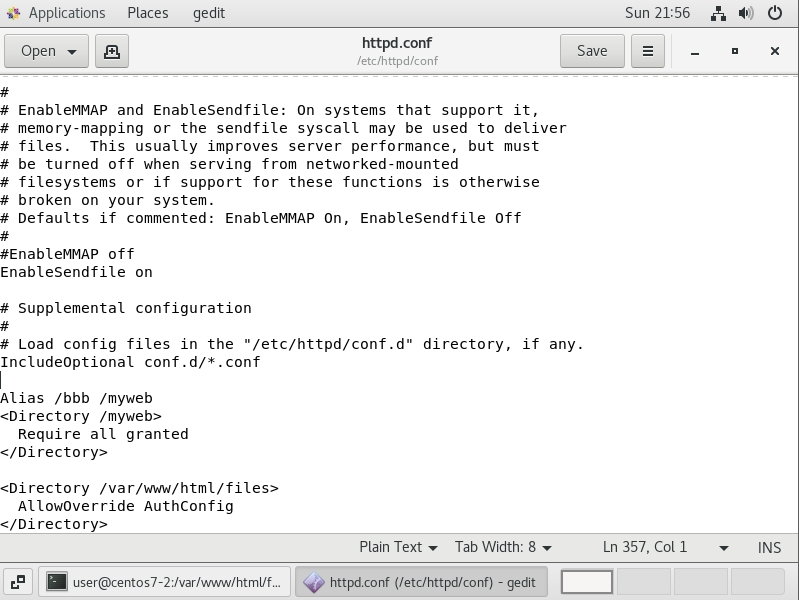
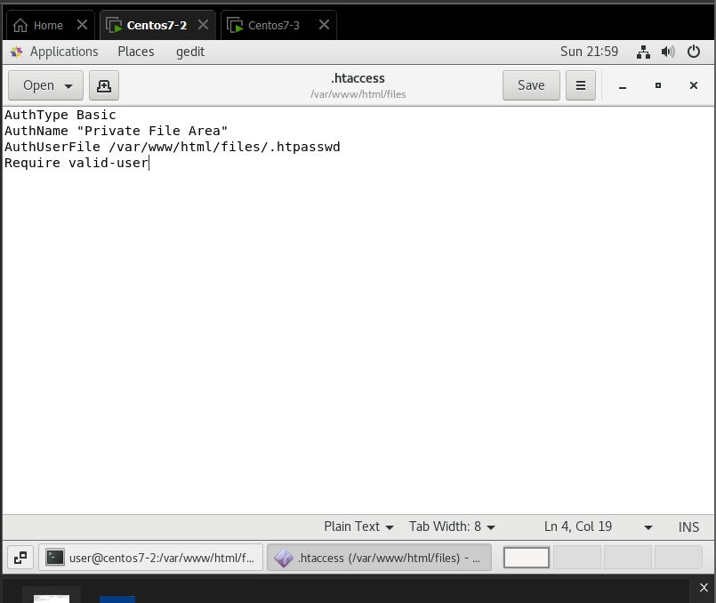
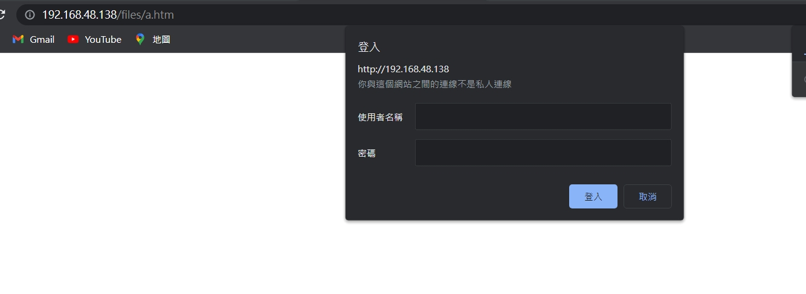
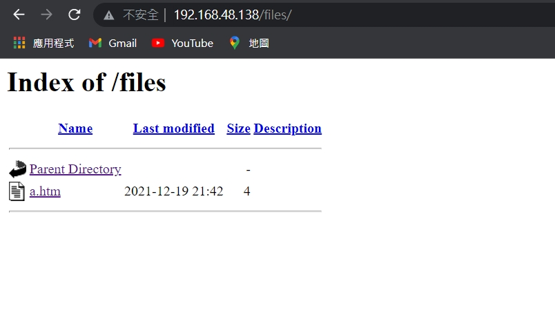

```
systemctl restart httpd
  198  systemctl status httpd
  199  cd /var/www/html
  200  ls
  201  mkdir files
  202  pwd
  203  ls
  204  cd files/
  205  echo "aaa" > a.htm
  206  gedit /etc/httpd/conf/httpd.conf 
  207  pwd
  208  htpasswd -c .htpasswd user
  209  htpasswd -c .htpasswd tom
  210  ls
  211  ls -al
  212  cat .htpasswd 
  213  htpasswd  .htpasswd user
  214  ls -al
  215  cat .htpasswd 
  216  gedit .htaccess
  218  systemctl restart httpd
  219  history
```
1. systemctl restart httpd

2. systemctl status httpd

3. mkdir files
4. ls
5. cd files/
6. echo "aaa" > a.htm
7. gedit /etc/httpd/conf/httpd.conf 
的最後增加以下
```
<Directory /var/www/html/files>
  AllowOverride AuthConfig
</Directory>
```



8. pwd

9. `htpasswd -c .htpasswd user`和` htpasswd  .htpasswd tom` (只有第一次需要 -c)

10. `cat .htpasswd`
```
[root@centos7-2 files]# cat .htpasswd 
tom:$apr1$cMpAk4Zr$LZbwd/LgvaC4a/bT25V68.
user:$apr1$kWSGVosO$LSjDiUVpxZ46miLF0v6j11
```

11. `gedit /var/www/html/file`
```
AuthType Basic
AuthName "Private File Area"
AuthUserFile /var/www/html/files/.htpasswd
Require valid-user
```


12. `systemctl restart httpd`

13. 在windows網頁上登入ip+檔名這時就需要密碼了




```
[root@centos7-2 files]# htpasswd -c .htpasswd tom
New password: 
Re-type new password: 
Adding password for user tom
[root@centos7-2 files]# ls
a.htm
[root@centos7-2 files]# ls -al
total 8
drwxr-xr-x 2 root root  36 Dec 19 21:45 .
drwxr-xr-x 8 root root 174 Dec 19 21:41 ..
-rw-r--r-- 1 root root   4 Dec 19 21:42 a.htm
-rw-r--r-- 1 root root  42 Dec 19 21:45 .htpasswd
[root@centos7-2 files]# cat .htpasswd 
tom:$apr1$cMpAk4Zr$LZbwd/LgvaC4a/bT25V68.
[root@centos7-2 files]# htpasswd  .htpasswd user
New password: 
Re-type new password: 
Adding password for user user

```