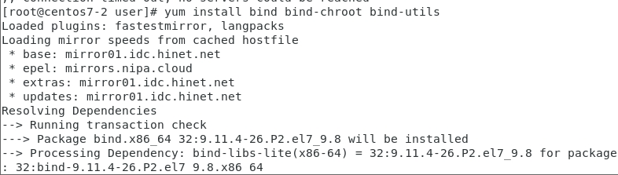
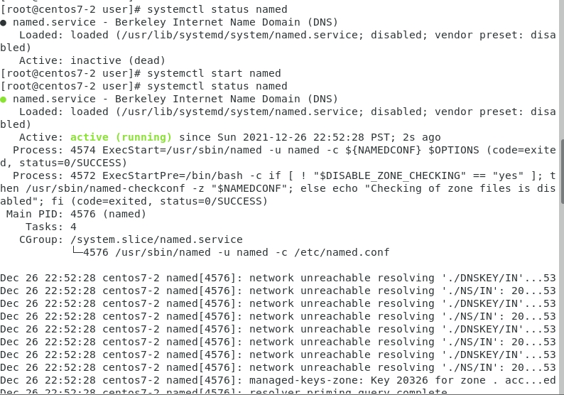
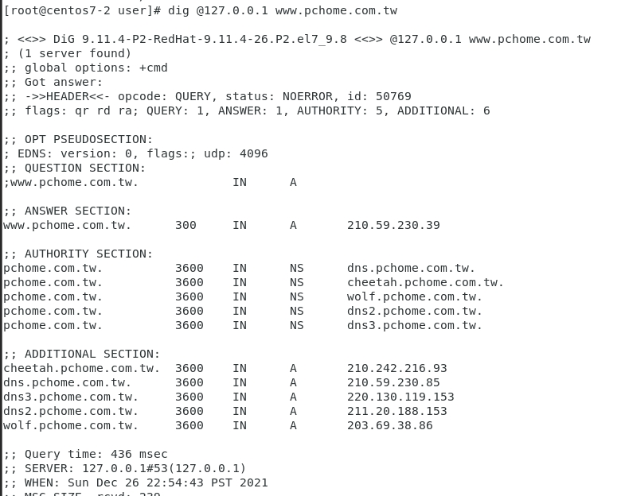
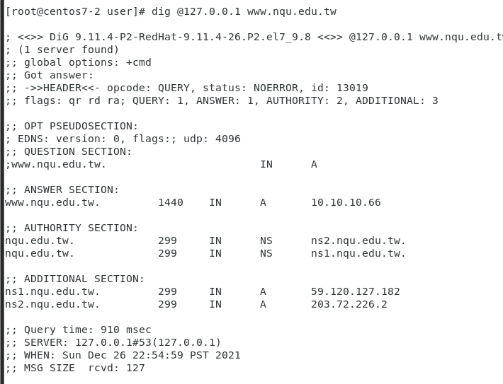
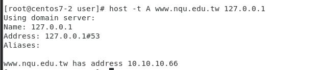
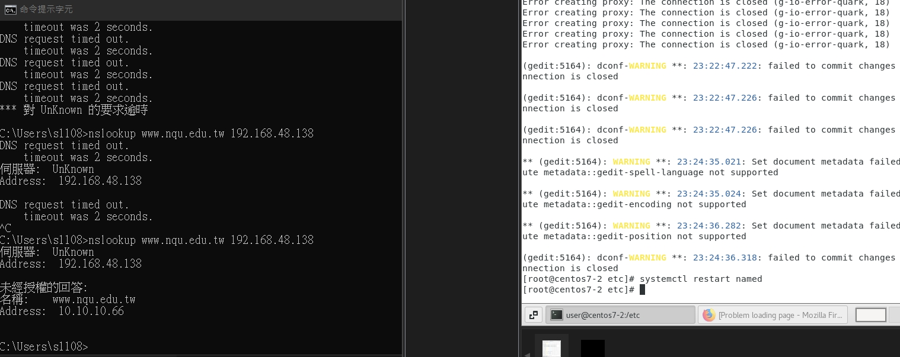
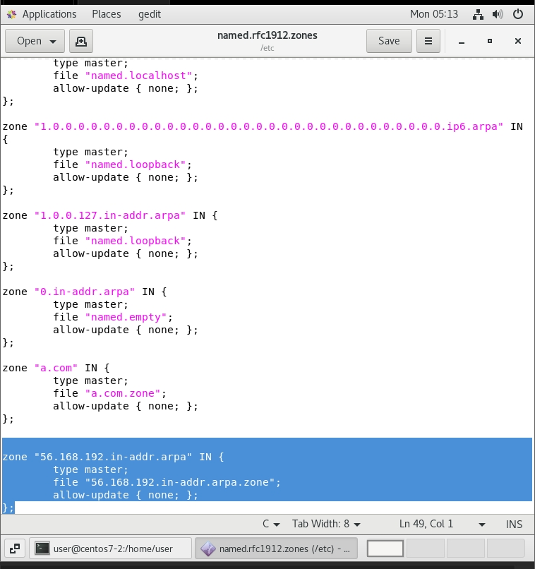
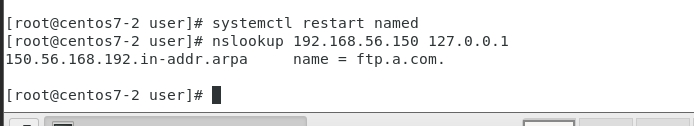

# bind
1. 一開始dig `@127.0.0.1 www.pchome.com.tw`會no servers could be reached
```
[root@centos7-2 user]# dig @127.0.0.1 www.pchome.com.tw

; <<>> DiG 9.11.4-P2-RedHat-9.11.4-26.P2.el7 <<>> @127.0.0.1 www.pchome.com.tw
; (1 server found)
;; global options: +cmd
;; connection timed out; no servers could be reached

```

2. 安裝`yum install bind bind-chroot bind-utils`


3. 一開始named是關的要將其打開`systemctl status named` -> `systemctl start named` -> `systemctl status named`(確認狀態)


4. 試試看dig`dig @127.0.0.1 www.pchome.com.tw` 和 `dig @127.0.0.1 www.nqu.edu.tw`



5. 安裝完成`host -t A www.nqu.edu.tw 127.0.0.1`


6. 編輯`gedit /etc/named.conf` 將127.0.0.1 -> any 和 localhost -> any


7. 接著，重啟`systemctl restart named`
8. 在 cmd 中打上 `nslookup www.nqu.edu.tw 192.168.48.138`(原本會timeout -> 做完後就不會了)



9. 管理一個網域
10. 編輯`gedit a.com.zone`加上以下
```
$TTL 600 ;10 minutes

@ IN SOA	@ ramy1231863.gmail.com (
		2021031803 ;serial
		10800      ;refresh
		900        ;retry
		604800     ;expire
		86400      ;minimum
		)
@		NS    dns1.a.com.
dns.com.	A     192.168.56.108
dns1		A     192.168.56.108
www		A     192.168.56.150
eshop		CNAME www
ftp		A     192.168.56.150
abc		A     192.168.56.120
```
11. 編輯 `gedit /etc/named.rfc1912.zones` 在最後增加以下
```
zone "a.com" IN {
	type master;
	file "a.com.zone";
	allow-update { none; };
};
```

12. 重啟named`systemctl restart named`

* `host -t A ftp.a.com 127.0.0.1`
  `host -t ns a.com 127.0.0.1`
  `host -t cname eshop.a.com 127.0.0.1`

13.  `gedit /etc/named.rfc1912.zones` 在後面加上
```
zone "56.168.192.in-addr.arpa" IN {
	type master;
	file "56.168.192.in-addr.arpa.zone";
	allow-update { none; };
};
```


14. 編輯`gedit /var/named/56.168.192.in-addr.arpa.zone`
```
@ IN SOA	@ ramy1231863.gmail.com (
		2021031803 ;serial
		10800      ;refresh
		900        ;retry
		604800     ;expire
		86400      ;minimum
		)

56.168.192.in-addr.arpa.    IN  NS dns1.a.com.
56.168.192.in-addr.arpa.    IN  NS dns2.a.com.

200.56.168.192.in-addr.arpa.  IN PTR www.a.com.
150.56.168.192.in-addr.arpa.  IN PTR ftp.a.com.

```

15. 最後將named重新啟動並打`nslookup 192.168.56.150 127.0.0.1`出現結果如下即完成
[root@centos7-2 user]# systemctl restart named
[root@centos7-2 user]# nslookup 192.168.56.150 127.0.0.1
150.56.168.192.in-addr.arpa	name = ftp.a.com.




* 補充:(debug)
  * `named-checkconf a.com /var/named/a.com.conf` : 可以看看是否有出現錯誤
  * `named-checkzone a.com /var/named/a.com.zone` : 可以看看是否有出現錯誤


  test for cmd`cmd:nslookup abc.a.com 192.168.48.138`
