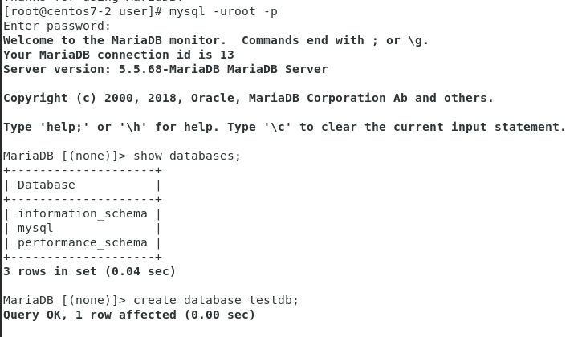
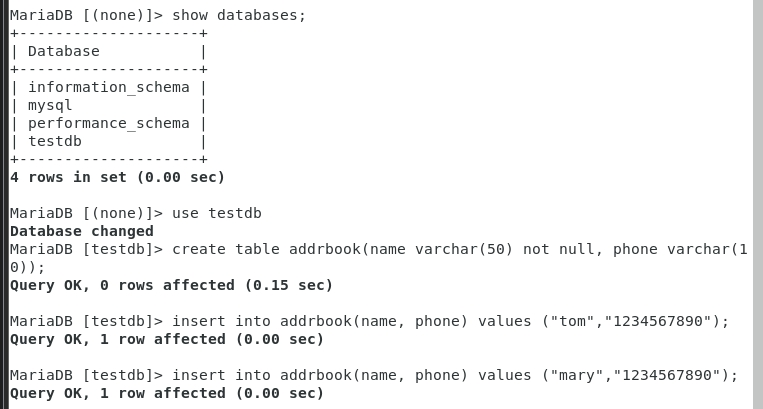
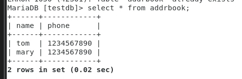
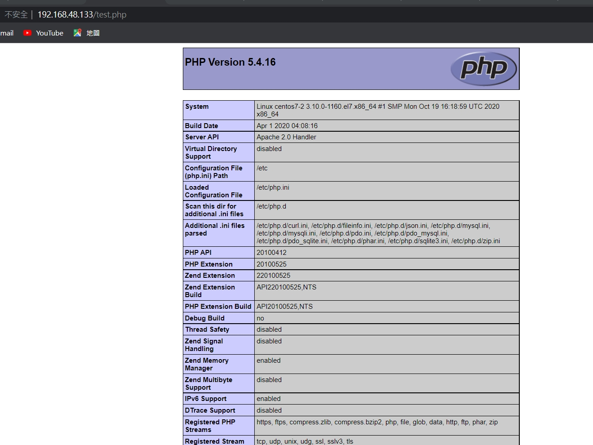
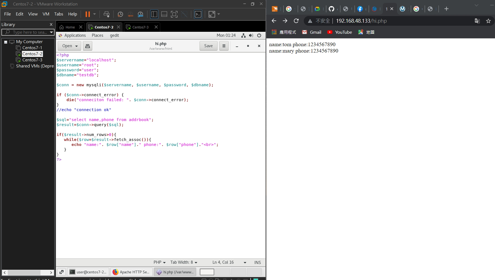

## 期末會考

* 參考資料

>* [apache&DB](https://www.phoenixnap.pt/kb/how-to-install-lamp-stack-on-centos)

* 安裝db: `yum install mariadb-server mariadb`

* `yum install httpd`
* `yum install php-mysql`


* `yum install php -y`

* 打開db: `systemctl start mariadb`

* 確認db狀態: `systemctl status mariadb`

* `mysql_secure_installation`

>* ynnny

* 進入db: `mysql -uroot -p`

* 看databases`show databases;`
* 創建一個databases:`create database testdb;`

* 看看有沒有創建databases完成: `show databases;`
* 建立資料: `create table addrbook`
* 進入那個db: `use testdb`            
                                                                                                                                                                                                         

* 創建資料表`create table addrbook(name varchar(50) not null, phone varchar(10));`

* 插入資料1 : `insert into addrbook(name, phone) values ("tom", "1234567890");`
* 插入資料2 : `insert into addrbook(name, phone) values ("mary", "9876543210");`

* 查看資料表: `select * from addrbook`


### Test PHP Processing
* `yum install nano`
* `systemctl restart httpd`
*  `cd /var/www/html`
* `touch test.php`
* `gedit test.php`
    ```php
    <?php
    phpinfo();
    ?>
    ```
* 在windows上輸入ip位址+/test.php
    
* `touch hi.php`
* `gedit hi.php`
    ```php
    //hi.php

    <?php
    $servername="localhost";
    $username="root";
    $password="123456";
    $dbname="testdb";

    $conn = new mysqli($servername, $username, $password, $dbname);

    if ($conn->connect_error) {
        die("conneciton failed: ". $conn->connect_error);
    }
    //echo "connection ok"

    $sql="select name,phone from addrbook";
    $result=$conn->query($sql);

    if($result->num_rows>0){
    while($row=$result->fetch_assoc()){
        echo "name:". $row["name"]." phone:". $row["phone"]."<br>";
    }
    }
    ?>
    ```

* 在windows上輸入ip位址+/hi.php
