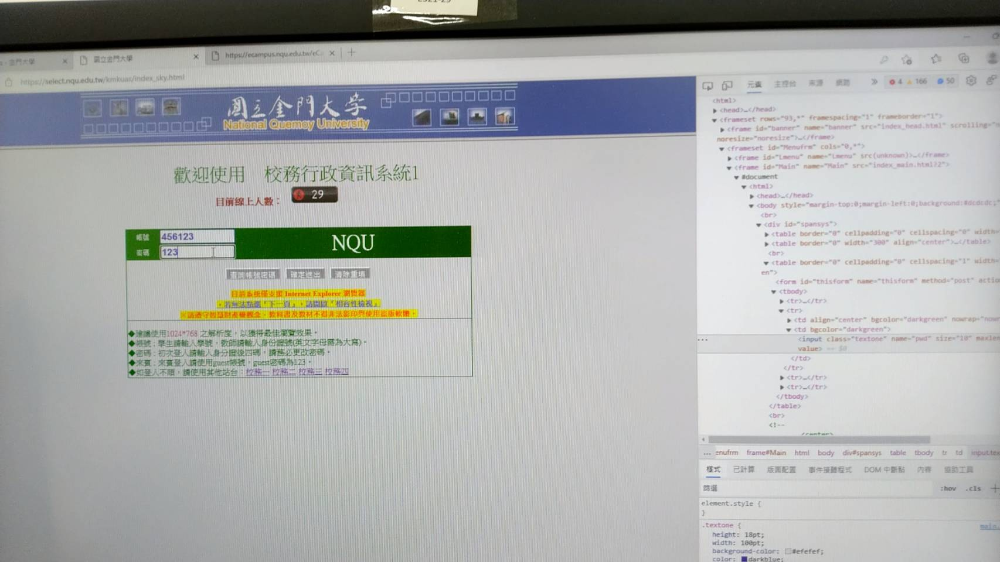
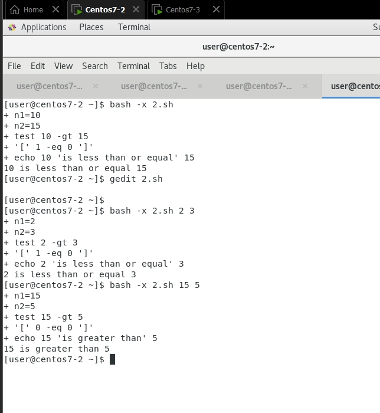
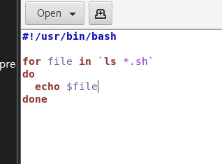
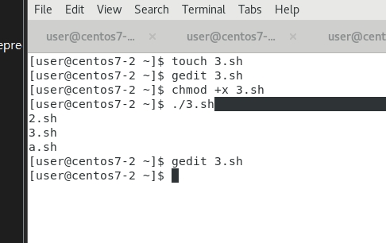

# 2021_11_01
## 網站安全
* 學校電腦，建議使用無痕模式
* 因為更改他的type(將其刪掉)，就可以直接顯示出密碼，這樣很危險
* 以下就是將其更改後結果


---

## 如果一開始沒有檔案，創造一個檔案，否則建立一個檔案
### 1.txt
```
#!/usr/bin/bash

if ! test -e /tmp/a.txt
then
  touch /tmp/a.txt
fi
```
### 可以輸入2數字，判斷大小
* `touch 2.sh`
* `gedit 2.sh`
```
// 2.sh
#!/usr/bin/bash

n1=$1
n2=$2
test $n1 -gt $n2
if [ $? -eq 0 ]; then
  echo $n1 "is greater than" $n2
else
  echo $n1 "is less than or equal" $n2
fi
```
* `chmod +x 2.sh`
* `./2.sh 5 4`
    * 5 is greater than 4


* `bash -x 2.sh 15 5`



### 3.sh
```
#!/usr/bin/bash

for file in `ls *.sh`
do 
  echo $file
done 
```
* 

* 
