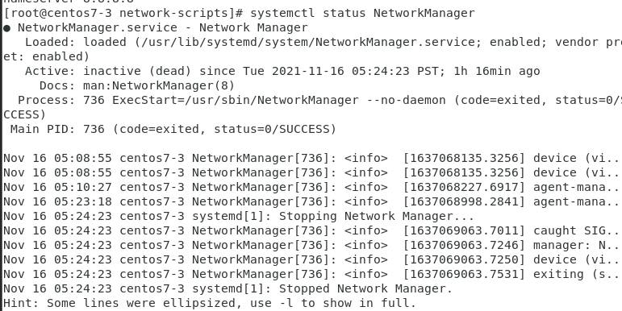
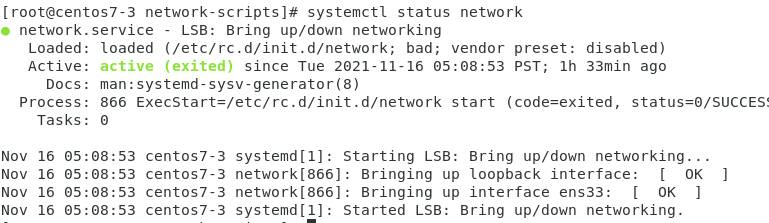
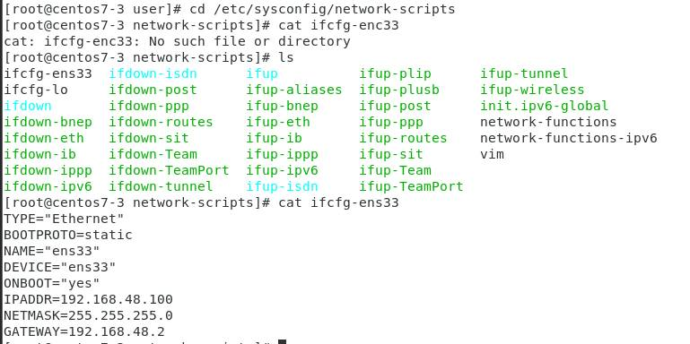
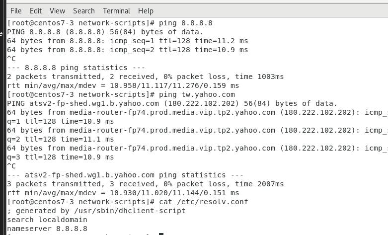

#  NFS
參考資料:https://codertw.com/%E4%BC%BA%E6%9C%8D%E5%99%A8/376452/

* 期末考網路設定10%


# NetworkManage & Network (5%~10%)
* `systemctl stop NetworkManager` :關閉NetworkManager
* `systemctl status NetworkManager` :確認NetworkManager狀態
    
    
* `systemctl status network ` : 開啟network
* `cd /etc/sysconfig/network-scripts` : 到/etc/sysconfig/network-scripts底下
    
* `vim ifcfg-enc33` :手動更改網路將原本的改成改變成的(之後要設定回去)
    * 原本的
    ```
    TYPE="Ethernet"
    PROXY_METHOD="none"
    BROWSER_ONLY="no"
    BOOTPROTO="dhcp"
    DEFROUTE="yes"
    IPV4_FAILURE_FATAL="no"
    IPV6INIT="yes"
    IPV6_AUTOCONF="yes"
    IPV6_DEFROUTE="yes"
    IPV6_FAILURE_FATAL="no"
    IPV6_ADDR_GEN_MODE="stable-privacy"
    NAME="ens33"
    UUID="dbff48f0-2297-476d-9db3-deca5638bfa8"
    DEVICE="ens33"
    ONBOOT="yes"
    ```

    * 改變成的
    ```
    TYPE="Ethernet"
    BOOTPROTO=static
    NAME="ens33"
    DEVICE="ens33"
    ONBOOT="yes"
    IPADDR=192.168.48.100 //
    NETMASK=255.255.255.0
    GATEWAY=192.168.48.2
    ```
* `vim /etc/resolv.conf` :改變DNS
    * 原本的
    ```
    ; generated by /usr/sbin/dhclient-script
    search localdomain
    nameserver 192.168.48.2
    ```
    * 更改後
    ```
    ; generated by /usr/sbin/dhclient-script
    search localdomain
    nameserver 8.8.8.8

    ```
* `ip route show` :看看是否設定好
* `ping 8.8.8.8`
* `ping tw.yahoo.com`
    

