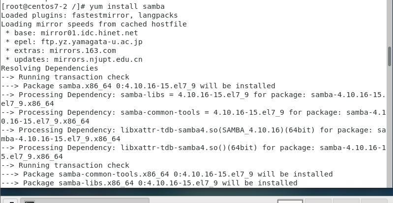
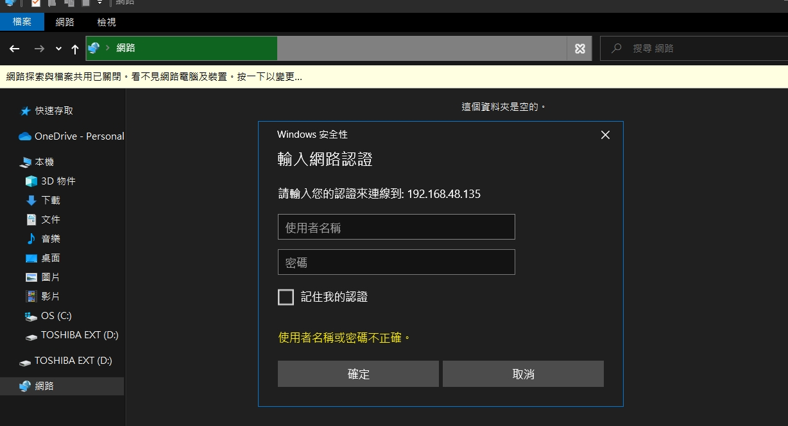
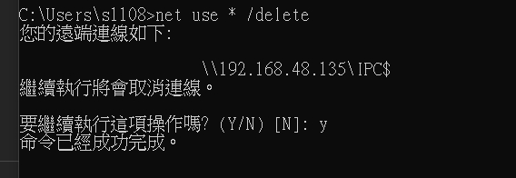

### https://josephjsf2.github.io/linux/2019/11/01/share_centos_folder_with_windows.html


## 在linux上安裝網路芳鄰SAMBA的伺服器
### for linux
* `yum install samba-client samba-common -y`

* `yum install samba`
  
* `cd /`

* `gedit /etc/samba/smb.con f`:編輯/etc/samba/smb.conf，public = yes每個人都有權限看
    ``` 
    # See smb.conf.example for a more detailed config file or
    # read the smb.conf manpage.
    # Run 'testparm' to verify the config is correct after
    # you modified it.

    [global]
    workgroup = SAMBA
    security = user

    passdb backend = tdbsam

    printing = cups
    printcap name = cups
    load printers = yes
    cups options = raw

    [homes]
    comment = Home Directories
    valid users = %S, %D%w%S
    browseable = No
    read only = No
    inherit acls = Yes

    [printers]
    comment = All Printers
    path = /var/tmp
    printable = Yes
    create mask = 0600
    browseable = No

    [print$]
    comment = Printer Drivers
    path = /var/lib/samba/drivers
    write list = @printadmin root
    force group = @printadmin
    create mask = 0664
    directory mask = 0775
    [mysamaba]
    comment =Shared Directory
    path = /mysamba
    browseable = yes
    writable = yes
    
    create mode = 0660
    directory mode = 2770
    
    public = yes
    ```
* `gedit /etc/samba/smb.conf`:編輯/etc/samba/smb.conf，valid users = mary只有 mary有權限
    ```
    # See smb.conf.example for a more detailed config file or
    # read the smb.conf manpage.
    # Run 'testparm' to verify the config is correct after
    # you modified it.

    [global]
    workgroup = SAMBA
    security = user

    passdb backend = tdbsam

    printing = cups
    printcap name = cups
    load printers = yes
    cups options = raw

    [homes]
    comment = Home Directories
    valid users = %S, %D%w%S
    browseable = No
    read only = No
    inherit acls = Yes

    [printers]
    comment = All Printers
    path = /var/tmp
    printable = Yes
    create mask = 0600
    browseable = No

    [print$]
    comment = Printer Drivers
    path = /var/lib/samba/drivers
    write list = @printadmin root
    force group = @printadmin
    create mask = 0664
    directory mask = 0775
    [mysamaba]
    comment =Shared Directory
    path = /mysamba
    browseable = yes
    writable = yes
    
    create mode = 0660
    directory mode = 2770
    
    valid users = mary
    ```
* `useradd mary` :新增user mary
* `smbpasswd -a mary` :加入smb的密碼
* 如果要刪除user `userdel -r mary`
* `systemctl restart smb` : 重啟SAMBA
* `systemctl status firewalld` : 確認firewalld是否關起來
* `ifconfig` : 查ip位置
### for windows
* 在收尋處輸入\\192.168.48.135 
  

  


## sharefolder:每個人可以add or del file ； fortom:only tom can add or del files
* `mkdir /sharefolder`
* `mkdir /fortom`
* `gedit /etc/samba/smb.conf`
    ```
    # See smb.conf.example for a more detailed config file or
    # read the smb.conf manpage.
    # Run 'testparm' to verify the config is correct after
    # you modified it.

    [global]
        workgroup = SAMBA
        security = user

        passdb backend = tdbsam

        printing = cups
        printcap name = cups
        load printers = yes
        cups options = raw

    [homes]
        comment = Home Directories
        valid users = %S, %D%w%S
        browseable = No
        read only = No
        inherit acls = Yes

    [printers]
        comment = All Printers
        path = /var/tmp
        printable = Yes
        create mask = 0600
        browseable = No

    [print$]
        comment = Printer Drivers
        path = /var/lib/samba/drivers
        write list = @printadmin root
        force group = @printadmin
        create mask = 0664
        directory mask = 0775
    [formary]
        comment = Shared Directory
        path = /formary
    
        create mode = 0660
        directory mode = 2770
        
        write list = mary
        valid users = mary,tom

    [sharefolder]
        comment = Shared Directory
        path = /sharefolder
        browseable = yes
        writable = yes
    
        create mode = 0660
        directory mode = 2770

        public = yes
    ```