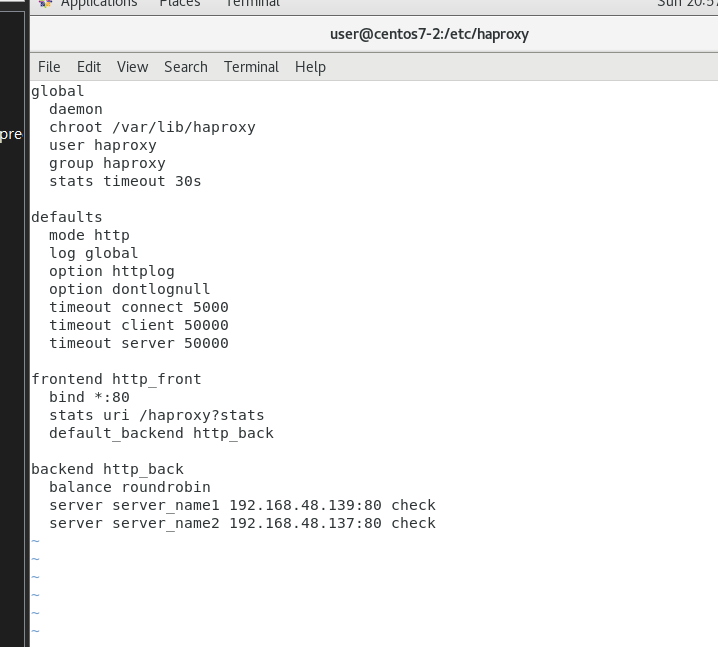
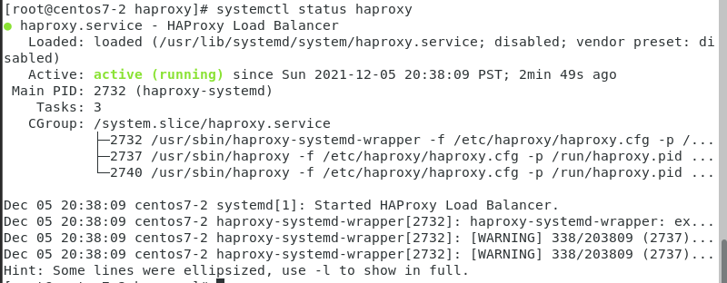
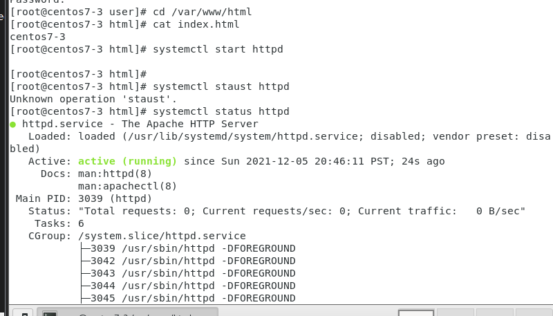
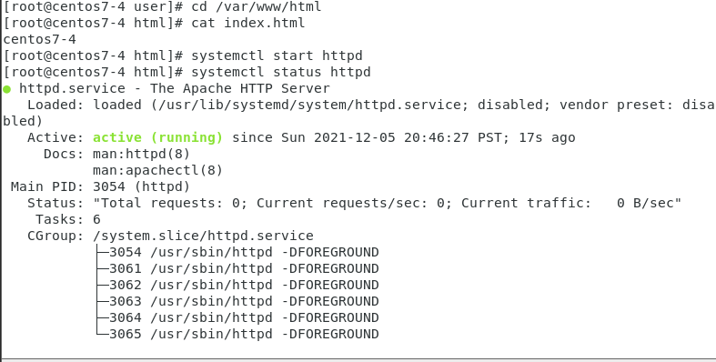
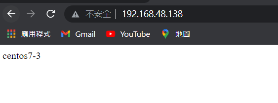

## for load balancer (centos7-2) 
>* don't need to open the httpd,if it's open you need to closed it

* 先安裝
    1. `yum install -y epel-release`
    2. `yum install haproxy -y`

* 將東西備份
    `cp /etc/haproxy/haproxy.cfg /etc/haproxy/haproxy.cfg.bak`

* 先編輯裡面內容
1. 切到/etc/haproxy裡
    ```
    [root@centos7-2 user]# cd /etc/haproxy
    ```
2. 編輯裡面內容，其中 server server_name1 192.168.48.139:80 check
  和 server server_name2 192.168.48.137:80 check 的ip是要填上另外兩台的ip

    ```
    [root@centos7-2 haproxy]# cat haproxy.cfg
    global
    daemon
    chroot /var/lib/haproxy
    user haproxy
    group haproxy
    stats timeout 30s

    defaults
    mode http
    log global
    option httplog
    option dontlognull
    timeout connect 5000
    timeout client 50000
    timeout server 50000

    frontend http_front
    bind *:80
    stats uri /haproxy?stats
    default_backend http_back

    backend http_back
    balance roundrobin
    server server_name1 192.168.48.139:80 check
    server server_name2 192.168.48.137:80 check

    ```
    

* 關閉防火牆
    ```
    [root@centos7-2 haproxy]# systemctl stop firewalld
    ```
* 重啟 load balancer
    ```
    [root@centos7-2 haproxy]# systemctl restart haproxy
    ```

`systemctl status haproxy`
    

## for centos7-3
* 切到/var/www/html中更改index.html

    

## for centos7-4
* 切到/var/www/html中更改index.html

    


## 結果 在windows中輸入load balancer的ip的ip
>* load balancer 會在兩台之間切換，案重整見就可以看到效果
    
    