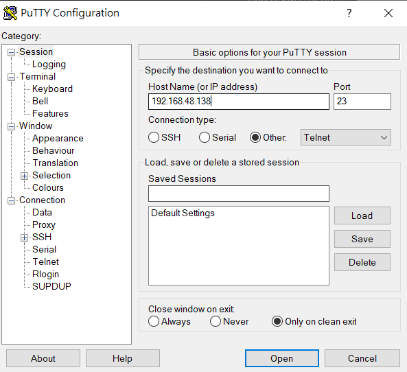
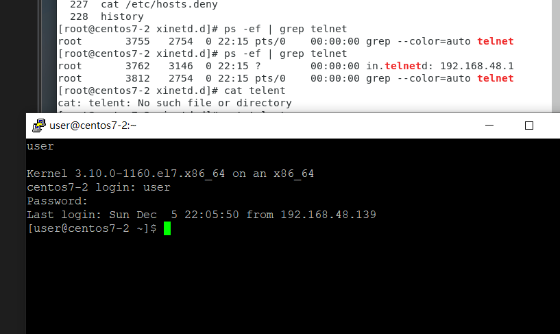

參考資料: 
https://blog.gtwang.org/linux/linux-netstat-command-examples/

---

## telnet (10分)連上putty

* 安裝telnet
    1. `yum install telnet`
    2. `yum install telnet-server`

`rpm -qa | grep xinetd`
* 關閉防火牆
    1. `systemctl stop firewalld`
    2. `systemctl status firewalld`
* 確認security linux，要顯示Disabled
    `getenforce`
* 切到/etc/xinetd.d
`cd /etc/xinetd.d`
* `gedit telnet`
```
service telnet

{
  flags = REUSE
  socket_type = stream
  wait = no
  user = root
  server = /usr/sbin/in.telnetd
  log_on_failure += USERID
  disable = no
}

```
* `cat echo-dgram`不用修改
```
[root@centos7-2 xinetd.d]# cat echo-dgram
# This is the configuration for the udp/dgram echo service.

service echo
{
# This is for quick on or off of the service
	disable		= yes

# The next attributes are mandatory for all services
	id		= echo-dgram
	type		= INTERNAL
	wait		= yes
	socket_type	= dgram
#	protocol	=  socket type is usually enough

# External services must fill out the following
#	user		=
#	group		=
#	server		=
#	server_args	=

# External services not listed in /etc/services must fill out the next one
#	port		=

# RPC based services must fill out these
#	rpc_version	=
#	rpc_number	=

# Logging options
#	log_type	=
#	log_on_success	=
#	log_on_failure	=

# Networking options
#	flags		=
#	bind		=
#	redirect	=
#	v6only		= 

# Access restrictions
#	only_from	=
#	no_access	=
#	access_times	=
#	cps		= 50 10
#	instances	= UNLIMITED
#	per_source	= UNLIMITED
#	max_load	= 0
#	deny_time	= 120
#	mdns		= yes 

# Environmental options
#	env		=
#	passenv		=
#	nice		= 0
#	umask		= 022
#	groups		= yes
#	rlimit_as	=
#	rlimit_cpu	=
#	rlimit_data	=
#	rlimit_rss	=
#	rlimit_stack	=

# Banner options. (Banners aren't normally used)
#	banner		=
#	banner_success	=
#	banner_fail	=
}


```
* `systemctl start xinetd`
* `systemctl status xinetd`

* `netstat -tunlp | grep 23`成功後會出現 tcp6那邊的23號port的顯示
    ```
    tcp6       0      0 :::23                   :::*                    LISTEN      3146/xinetd         
    udp        0      0 127.0.0.1:323           0.0.0.0:*                           652/chronyd         
    udp6       0      0 ::1:323      
    ```

## 接下來開起putty
*
    

* `ps -ef | grep telnet`:在開啟putty 和開啟putty後是不一樣的
    ```
    [root@centos7-2 xinetd.d]# ps -ef | grep telnet
    root       3755   2754  0 22:15 pts/0    00:00:00 grep --color=auto telnet
    [root@centos7-2 xinetd.d]# ps -ef | grep telnet
    root       3762   3146  0 22:15 ?        00:00:00 in.telnetd: 192.168.48.1
    root       3812   2754  0 22:15 pts/0    00:00:00 grep --color=auto telnet
    ```
    


