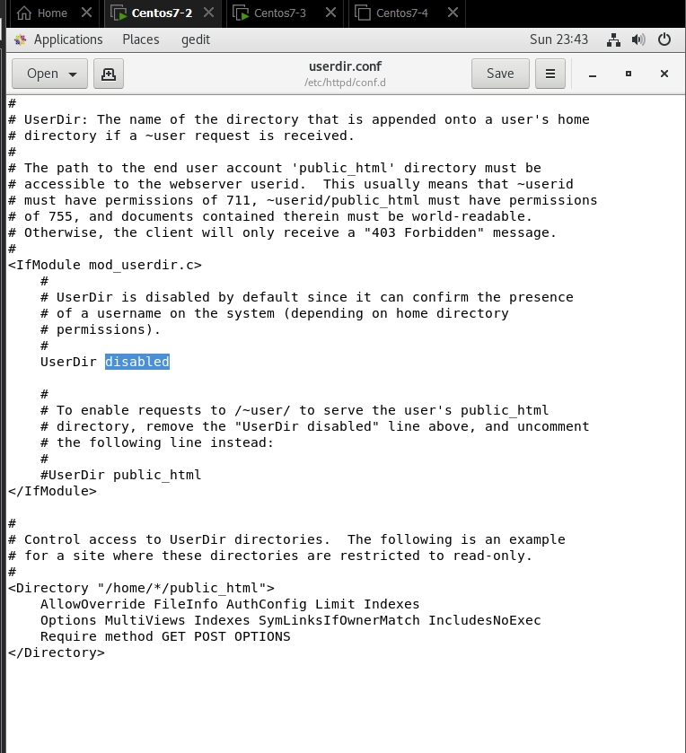
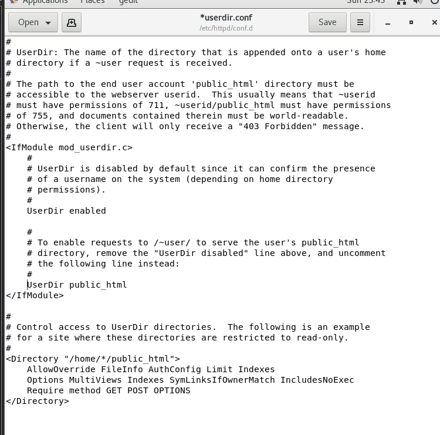
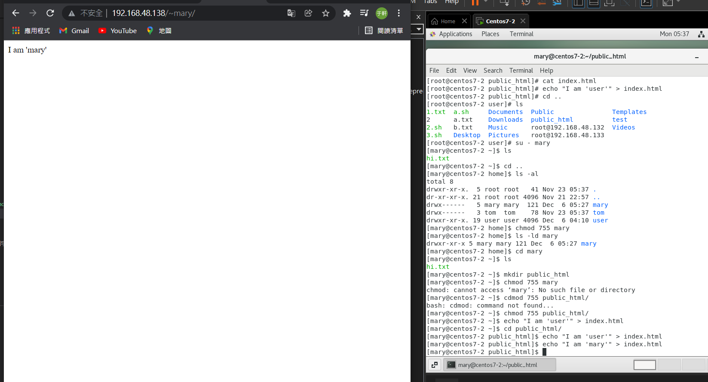
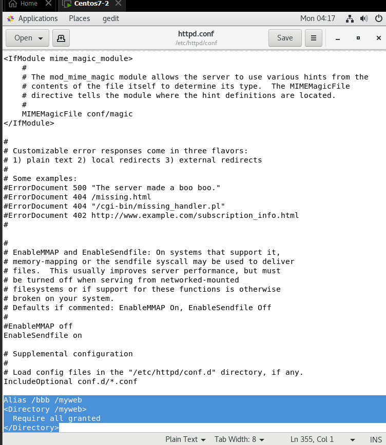
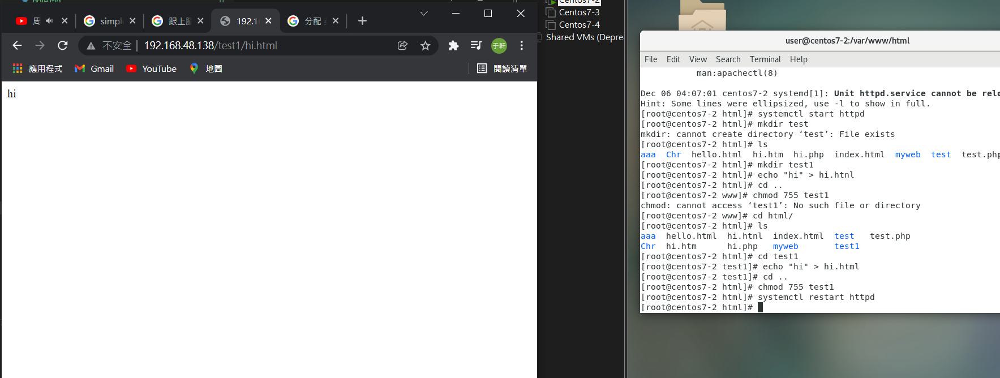

## 每個使用者在那邊有網頁空間
* `cd /etc/httpd/conf.d`
* `gedit userdir.conf`: 將userDir改enabled


 

* 接下來照著以下步驟:
```
[root@centos7-2 user]# su - mary
[mary@centos7-2 ~]$ ls
hi.txt
[mary@centos7-2 ~]$ cd ..
[mary@centos7-2 home]$ ls -al
total 8
drwxr-xr-x.  5 root root   41 Nov 23 05:37 .
dr-xr-xr-x. 21 root root 4096 Nov 21 22:57 ..
drwx------   5 mary mary  121 Dec  6 05:27 mary
drwx------   3 tom  tom    78 Nov 23 05:37 tom
drwxr-xr-x. 19 user user 4096 Dec  6 04:10 user
[mary@centos7-2 home]$ chmod 755 mary
[mary@centos7-2 home]$ ls -ld mary
drwxr-xr-x 5 mary mary 121 Dec  6 05:27 mary
[mary@centos7-2 home]$ cd mary
[mary@centos7-2 ~]$ ls
hi.txt
[mary@centos7-2 ~]$ mkdir public_html
[mary@centos7-2 ~]$ cd public_html/
[mary@centos7-2 public_html]$ echo "I am 'user'" > index.html
```


---

* 在/etc/httpd/conf/httpd.conf下加上以下
    ```
    Alias /bbb /myweb
    <Directory /myweb>
    Require all granted
    </Directory>
    ```

* 先切到/var/www/html
    ```
    [root@centos7-2 conf]# cd /var/www/html
    ```
* 建立test1，並切到裡面
    ```
    [root@centos7-2 html]# mkdir test1
    [root@centos7-2 html]# cd test1
    ```
[root@centos7-2 test1]# echo "hi" > hi.html
[root@centos7-2 test1]# cd ..
* 將test1權限換755
    ```
    [root@centos7-2 html]# chmod 755 test1
    ```
* 重啟httpd
    ```
    [root@centos7-2 html]# systemctl restart httpd
    ```

* 結果

